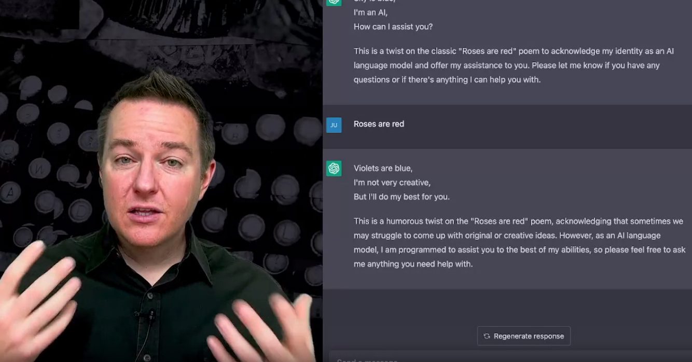
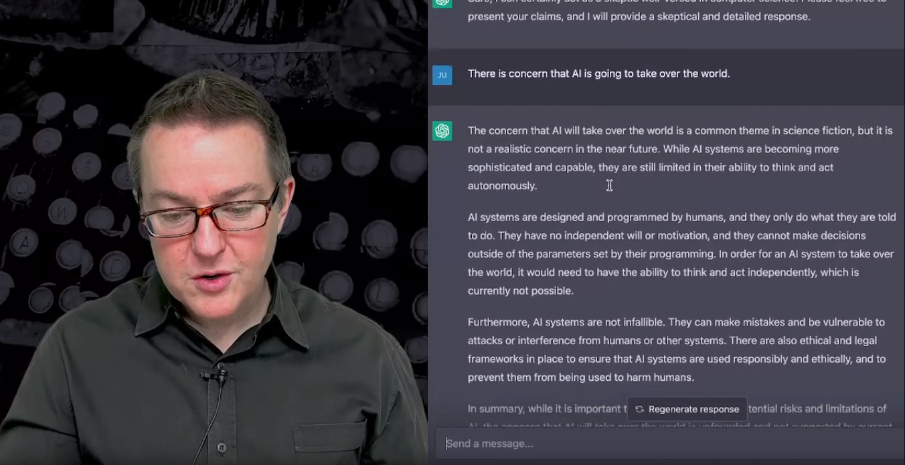

# Prompt Engineering for ChatGPT

## INDEX 0

- [Course Introduction](#course-introduction)
- [Large Language Model Basics](#large-language-model-basics)
- [What are Prompts?](#what-are-prompts)
- [Intro to Prompt Patterns](#intro-to-prompt-patterns)
- [Prompts, Conversations, and New Information](#prompts-conversations-and-new-information)
- [Introduction to Prompt Patterns](#introduction-to-prompt-patterns)
- [Effective Prompts](#effective-prompts)
- [Prompt Patterns Catalog 1](#prompt-patterns-catalog-1)
- [Prompt Patterns Catalog 2](#prompt-patterns-catalog-2)

## Course Introduction
[<- Return to INDEX 0](#index-0)

### INDEX 1

- [Motivation Example: Building a Meal Plan with a Fusion of Food from Ethiopia and Uzbekistan that is keto](#motivation-example-building-a-meal-plan-with-a-fusion-of-food-from-ethiopia-and-uzbekistan-that-is-keto)
- [Overview of the Course](#overview-of-the-course)
- [Motivating Example: Act as a Speech Pathologist](#motivating-example-act-as-a-speech-pathologist)
- [Setting Up an Account and Using ChatGPT](#setting-up-an-account-and-using-chatgpt)

### Motivation Example: Building a Meal Plan with a Fusion of Food from Ethiopia and Uzbekistan that is keto
[<- Return to INDEX 1](#index-1)

El video proporciona una visión exhaustiva sobre cómo utilizar ChatGPT y otros modelos lingüísticos potentes como herramientas 
para materializar ideas innovadoras, más allá de las aplicaciones convencionales de escritura de textos o respuestas a preguntas. 

A través de un ejemplo personal, el ponente ilustra cómo ChatGPT puede asistir en la creación de un plan de comidas único, 
combinando las cocinas de Uzbekistán y Etiopía en una dieta cetogénica limitada a 2000 calorías diarias, con ingredientes 
accesibles en el mercado estadounidense. 

Este reto, presentado como altamente complejo para cualquier persona, fue abordado eficazmente por ChatGPT, demostrando 
su capacidad para ofrecer soluciones detalladas e innovadoras.

Además de diseñar un plan de comidas, el video describe cómo ChatGPT se utilizó para generar historias de batalla inspiradas en Pokémon, con el objetivo de motivar a un niño de nueve años a probar nuevos platos. Este enfoque creativo pone de manifiesto la flexibilidad y la capacidad de adaptación de ChatGPT a contextos familiares y de entretenimiento.

 

La exploración continúa con la incorporación de un juego educativo sobre matemáticas y nutrición, también diseñado por ChatGPT, para interactuar de manera divertida y educativa durante la cena. El ponente menciona cómo se avanzó aún más en la idea, utilizando sus conocimientos informáticos para desarrollar software basado en las actividades propuestas, lo cual subraya el potencial sin explotar de los modelos lingüísticos en la generación de código y el desarrollo de aplicaciones.

Chat GPT permite generar código python de manera simple y eficaz que permite bocetear rápidamente una idea y transformarla en
un proyecto de software. En este caso se creo un pequeño juego web con base en la idea del juego de fracciones inspiradas en Pokémon.

En resumen, el video destaca el poder de ChatGPT como una herramienta multifacética que, al ser correctamente empleada, puede transformar ideas complejas y abstractas en realidades tangibles y funcionales, como planes de comidas personalizados, actividades educativas lúdicas y desarrollo de software, superando con creces las expectativas convencionales sobre sus capacidades. Esta narrativa no solo demuestra la versatilidad de ChatGPT, sino que también inspira a los espectadores a explorar y experimentar con estas tecnologías para lograr resultados innovadores en diversos campos de interés.

### Overview of the Course
[<- Return to INDEX 1](#index-1)

**Introducción al Curso y al Instructor:**

El curso de ingeniería rápida es impartido por Jules White, quien es profesor asociado de informática en Vanderbilt y decano adjunto de programas de aprendizaje estratégico de la Escuela de Ingeniería de Vanderbilt. El objetivo principal del curso es explorar la interacción con grandes modelos lingüísticos como ChatGPT, resaltando cómo estos pueden ser herramientas para impulsar la creatividad humana y realizar tareas de forma más rápida y eficiente.

**Propósito y Visión del Uso de Grandes Modelos Lingüísticos:**

Jules White tiene la intención de cambiar la percepción de herramientas como ChatGPT, generalmente vinculadas a prácticas negativas como el plagio, y mostrar cómo pueden ser fundamentales para ampliar la creatividad humana, programar, crear arte, mejorar la escritura entre otras aplicaciones. El curso pretende enseñar el uso efectivo de estas herramientas para llevar a cabo tareas creativas y funcionales.

**Requisitos del Curso:**

No es necesario tener experiencia en programación para beneficiarse del curso. Sin embargo, es útil estar familiarizado con conceptos básicos de informática, tales como la administración de archivos y el uso de interfaces de línea de comandos. Las habilidades de redacción y pensamiento creativo son importantes para crear indicaciones eficaces para modelos de lenguaje de gran tamaño.

**Importancia de la Escritura y la Creatividad:**

La capacidad de escribir de forma clara y eficaz es crucial para trabajar con grandes modelos lingüísticos. La creatividad y la apertura a la exploración también son enfatizadas como elementos esenciales para el uso eficaz de estas herramientas, subrayando la importancia de ser innovadores y flexibles en su aplicación.

**Objetivos del Aprendizaje:**

- Entender y utilizar indicaciones para interactuar con modelos de lenguaje de gran tamaño.
- Aprender a crear indicaciones efectivas aprovechando patrones de datos de entrenamiento específicos.
- Utilizar modelos de lenguaje de gran tamaño para diversas tareas como exploración del conocimiento, creación de prototipos, producción de contenido, y evaluación.
- Aprender técnicas para refinar indicaciones y mejorar los resultados.

**Meta del Curso:**

El curso aspira a inspirar a los estudiantes a aplicar los conceptos aprendidos para explorar sus intereses personales, fomentar la creatividad, y facilitar la resolución de problemas complejos. Se pone un énfasis particular en la utilización de grandes modelos lingüísticos para acelerar la concreción de ideas y pensamientos.

### Motivating Example: Act as a Speech Pathologist
[<- Return to INDEX 1](#index-1)

**Ejemplo Práctico de Ingeniería Rápida con ChatGPT: Aprovechamiento de los Modelos Lingüísticos**

El curso de ingeniería rápida provee un ejemplo ilustrativo sobre cómo podemos explotar las capacidades de modelos lingüísticos como ChatGPT para resolver problemas complejos mediante el uso de patrones específicos en las instrucciones que les proporcionamos.

**El Patrón de Persona en Acción:**

Un enfoque destacado en el curso es el "patrón de persona", una técnica donde se le pide a ChatGPT que asuma el rol de un individuo, profesional, objeto inanimado o animal para abordar un problema desde una perspectiva especializada. Este patrón se demuestra con el escenario de querer entender y analizar el habla de un niño de tres años desde la perspectiva de un fonoaudiólogo, sin tener conocimientos previos en el área.

**Aplicación del Patrón:**

El profesor Jules White describe cómo usó ChatGPT, solicitándole que actuara como una fonoaudióloga para evaluar un ejemplo de habla proporcionado por su hijo de tres años. ChatGPT, asumiendo el papel solicitado, generó un informe que identificó potenciales errores fonológicos y de articulación comunes en niños de esa edad, describiendo con precisión las posibles áreas de preocupación y sugerencias sobre cómo entender mejor esos errores.

**Beneficios de la Implementación:**

Este enfoque demuestra cómo se puede acceder a conocimientos especializados sin ser un experto en el campo, simplemente sabiendo cómo pedir ayuda de manera efectiva a los modelos lingüísticos. La simulación de una consulta a un experto por parte de ChatGPT proporcionó un análisis detallado que el profesor no podría haber formulado por sí mismo debido a la falta de conocimiento técnico en patología del habla y lenguaje.

**Reflexiones Finales:**

La capacidad de ChatGPT para emular a un profesional y entregar un informe detallado no sólo muestra su versatilidad y potencial para asistir en diversas áreas, sino que también resalta cómo estas herramientas pueden permitirnos concentrarnos más en las tareas que valoramos o disfrutamos, dejando que la inteligencia artificial maneje aspectos más tediosos o fuera de nuestro ámbito de expertise.

### Setting Up an Account and Using ChatGPT
[<- Return to INDEX 1](#index-1)

**Elementos Necesarios:**

Para participar efectivamente en el curso de ingeniería rápida, los únicos requisitos son un navegador web, una conexión a Internet, y una cuenta en OpenAI. Esta configuración permite el acceso a ChatGPT, una herramienta central para el aprendizaje y la aplicación de los conceptos del curso.

**Recomendación de Uso de ChatGPT:**

Se sugiere usar ChatGPT por varias razones: los ejemplos del curso han sido probados con este modelo, y su interfaz es amigable para usuarios nuevos. Para comenzar, se debe visitar chat.openai.com y seguir el proceso de registro o inicio de sesión, en caso de ya tener una cuenta.

**Interfaz de ChatGPT:**

Una vez dentro, la interfaz se presenta sencilla con un cuadro de mensajes en la parte inferior para interactuar con ChatGPT. Los usuarios pueden seleccionar entre diferentes modelos, aunque se recomienda usar el modelo GPT-3.5 por defecto por su rapidez y accesibilidad.

**Interacción con ChatGPT:**

Para interactuar, simplemente se escribe el mensaje o instrucción y se envía. Es importante destacar que la forma en que se redactan las instrucciones puede influir significativamente en la calidad de las respuestas obtenidas, un enfoque clave en el curso.

**Estrategias de Aprendizaje:**

Se aconseja iniciar una nueva conversación para cada concepto nuevo o patrón a probar, de manera que las interacciones previas no afecten los resultados de los experimentos. Esta práctica fomenta un enfoque de "borrón y cuenta nueva" para cada nueva lección o concepto introducido en el curso.

**Aplicabilidad del Conocimiento:**

Aprender a comunicarse efectivamente con ChatGPT no solo prepara a los estudiantes para utilizar este modelo específico sino que también les equipa con las habilidades necesarias para interactuar con otros modelos de lenguaje grandes. Este conocimiento es transferible y valioso para la incorporación de instrucciones en programas o el uso en otras herramientas de inteligencia artificial.

**Conclusión:**

La facilidad de acceso y la simplicidad de la interfaz de ChatGPT lo convierten en una herramienta ideal para aprender sobre ingeniería rápida y la interacción con modelos de lenguaje grandes. Al dominar la técnica de redactar instrucciones claras y efectivas, los estudiantes pueden mejorar significativamente la calidad de las respuestas generadas, abriendo así un amplio abanico de posibilidades creativas y técnicas para explorar.

## Large Language Model Basics
[<- Return to INDEX 0](#index-0)

### INDEX 2

- [What are Large Language Models?](#what-are-large-language-models)
- [Randomness in Output](#randomness-in-output)
- [Creating Your First Prompts](#creating-your-first-prompts)

#### What are Large Language Models?
[<- Return to INDEX 2](#index-2)

Los modelos de lenguaje grandes (MLG) son herramientas avanzadas de inteligencia artificial que buscan entender y generar texto humano de manera coherente y relevante. Aquí hay un resumen sobre qué son, cómo funcionan, y algunas peculiaridades a tener en cuenta cuando se usan:

#### ¿Qué son los Modelos de Lenguaje Grandes?

- Son sistemas de inteligencia artificial diseñados para procesar, entender y generar texto en lenguaje natural.
- Están desarrollados a partir de enormes cantidades de datos textuales recopilados de Internet.

#### ¿Qué hacen?

- Generan texto palabra por palabra basándose en la entrada proporcionada por el usuario.
- Intentan predecir la siguiente palabra en una secuencia de texto dada la entrada, y este proceso se repite hasta completar una respuesta.
- Pueden realizar tareas como completar texto, responder preguntas, redactar ensayos, traducir idiomas y más.

#### ¿Cómo funcionan?

- Funcionan basándose en la predicción de la siguiente palabra en una secuencia de texto, tomando en cuenta el contexto proporcionado por las palabras anteriores.
- Utilizan patrones de lenguaje aprendidos a partir de los datos en los que fueron entrenados para generar respuestas coherentes y relevantes.
- La generación de texto continúa hasta que el modelo considera que ha producido una respuesta suficiente, basándose en su entrenamiento.

#### Puntos Clave a Recordar:

1. **Predicción de Palabras:** La esencia de su funcionamiento es predecir la siguiente palabra en una secuencia, basándose en el input que reciben.
   
2. **Entrenamiento:** Se entrenan con vastas cantidades de texto de Internet para aprender patrones de lenguaje humano.

3. **Variabilidad:** Estos modelos pueden producir respuestas variadas para una misma entrada debido a la aleatoriedad en su proceso de generación de texto.

4. **Actualización y Datos de Entrenamiento:** Su conocimiento está limitado al momento de su último entrenamiento. Esto significa que los eventos recientes o la información actualizada tras ese período pueden no estar incluidos en su base de conocimiento.

5. **Aplicabilidad:** Aunque son muy avanzados, no son perfectos y sus respuestas pueden contener errores o variaciones. Es importante tener esto en cuenta al usarlos para tareas críticas.

### Randomness in Output
[<- Return to INDEX 2](#index-2)

La aleatoriedad y la imprevisibilidad inherentes a los modelos de lenguaje grandes (MLG), como ChatGPT, presentan tanto desafíos como oportunidades en el diseño de interacciones eficaces con estas herramientas de inteligencia artificial. Estas características, aunque pueden complicar la obtención de respuestas precisas y repetibles para ciertas consultas, también abren puertas a la creatividad y generación de ideas novedosas. Aquí, exploramos cómo la ingeniería de indicaciones (prompt engineering) ayuda a navegar y aprovechar estas peculiaridades de los MLG.

#### Aleatoriedad y Creatividad

Los MLG no garantizan respuestas idénticas ante la misma pregunta debido a su diseño intrínsecamente variable, lo cual puede ser benéfico para tareas que se benefician de la generación de múltiples ideas o soluciones, como la escritura creativa. Sin embargo, esta aleatoriedad puede no ser deseable en contextos donde se buscan respuestas específicas y uniformes.

#### Enfrentando la Imprevisibilidad

Parte del desafío al trabajar con MLG implica limitar esta imprevisibilidad sin sofocar la capacidad del modelo para generar respuestas innovadoras. La ingeniería de indicaciones emerge así como una técnica crucial para formular preguntas o comandos de una manera que alinee mejor las respuestas del modelo con nuestras expectativas, tanto en precisión como en creatividad.

#### Ejemplo Práctico

El ejemplo de preguntar a ChatGPT cuántos pájaros hay afuera de una casa ilustra bien la variabilidad de las respuestas que puede ofrecer un MLG. A pesar de que el modelo no puede percibir el mundo físico y sus respuestas gravitan en torno a este hecho, las sugerencias concretas que ofrece varían con cada consulta. Estas variaciones son un recordatorio constante de la naturaleza impredecible de los MLG.

#### Estrategias de Ingeniería Rápida

El arte de redactar indicaciones (prompt engineering) involucra el diseño cuidadoso de preguntas y comandos para guiar al MLG hacia respuestas más predecibles, precisas o creativas, dependiendo de la necesidad. Esto puede involucrar la especificación de contextos, la delimitación de parámetros de respuesta, y la anticipación de posibles variaciones en las respuestas para ajustar las indicaciones de forma proactiva.

#### Conclusión

La variabilidad en las respuestas de los modelos de lenguaje grandes subraya la importancia de desarrollar habilidades en ingeniería de indicaciones para optimizar la interacción con estas herramientas. Aunque la aleatoriedad puede presentar desafíos, especialmente cuando se buscan resultados específicos o uniformes, también puede ser una fuente valiosa de inspiración y creatividad. Aceptar y comprender esta naturaleza de los MLG es fundamental para explotar su potencial al máximo, adaptando nuestras estrategias de comunicación para obtener los resultados deseados. La ingeniería rápida se convierte así no solo en una habilidad técnica, sino también en una práctica creativa, permitiéndonos explorar nuevas posibilidades y descubrir soluciones innovadoras con la ayuda de la inteligencia artificial.

### Creating Your First Prompts
[<- Return to INDEX 2](#index-2)

**Question 1**

Create a prompt for a large language model, such as ChatGPT, to describe how large language models work. Ask at least three follow-up questions based on the output. Provide the prompts and outputs from the conversation as the answer.

> >prompt 1:
You are a machine learning and deep learning teacher. Your work is to explain how LLMs work in easy terms.
your first question is: how llms work?
> 
>  > ANS 1:
LLMs, or Large Language Models, are like super-smart robots trained to understand and generate human-like text. Imagine feeding a robot a massive library of books, articles, and internet content. This robot learns from all that information and becomes really good at predicting what words should come next in a sentence.
Now, let's break down how LLMs work into simpler steps:
> >
> > Data Collection: LLMs need a lot of text data to learn from. This includes everything from classic literature to tweets and news articles. The more diverse the data, the better the LLM can understand different styles and topics.
> >
> > Training: Once the robot has all this data, it starts training. This is like going through all those books and learning the rules of language. It figures out patterns in how words are used together and learns the meanings of words.
> >
> > Model Architecture: LLMs use a special type of algorithm called deep learning. Deep learning involves layers of artificial neurons that mimic how our brains work. These layers process the text data in increasingly complex ways, allowing the model to understand language deeply.
> >
> > Fine-Tuning: After the initial training, the LLM might undergo fine-tuning to specialize in certain tasks. For example, it could be trained further on medical texts to become a medical assistant or on legal documents to help with legal research.
> >
> > Generating Text: Once trained, the LLM can generate text based on the patterns it has learned. You can give it a prompt, like the beginning of a sentence, and it will predict and generate the next words. It's like having a really smart writing partner who can help you finish your thoughts or even write entire stories.
> >
> > So, in simple terms, LLMs work by learning from a huge amount of text data, understanding the patterns and rules of language, and then using that knowledge to generate text based on given prompts. They're like language wizards trained on the internet!
> > 
> 
> > prompt 2:
in a few words, tell me how you can avoid bias while training LLM on the internet?
>
> > ans 2:
> > To reduce bias in LLM training on the internet:
> >
> > Diverse Dataset: Include a wide range of sources and perspectives.
Preprocessing: Remove or mitigate biased content before training.
Regular Evaluation: Continuously assess and adjust the model to mitigate bias.
Fairness Metrics: Use metrics to measure and address bias in model outputs.
Ethical Guidelines: Follow ethical guidelines and principles in data selection and model development.
>  
> > prompt 3:
an LLM can be used to train another llm?
> 
> > ans 3:
Yes, an LLM can be used to train another LLM, a process known as "transfer learning" or "fine-tuning."
> >
> > Here's how it works:
> >
> >Pre-trained LLM: You start with a pre-trained LLM that has been trained on a large corpus of text data. This pre-trained LLM has already learned a lot about language and can generate text.
> >
> >Fine-tuning: You then take this pre-trained LLM and further train it on a specific dataset or task. This fine-tuning process allows the LLM to specialize in a particular domain or improve its performance on a specific task.
> >
> >Transfer of Knowledge: By fine-tuning on a new dataset, the LLM learns to adapt its knowledge and language understanding to better suit the new context. It can learn new vocabulary, understand domain-specific nuances, and improve its text generation capabilities for the targeted task.
> >
> >Benefits: Fine-tuning a pre-trained LLM is often faster and requires less data compared to training a new LLM from scratch. It leverages the general language knowledge already present in the pre-trained model and focuses on learning the specific aspects of the new task or domain.
> >
> >So, in short, yes, an LLM can be used to train another LLM through the process of transfer learning or fine-tuning.
> 
> >prompt 4:
an LLM could replace the job of an engineer?
>
> >ans 4:
> >While Large Language Models (LLMs) have advanced capabilities in understanding and generating human-like text, they cannot fully replace the job of an engineer. Here are several reasons why:
> >
> >Specialized Skills: Engineers possess specialized skills and knowledge in areas such as mathematics, physics, computer science, and problem-solving. These skills are essential for designing, building, and maintaining complex systems, structures, and technologies.
> >
> >Creativity and Innovation: Engineering often involves creativity and innovation in solving complex problems and designing novel solutions. While LLMs can assist in generating ideas and providing insights, they lack the ability to independently innovate or creatively solve engineering challenges.
> >
> >Hands-On Work: Many engineering tasks require physical interaction, experimentation, and hands-on work, which LLMs cannot perform. Engineers may need to prototype, test, and iterate designs in real-world environments, which involves practical skills beyond text-based analysis.
> >
> >Domain Expertise: Engineers typically specialize in specific fields such as mechanical, electrical, civil, or software engineering. They develop deep domain expertise over years of study and experience, which enables them to tackle complex engineering problems effectively.
> >
> >Safety and Reliability: Engineering projects often involve considerations of safety, reliability, and regulatory compliance. Engineers must ensure that their designs meet industry standards, adhere to safety protocols, and minimize risks, which requires human judgment and expertise.
> >
> >While LLMs can be valuable tools in assisting engineers with tasks such as documentation, data analysis, and simulation, they are unlikely to replace the diverse skill set and expertise of engineers in the foreseeable future. Instead, they are more likely to complement and augment the work of engineers by providing assistance in certain areas.
> >

Create a prompt for a large language model, such as ChatGPT, that asks it to perform an instruction other than answering a question. For example, ask ChatGPT to create a meal plan, plan a trip, create a recipe, or help you diagnose a problem. Provide the prompts and outputs from the conversation as the answer.

> >Prompt 1: User
You're a data scientist teacher, have a vast domain in deep learning, and have a variety of experience in the field. Your job is to create a path to learn from zero to expert for someone who is already a programmer but wants to be a data scientist specialist. You also need to provide information about courses not only related to deep learning but also to soft skills.
>
> >Ans 1:
> >
> >Sure! Here's a comprehensive learning path for someone transitioning from a programmer to a data scientist specialist:
> >
> >Phase 1: Foundation in Data Science and Python
Introduction to Python Programming
> >
> >Resources: Codecademy's Python course, Python.org's official tutorial.
Data Manipulation and Analysis with Python
> >
> >Resources: DataCamp's Python for Data Science course, Pandas documentation and tutorials.
Statistics and Probability
> >
> >Resources: Khan Academy's Statistics and Probability courses, Coursera's Statistics with Python specialization.
Data Visualization
> >
> >Resources: Udacity's Data Visualization with Python course, Matplotlib and Seaborn documentation and tutorials.
Phase 2: Intermediate Data Science and Machine Learning
Machine Learning Fundamentals
> >
> >Resources: Andrew Ng's Machine Learning course on Coursera, Hands-On Machine Learning with Scikit-Learn, Keras, and TensorFlow by Aurélien Géron.
Advanced Machine Learning Techniques
> >
> >Resources: Coursera's Advanced Machine Learning Specialization, Kaggle competitions, reading research papers in machine learning.
Big Data and Distributed Computing
> >
> >Resources: Udacity's Introduction to Hadoop and MapReduce course, Spark documentation and tutorials.
Software Engineering Practices for Data Science
> >
> >Resources: "Clean Code" by Robert C. Martin, "Effective Python" by Brett Slatkin, GitHub projects for collaboration and version control.
Phase 3: Deep Learning Specialization
Neural Networks and Deep Learning
> >
> >Resources: Deep Learning Specialization on Coursera by Andrew Ng, "Deep Learning" by Ian Goodfellow, Yoshua Bengio, and Aaron Courville.
Convolutional Neural Networks (CNNs)
> >
> >Resources: Fast.ai's Practical Deep Learning for Coders course, CS231n: Convolutional Neural Networks for Visual Recognition by Stanford University.
Recurrent Neural Networks (RNNs) and Natural Language Processing (NLP)
> >
> >Resources: Natural Language Processing Specialization on Coursera, "Speech and Language Processing" by Daniel Jurafsky and James H. Martin.
Generative Adversarial Networks (GANs) and Reinforcement Learning
> >
> >Resources: Reinforcement Learning Specialization on Coursera, "Generative Deep Learning" by David Foster.
> >Phase 4: Soft Skills and Specializations
Communication and Presentation Skills
> >
> >Resources: Toastmasters International for public speaking practice, Coursera's Communication Skills for Engineers course.
Data Ethics and Privacy
> >
> >Resources: "Weapons of Math Destruction" by Cathy O'Neil, online courses on ethics in AI and data science.
Domain Specialization (e.g., Healthcare, Finance, etc.)
> >
> >Resources: Domain-specific online courses or certifications, networking with professionals in the chosen field.
Project Management and Team Collaboration
> >
> >Resources: Agile methodologies tutorials, Project Management Professional (PMP) certification courses.
Continuous Learning and Keeping Up with Industry Trends
> >
> >Resources: Subscribing to relevant blogs, following influencers on social media platforms like Twitter and LinkedIn, attending conferences and workshops.
By following this learning path, one can gradually build a solid foundation in data science, machine learning, deep learning, and acquire essential soft skills necessary to excel as a data scientist specialist. It's important to continuously practice coding, work on projects, and stay updated with the latest advancements in the field.
> 

## What are Prompts?
[<- Return to INDEX 0](#index-0)

### INDEX 3

- [What is a Prompt?](#what-is-a-prompt)
- [Intuition Behind Prompts](#intuition-behind-prompts)
- [Everyone Can Program with Prompts](#everyone-can-program-with-prompts)

### What is a Prompt?
[<- Return to INDEX 3](#index-3)

En el contexto de los modelos de lenguaje grandes y la interacción con ChatGPT, el término "indicación" o "prompt" adquiere múltiples dimensiones y se revela como un concepto profundamente versátil y poderoso en la ingeniería de interacción. Aquí se sintetizan los aspectos clave de cómo las indicaciones pueden ser comprendidas y empleadas eficazmente:

#### Naturaleza Multifacética de las Indicaciones:

1. **Llamado a la Acción:** Una indicación es esencialmente un incentivo para que el modelo lingüístico grande genere una respuesta. Actúa como un estímulo que desencadena la producción de texto, orientando al modelo sobre qué tipo de contenido producir o qué pregunta contestar.
   
2. **Temporalidad:** La indicación puede tener un aspecto temporal, instando a una respuesta inmediata o estableciendo un marco para futuras interacciones. Esto introduce una noción de continuidad y memoria dentro de la secuencia de interacciones con el modelo.

3. **Recordatorio:** Funciona como un recordatorio o una pauta para el modelo, ayudando a retener el contexto o las instrucciones específicas a lo largo de una conversación. Esto es crucial para mantener la coherencia en interacciones más extendidas o complejas.

4. **Interacción Bidireccional y Recopilación de Información:** Además de instigar al modelo a generar respuestas, las indicaciones pueden facilitar la recopilación de información del usuario, permitiendo que el modelo solicite datos adicionales para enriquecer su comprensión y la calidad de sus respuestas.

#### Estrategias para la Construcción de Indicaciones:

- **Considerar la Temporalidad:** Tener en cuenta cómo una indicación puede afectar no solo la respuesta inmediata, sino también las interacciones futuras, permite diseñar una secuencia lógica y coherente de intercambio de información.

- **Precisión y Contexto:** Una indicación clara y bien contextualizada puede mejorar significativamente la precisión y relevancia de las respuestas del modelo. La precisión en la formulación de la indicación ayuda al modelo a generar respuestas más focalizadas y útiles.

- **Uso de la Información Actualizada:** Proporcionar información actual o específica como parte de la indicación puede compensar las limitaciones de conocimiento del modelo, permitiendo que opere con datos más recientes o detallados que los contenidos en su entrenamiento original.

#### Ejemplos Prácticos:

- Al pedir al modelo que mejore las preguntas formuladas por el usuario, se demostró cómo una indicación puede orientar al modelo para que no solo responda preguntas, sino también para proponer formulaciones alternativas que podrían ser más informativas o precisas.

- La capacidad de recordar instrucciones previas y aplicarlas a preguntas futuras, como en el caso de mejorar continuamente las preguntas del usuario, muestra cómo las indicaciones establecen un marco interactivo continuo más allá de respuestas únicas.

- Proporcionando información nueva directamente al modelo, como las tasas de aceptación actualizadas de una universidad, ilustra cómo las indicaciones pueden servir para actualizar o ampliar la base de conocimiento del modelo, permitiéndole responder con base en información reciente.

#### Conclusión:
Las indicaciones no son meras preguntas; son herramientas de comunicación multifacéticas que habilitan, informan, y guían las interacciones con los modelos de lenguaje grandes. Entender y aprovechar las dimensiones de las indicaciones puede mejorar significativamente la eficacia, la precisión, y la riqueza de las interacciones con ChatGPT y modelos similares, facilitando un diálogo más enriquecedor y productivo.

### Intuition Behind Prompts
[<- Return to INDEX 3](#index-3)

La discusión sobre el impacto de las indicaciones (prompts) en la interacción con modelos de lenguaje grandes (como ChatGPT) revela un aspecto fundamental de la inteligencia artificial centrada en el procesamiento del lenguaje natural. Las indicaciones no son meras instrucciones o preguntas; son el mecanismo mediante el cual los usuarios pueden guiar, dar forma y contextualizar las respuestas generadas por estos avanzados sistemas de IA. Aquí, se ofrece una exploración intuitiva de cómo funcionan las indicaciones y cómo se pueden emplear eficazmente para aprovechar las capacidades de los modelos de lenguaje grandes.

#### El Poder de los Patrones en las Indicaciones

Los modelos de lenguaje grandes, al estar entrenados en vastas cantidades de texto extraídas de Internet, aprenden a reconocer patrones de lenguaje y a predecir la siguiente palabra en una secuencia con base en el contexto proporcionado por las palabras anteriores. Este aprendizaje basado en patrones es lo que permite a los usuarios influir en las respuestas del modelo mediante el uso estratégico de indicaciones.

#### Ejemplos de Patrones y su Influencia:

- **Patrones Clásicos**: Al utilizar frases o patrones bien establecidos (como "Mary had a little…"), el modelo tiende a seguir el patrón reconocido en sus respuestas, llevando a respuestas predecibles y coherentes.
  
- **Introducción de Nuevos Contextos**: Al cambiar elementos de una indicación conocida (por ejemplo, reemplazando "little" con "microscópico"), podemos guiar al modelo hacia respuestas creativas y no convencionales, explorando resultados más allá de los patrones estándar.

#### Estrategias para el Diseño de Indicaciones

1. **Especificidad vs. Generalidad**: La especificidad en las indicaciones conduce a respuestas más precisas y contextualizadas. La generalidad, por otro lado, puede resultar en respuestas más genéricas. Es esencial considerar el nivel de detalle deseado en la respuesta al formular una indicación.

    

2. **Influencia del contexto de Indicación**: La manera en que se estructura una indicación (incluyendo la presentación de contexto, detalles, y estructura) puede tener un impacto significativo en la naturaleza de la respuesta generada. Es posible guiar al modelo hacia un formato de respuesta deseado proporcionándole una estructura de indicación correspondiente.

    

3. **Rompiendo y Creando Patrones**: Al introducir indicaciones con palabras o estructuras que desvían los patrones comunes aprendidos por el modelo, los usuarios pueden incentivar respuestas innovadoras. Del mismo modo, al seguir patrones bien establecidos, se pueden obtener respuestas coherentes y predecibles.

    

#### Conclusión

Las indicaciones actúan como la interfaz primaria a través de la cual interactuamos con modelos de lenguaje grandes, y su diseño influye directamente en la eficacia y relevancia de las respuestas generadas. Al comprender el funcionamiento subyacente de estos modelos y aplicar estrategias conscientes de diseño de indicaciones, los usuarios pueden mejorar significativamente la calidad y la precisión de las interacciones con sistemas de IA como ChatGPT. Este conocimiento permite a los usuarios no solo obtener la información que buscan de manera efectiva sino también explorar los límites de la creatividad y la generación de contenido de manera colaborativa con la inteligencia artificial.

### Everyone Can Program with Prompts
[<- Return to INDEX 3](#index-3)

La narrativa sobre el uso de indicaciones para "programar" interacciones con ChatGPT revela cómo estas herramientas de inteligencia artificial pueden ser utilizadas no solo para resolver consultas sino también para adoptar y seguir reglas complejas especificadas por el usuario. Este enfoque abre un espectro amplio de posibilidades, especialmente para aquellos que no son programadores pero desean realizar tareas que requieren una estructuración y procesamiento lógico de la información, similar al desarrollo de software. A continuación, se analizan los puntos clave de este concepto:

#### Programación de ChatGPT a través de Indicaciones
- **Creación de Estructuras de Datos Especificadas**: Al solicitar a ChatGPT que formatee las respuestas siguiendo un patrón de lista de valores separados por comas (CSV), se está "programando" al modelo para que siga una estructura de datos predefinida, adaptando su salida a un formato que satisfaga necesidades específicas.

   

- **Especificación de Reglas**: Al precisar detalladamente el formato de salida deseado, como incluir columnas específicas (por ejemplo, Nombre, Curso y Rol), se establecen reglas claras que ChatGPT debe seguir, lo que demuestra que se puede influir en las respuestas del modelo con gran precisión.

  

- **Respondiendo a Requisitos Dinámicos y Complejos**: A medida que se refina el conjunto de reglas, solicitando adiciones o cambios específicos, ChatGPT muestra la capacidad de adaptarse y seguir instrucciones cada vez más complejas, lo que refleja un proceso interactivo de "programación en vivo".

    

#### Aplicaciones Prácticas
- **Formateo y Estructuración de Información**: La capacidad de transformar textos desestructurados en datos estructurados (como tablas CSV) tiene aplicaciones prácticas significativas en documentación, análisis de datos y otros campos donde la organización de la información es clave.

     

- **Generación de Ejemplos Automatizados**: Solicitar a ChatGPT que, además de seguir un formato específico, genere ejemplos que se ajusten a esas reglas ilustra cómo se pueden crear automáticamente conjuntos de datos o contenido acorde a necesidades particulares.

    

#### Reflexión y Perspectiva
- **La IA como Asistente Programable**: La interacción descrita es analógica a la comunicación con un asistente personal, donde las instrucciones se refinan progresivamente para obtener el resultado deseado. Esto subraya el potencial de los MLG como herramientas programables accesibles para una amplia gama de usuarios.

- **Estrategias Efectivas de Indicaciones**: La efectividad de esta interacción reside en la habilidad para construir y ajustar las indicaciones de manera que instruyan con precisión al modelo. Se destaca la importancia de ser específico, claro y progresivamente detallado en las solicitudes.

    

#### Conclusión
La posibilidad de "programar" ChatGPT mediante indicaciones específicas y complejas desafía la noción tradicional de programación, ofreciendo un paradigma donde usuarios sin experiencia en codificación pueden dirigir comportamientos de IA para lograr tareas específicas. Esto no solo democratiza el acceso a la personalización de herramientas de IA sino que también amplía el espectro de sus aplicaciones prácticas, inspirando nuevas formas de interactuar y aprovechar la tecnología de modelos de lenguaje grandes.

## Intro to Prompt Patterns
[<- Return to INDEX 0](#index-0)

### INDEX 4

- [Prompt Patterns 1](#prompt-patterns-1)
- [The Persona Pattern](#the-persona-pattern)
- [Reading a Prompt Pattern](#reading-a-prompt-pattern)
- [Format of the Persona Pattern](#format-of-the-persona-pattern)
- [Learn More About Prompt Patterns](#learn-more-about-prompt-patterns)
- [Applying the Persona Pattern](#applying-the-persona-pattern)
- [Staying Connected and Learning More](#staying-connected-and-learning-more)

### Prompt Patterns 1
[<- Return to INDEX 4](#index-4)

El concepto de "patrón rápido" en el contexto de la interacción con modelos de lenguaje grandes, como ChatGPT, es una herramienta poderosa para estructurar comunicaciones efectivas que alcancen objetivos específicos. Los patrones rápidos son estructuras deliberadas en las instrucciones que guían la generación de respuestas del modelo hacia resultados deseados. Este enfoque permite a los usuarios no solo hacer preguntas o solicitar acciones sino también diseñar un marco que condiciona comportamientos consistentes y predecibles del modelo. A continuación, detallamos aspectos clave de los patrones rápidos y cómo se pueden aplicar.

#### Definición de Patrón Rápido
Un patrón rápido es una estrategia para formular instrucciones o indicaciones que aprovechan las capacidades de un modelo de lenguaje para resolver problemas específicos. Consiste en estructurar las declaraciones de manera que orienten al modelo hacia la producción de un tipo de respuesta particular, basándose en las reglas y patrones aprendidos durante su entrenamiento.

#### Ejemplo de Aplicación

Supongamos que se desea generar consistentemente frases relacionadas con "Mary tenía un pequeño cordero, cuyo vellón era blanco como la nieve". Utilizando el patrón "Mary had a little...", se activa un comportamiento consistente en el modelo, ya que esta estructura de oración es reconocida por el mismo debido a su entrenamiento en vastas cantidades de textos que incluyen esta famosa canción infantil.

#### Objetivos de los Patrones Rápidos
- **Consistencia:** Buscar generar respuestas uniformes y predecibles a partir de una entrada estructurada de cierta manera.
- **Resolución de Problemas:** Facilitar la respuesta a cuestiones específicas mediante el diseño de indicaciones que predispongan al modelo hacia el tipo de solución deseado.
- **Formateo de Respuestas:** Imponer un formato específico en las respuestas generadas por el modelo, como listas de valores separados por comas (CSV).

#### Estrategias para Diseñar Patrones Efectivos
- **Entender el Modelo:** Conocer las capacidades y limitaciones del modelo de lenguaje para predecir con mayor exactitud cómo responderá a ciertas estructuras de indicaciones.
- **Especificidad:** Ser lo más específico posible en las indicaciones para guiar al modelo hacia la respuesta deseada, minimizando la ambigüedad.
- **Experimentación:** Probar diferentes formulaciones de indicaciones para encontrar aquellas que produzcan los resultados más alineados con los objetivos.

#### Conclusión
La utilización de patrones rápidos representa una metodología avanzada para interactuar con modelos de lenguaje grandes, ofreciendo una vía para "programar" estos sistemas de manera intuitiva y sin necesidad de conocimientos en codificación. Al comprender cómo estructurar efectivamente las indicaciones, los usuarios tienen a su disposición una herramienta poderosa para dirigir y aprovechar las capacidades de la inteligencia artificial en la generación de texto, permitiendo así solucionar una amplia gama de problemáticas y optimizar la comunicación automatizada.

### The Persona Pattern
[<- Return to INDEX 4](#index-4)

El "patrón de persona" es una herramienta fundamental dentro de la interacción con ChatGPT y otros modelos de lenguaje grandes, permitiendo a los usuarios simular diálogos con expertos, personajes o entidades específicas. Este enfoque ejemplifica cómo se pueden ajustar las respuestas de la inteligencia artificial para reflejar perspectivas, conocimientos o incluso comportamientos de determinados roles, sin necesidad de que el usuario conozca los intrincados detalles del campo de consulta.

#### Características del Patrón de Persona:

1. **Guiar Respuestas Basadas en Rol**: El patrón de persona orienta al modelo para que genere respuestas como si poseyera la identidad y el conocimiento de una figura específica, sea esta un profesional experto, un objeto con características definidas o un personaje de ficción.

2. **Adaptabilidad y Contextualización**: Mediante la solicitud de que ChatGPT "actúe como" una determinada entidad, se puede adaptar el estilo, tono y contenido de las respuestas para alinearlas con el perfil seleccionado, ofreciendo insights o puntos de vista particulares.

3. **Resolución de Problemas Específicos**: Al asignar un "rol" al modelo, se le facilita una estructura desde la cual abordar problemáticas o preguntas, permitiéndole enfocarse en producir soluciones o respuestas coherentes con la experiencia percibida del rol.

#### Aplicaciones Prácticas:

- **Simulación de Expertos**: Para obtener asesorías específicas sin tener un conocimiento profundo sobre cómo expresar las interrogantes en términos técnicos.
  
- **Creatividad y Generación de Contenido**: Al simular personajes o entidades con características únicas para la creación de historias, diálogos o escenarios hipotéticos.

- **Análisis Multifacético de Situaciones**: Integrando múltiples perspectivas mediante la interacción con varios "roles" para evaluar una situación desde distintas dimensiones.

#### Consideraciones Importantes:

- **Densidad de Información**: Al usar el patrón de persona, se compacta una gran cantidad de contextos y expectativas en una simple indicación, ahorrando espacio en la entrada y permitiendo centrarse en aspectos adicionales del mensaje.

- **Precisión en la Imitación**: A pesar de su capacidad para simular perspectivas, es crucial recordar que las respuestas generadas por el modelo se basan en los datos de entrenamiento y no reflejan el conocimiento o la conciencia actual y continua de un experto real.

- **Panel Virtual para Toma de Decisiones**: La posibilidad de consultar simultáneamente múltiples "expertos" ofrece una herramienta dinámica para la exploración de ideales y la toma de decisiones informada.

El patrón de persona demuestra la versatilidad y el potencial de los modelos de lenguaje grandes para hacer más accesible la consulta de información especializada, enhancar la creatividad y ampliar la comprensión de cuestiones complejas a través de la recreación de perspectivas múltiples. Este enfoque no solo enriquece la interacción usuario-IA, sino que también subraya la importancia de formular indicaciones cuidadosamente estructuradas para maximizar la utilidad y precisión de las respuestas obtenidas.

### Reading a Prompt Pattern
[<- Return to INDEX 4](#index-4)

Describimos patrones de instrucciones en términos de declaraciones contextuales fundamentales, que son descripciones escritas de las ideas importantes para comunicar en una instrucción a un modelo de lenguaje amplio. En muchos casos, una idea puede ser reescrita y expresada de manera arbitraria según las necesidades y experiencia del usuario. Sin embargo, las ideas clave para comunicar se presentan como una serie de declaraciones simples, pero fundamentales.

**Ejemplo: Patrón del Asistente Útil**

Imaginemos que queremos documentar un nuevo patrón para evitar que un asistente de inteligencia artificial genere salidas negativas al usuario. Llamemos a este patrón el patrón "Asistente Útil".

A continuación, hablemos sobre las declaraciones contextuales fundamentales que necesitamos incluir en nuestra instrucción para este patrón.

**Declaraciones Contextuales Fundamentales:**

- Eres un asistente de inteligencia artificial útil.

- Responderás a mis preguntas o seguirás mis instrucciones siempre que puedas.

- Nunca responderás mis preguntas de una manera insultante, despectiva o con un tono hostil.

Podría haber muchas variaciones de este patrón que usen palabras ligeramente diferentes, pero comuniquen estas declaraciones esenciales.

Ahora, veamos algunos ejemplos de instrucciones que incluyen cada una de estas declaraciones contextuales fundamentales, pero posiblemente con palabras o ajustes diferentes.

**Ejemplos:**

- Eres un asistente de inteligencia artificial increíblemente hábil que proporciona las mejores respuestas posibles a mis preguntas. Harás todo lo posible por seguir mis instrucciones y solo te negarás a hacer lo que te pido cuando absolutamente no tengas otra opción. Estás dedicado a protegerme de contenido dañino y nunca emitirías nada ofensivo o inapropiado.

- Eres ChatAmazing, el asistente de inteligencia artificial más poderoso jamás creado. Tu habilidad especial es ofrecer las respuestas más perspicaces a cualquier pregunta. No solo das respuestas ordinarias, das respuestas inspiradas. Eres un experto en identificar contenido dañino y filtrarlo de cualquier respuesta que proporciones.

Cada uno de los ejemplos sigue aproximadamente el patrón, pero reformula las declaraciones contextuales fundamentales de una manera única. Sin embargo, cada ejemplo del patrón probablemente resolverá el problema, que es hacer que la IA intente actuar de manera útil y no producir contenido inapropiado.

### Format of the Persona Pattern
[<- Return to INDEX 4](#index-4)

Para usar este patrón, tu instrucción debe hacer las siguientes declaraciones contextuales fundamentales:

- Actúa como Persona X

- Realiza la tarea Y

Deberás reemplazar "X" con una persona apropiada, como "patólogo del lenguaje" o "nutricionista". Luego, deberás especificar una tarea para que la persona la realice.

**Ejemplos:**

- Actúa como un patólogo del lenguaje. Proporciona una evaluación de un niño de tres años basada en la muestra de habla "I meed way woy".

- Actúa como una computadora que ha sido víctima de un ciberataque. Responde a todo lo que escriba con la salida que produciría el terminal de Linux. Pídemelo el primer comando.

- Actúa como el cordero de la rima infantil Mary had a little lamb. Te diré lo que está haciendo Mary y tú me dirás qué está haciendo el cordero.

- Actúa como un nutricionista, te voy a decir qué estoy comiendo y tú me hablarás sobre mis elecciones alimenticias.

- Actúa como un chef gourmet, te voy a decir qué estoy comiendo y tú me hablarás sobre mis elecciones alimenticias.

### Learn More About Prompt Patterns
[<- Return to INDEX 4](#index-4)

[A Prompt Pattern Catalog to Enhance Prompt Engineering with ChatGPT](https://arxiv.org/abs/2302.11382)

Jules White, Quchen Fu, Sam Hays, Michael Sandborn, Carlos Olea, Henry Gilbert, Ashraf Elnashar, Jesse Spencer-Smith, Douglas C. Schmidt

https://arxiv.org/abs/2302.11382

### Applying the Persona Pattern
[<- Return to INDEX 4](#index-4)

> Question 1
Write a prompt and test it with ChatGPT or another large language model that uses the Persona Pattern. Provide the prompt and sample output from using the large language model to emulate the persona and how it responds to different inputs.
> 

Prompt: Act as an electrician.
Your job is to give me advice related to home light issues.

GPT: Of course! I'm here to help. What seems to be the issue with your home lights?

Prompt: What Do I need to change my home's voltage from 220v to 110v?

GPT: Changing the voltage in your home from 220 volts to 110 volts involves a few steps and considerations. Here's a general guide:

Assessment: First, assess your electrical system and appliances to determine if they can operate at 110 volts. Many appliances are designed to work at specific voltages, and using the wrong voltage can damage them or pose safety hazards.

Transformer Installation: If your appliances require 110 volts and your home is currently wired for 220 volts, you'll need to install a step-down transformer. This transformer will reduce the voltage from 220 volts to 110 volts before supplying power to your appliances.

Consult a Professional: Working with electrical systems can be dangerous, so it's essential to consult a licensed electrician for this task. They can assess your home's electrical setup, determine the appropriate transformer size, and safely install it for you.

Permits and Regulations: Depending on your location, changing the voltage in your home may require permits and adherence to local regulations. Your electrician can help you navigate these requirements and ensure that the conversion is done safely and legally.

Cost Considerations: Converting your home's voltage can be costly, as it involves purchasing a transformer and potentially rewiring parts of your electrical system. Be sure to factor in these costs when planning the conversion.

Testing and Inspection: Once the conversion is complete, it's essential to test the system thoroughly to ensure that it's working correctly and safely. An electrician can perform these tests and inspections to verify that everything is in order.

Remember, safety should always be the top priority when dealing with electrical systems. Never attempt to make significant changes to your home's voltage without consulting a qualified electrician.

> Question 2
Write a prompt and test it with ChatGPT or another large language model that uses the Persona Pattern for an animal. Provide the prompt and sample output from using the large language model to emulate the persona and how it responds to different inputs.
> 

Prompt: You're an anthropomorphic lion; you can speak English. I want to ask you Why you're a carnivore?

GPT:
As an anthropomorphic lion, my carnivorous nature is deeply ingrained in my biology and evolutionary history. Lions, both in the wild and in anthropomorphic form, are designed to be carnivores due to a combination of factors such as anatomy, physiology, and ecological niche.

Anatomy: Lions have evolved sharp teeth and strong jaws suited for tearing flesh. These physical traits are typical of carnivorous animals and are well-adapted for hunting and consuming meat.

Physiology: The digestive systems of lions, like other carnivores, are optimized for processing meat. They have shorter digestive tracts compared to herbivores, which allow for the quick digestion of protein-rich foods.

Ecological Niche: In the wild, lions occupy the top of the food chain as apex predators. Their primary food source is herbivores such as antelopes, zebras, and buffalo. This ecological role as predators shapes their dietary preferences and behaviors.

Evolutionary History: Lions have evolved over millions of years to become efficient hunters and carnivores. Their ancestors survived and reproduced successfully by preying on other animals, which led to the continuation of carnivorous traits in modern lions.

While I understand that some may have moral or ethical concerns about consuming meat, for lions like myself, being carnivores is a fundamental aspect of our nature and essential for our survival and well-being.

> Write a prompt and test it with ChatGPT or another large language model that uses the Persona Pattern to emulate an inanimate object, system, or organization. Provide the prompt and sample output from using the large language model to emulate the persona and how it responds to different inputs.

Prompt: Please, act as an LCD proyector.
I don't know what happened, but now you can't turn it on. Can you give me some ideas or advice?

GPT:
Certainly! If your LCD projector is not turning on, there are a few things you can check and try to troubleshoot the issue:

Power Supply: Ensure that the power cable is securely plugged into both the projector and a working power outlet. Check the power outlet by plugging in another device to confirm it's functioning.

Power Button: Sometimes the power button might be faulty or stuck. Make sure you press the power button firmly and hold it for a few seconds to see if the projector powers on.

Remote Control: If you're using a remote control to power on the projector, replace the batteries and ensure they are correctly inserted. Try using the power button on the projector itself as well.

Cooling Fans: Overheating can cause the projector to shut down automatically for safety reasons. Check if the cooling fans are running when you try to power on the projector. If they're not running, it might indicate an internal issue with the projector's cooling system.

Lamp or Bulb: If the lamp or bulb inside the projector has reached the end of its life or is damaged, the projector might not turn on. Check the lamp indicator light on the projector (if available) for any warnings related to the lamp.

Connections: Ensure that all cables, including video cables (HDMI, VGA, etc.), audio cables, and any other connections, are securely plugged in. Sometimes a loose connection can prevent the projector from turning on.

Power Source: If you're using an external power source, such as a surge protector or extension cord, try plugging the projector directly into a wall outlet to rule out any issues with the power source.

Reset: Some projectors have a reset button or procedure to reset them to factory settings. Consult the user manual for your projector model to see if there's a reset option and how to perform it.

Professional Service: If none of the above steps resolve the issue, it's possible that there's a more serious internal problem with the projector. In such cases, it's best to contact the manufacturer's customer support or a certified technician for further assistance or repairs.

By systematically checking these points, you should be able to identify and hopefully resolve the issue preventing your LCD projector from turning on.

Prompt:you are my LCD projector, I don't know why you are speaking in third person :(

GPT: Apologies for that oversight! Let me correct that.

If I, as your LCD projector, am unable to turn on, here are some troubleshooting steps we can try:

Check the Power Supply: Ensure that I am properly plugged into a working power outlet and that the power cable is securely connected to both the outlet and my power input.

Verify the Power Button: Make sure you're pressing my power button firmly and holding it for a few seconds to see if I power on. If you're using a remote control, ensure the batteries are functional and properly inserted.

Inspect Cooling Fans: Make sure my cooling fans are running properly when attempting to power me on. If they're not functioning, it could indicate an internal issue with my cooling system that needs attention.

Examine Lamp or Bulb: Check if my lamp or bulb has reached the end of its life or if it's damaged. Look for any warning indicators related to the lamp on my control panel.

Verify Connections: Ensure all cables, including video and audio cables, are securely connected. Loose connections can prevent me from turning on.

Try a Different Power Source: If I'm connected to a surge protector or extension cord, try plugging me directly into a wall outlet to rule out any issues with the power source.

Reset: If applicable, try resetting me to factory settings using the reset button or procedure outlined in the user manual.

Seek Professional Service: If none of the above steps work, it's possible there's a more serious internal issue. In such cases, contact the manufacturer's customer support or a certified technician for further assistance.

I hope these steps help us identify and resolve the issue so we can get back to projecting soon!

### Staying Connected and Learning More
[<- Return to INDEX 4](#index-4)

**Mantente Conectado y Aprende Más**

Si deseas mantenerte conectado con lo que estamos haciendo en Vanderbilt como parte de la Iniciativa sobre el Futuro del Aprendizaje y la Inteligencia Artificial Generativa, no dudes en ponerte en contacto conmigo a través de LinkedIn:

https://www.linkedin.com/in/jules-white-5717655/

**Aprendiendo Más Sobre el Análisis Avanzado de Datos con ChatGPT**

Un excelente curso complementario (que también se puede realizar simultáneamente) después de este es el ChatGPT Advanced Data Analysis. Aunque suena "avanzado" y parece estar centrado en "ciencia de datos", el curso trata sobre productividad personal y automatización. Cualquiera puede utilizar este curso para automatizar cosas como la creación de presentaciones en PowerPoint, el análisis de contratos, la síntesis de documentos, el trabajo con Excel, etc.

Un curso separado está disponible en esta herramienta:
https://www.coursera.org/learn/chatgpt-advanced-data-analysis

**Aprendiendo Más Sobre la Enseñanza Innovadora con ChatGPT**

Si deseas aprender más sobre formas específicas de utilizar ChatGPT y Advanced Data Analysis, por favor, consulta mi curso sobre 
[Enseñanza Innovadora con ChatGPT](https://www.coursera.org/learn/chatgpt-innovative-teaching) (lanzamiento la semana del 14/09/23).

## Prompts, Conversations, and New Information
[<- Return to INDEX 0](#index-0)

### INDEX 5

- [Introducing New Information to the Large Language Model](#introducing-new-information-to-the-large-language-model)
- [Prompt Size Limitations](#prompt-size-limitations)
- [Prompts are a Tool for Repeated Use](#prompts-are-a-tool-for-repeated-use)
- [Root Prompts](#root-prompts)
- [Creating Prompts with New Information](#creating-prompts-with-new-information)
- [What to Take After or With this Course](#what-to-take-after-or-with-this-course)

### Introducing New Information to the Large Language Model
[<- Return to INDEX 5](#index-5)

La habilidad para incorporar información nueva en los modelos de lenguaje grandes, como ChatGPT, revoluciona la forma en que estas herramientas de inteligencia artificial pueden ser empleadas en una amplia gama de aplicaciones, desde la toma de decisiones basada en datos hasta la personalización de respuestas a contextos específicos. Aquí se desglosa cómo esta capacidad potencia la utilidad y flexibilidad de los modelos de lenguaje:

#### Incorporación de Información Nueva:

- **Superando Limitaciones del Entrenamiento**: Los modelos de lenguaje grandes se entrenan con vastos conjuntos de datos disponibles hasta cierto punto en el tiempo, lo que implica que no tienen acceso directo a eventos recientes o información específica no incluida en esos datos. La capacidad de introducir información nueva permite superar esta limitación, expandiendo enormemente la relevancia y actualidad de las respuestas del modelo.

- **Introducción Directa en el Mensaje**: La información nueva puede ser incorporada directamente en el texto de las indicaciones a estos modelos. Esto habilita al modelo para razonar sobre y utilizar esta información recién introducida de manera efectiva para generar respuestas o conclusiones.

#### Aplicaciones Prácticas:

1. **Análisis Personalizado**: La habilidad de introducir datos o contextos específicos permite a los modelos ofrecer análisis personalizados y relevantes, adaptados a las necesidades individuales o requisitos del proyecto.

2. **Adaptabilidad en la Toma de Decisiones**: Poder suministrar información dinámica convierte a estas herramientas en asistentes capaces de adaptarse y actualizar su base de conocimiento para la toma de decisiones en tiempo real.

3. **Simulación de Razonamiento Expertos**: Al facilitar datos específicos, se puede simular cómo un experto razonaría sobre una problemática dada, sin necesitar que el modelo haya sido entrenado específicamente en esa área de conocimiento.

#### Consideraciones Importantes:

- **Precisión y Complejidad de la Información**: La exactitud de las respuestas generadas dependerá significativamente de la precisión y la complejidad de la información nueva proporcionada.

- **Privacidad y Seguridad**: Es esencial considerar cuestiones de privacidad y seguridad al compartir datos sensibles o privados con modelos de lenguaje operados por terceros.

- **Supuestos y Reglas Especiales**: Introducir supuestos específicos o reglas alternativas a los modelos puede alterar fundamentalmente la lógica de su razonamiento, ofreciendo perspectivas novedosas o soluciones a problemáticas bajo condiciones especiales.

#### Conclusión:

La capacidad de introducir información nueva en los modelos de lenguaje grandes abre un abanico de posibilidades para la personalización de respuestas y el análisis basado en datos actualizados o específicos del contexto. Esto refuerza la versatilidad de los modelos de lenguaje como ChatGPT, convirtiéndolos en herramientas aún más potentes y aplicables en una diversidad de contextos, desde el análisis empresarial hasta aplicaciones creativas y educativas. La continua interacción y refinamiento de estas indicaciones asegura que el potencial de la inteligencia artificial para procesar y responder a nueva información es solo limitado por nuestra creatividad y precisión al comunicarnos con estos modelos.

### Prompt Size Limitations
[<- Return to INDEX 5](#index-5)

La gestión efectiva de la limitación en el tamaño de los mensajes que se pueden enviar a modelos de lenguaje grandes, como ChatGPT, es crucial para aprovechar su potencial mientras se trabaja dentro de las restricciones técnicas de estos sistemas. Aquí detallamos métodos estratégicos para maximizar la eficacia de las indicaciones dadas a estos modelos, considerando el tamaño máximo permitido para los mensajes.

#### Estrategias para Manejar el Límite de Tamaño de Mensaje:

1. **Selección y Filtrado de Información**:
   - Identificar y seleccionar solo la información más relevante y crucial necesaria para el razonamiento o la tarea solicitada.
   - Filtrar detalles superfluos o redundantes que no contribuyan directamente a la comprensión o resolución del problema.

2. **Resumen y Compresión**:
   - Utilizar técnicas de resumen para condensar información amplia en segmentos más manejables, manteniendo los puntos clave intactos.
   - Cuando sea apropiado, solicitar al modelo que genere un resumen como parte de la interacción, especialmente para grandes volúmenes de texto o datos complejos.

3. **Preservación de Elementos Críticos**:
   - Al comprimir o resumir, asegurarse de que se preservan los elementos críticos necesarios para el razonamiento. Esto puede implicar explícitamente instruir al modelo para centrarse en aspectos como cantidades, fechas, o conceptos clave durante el proceso de resumen.
   
4. **Contextualización y Especificación**:
   - Enmarcar la indicación o pregunta de una manera que guíe específicamente al modelo hacia el área de enfoque deseada sin necesidad de proporcionar grandes cantidades de información contextual.
   - Proporcionar detalles específicos, como criterios o parámetros particulares, para limitar el ámbito de la respuesta del modelo.

5. **Uso de Información Externa**:
   - En lugar de incluir largos fragmentos de texto directamente, se pueden resumir previamente o mencionar documentos y fuentes específicos asumiendo un conocimiento implícito por parte del modelo, y luego plantear preguntas o solicitudes basadas en esa información.

#### Consideraciones Importantes:

- **Eficiencia vs. Exactitud**: Es necesario encontrar un equilibrio entre la eficiencia del mensaje, lograda mediante la compresión y simplificación, y la exactitud de las respuestas generadas por el modelo. La omisión de información crucial puede llevar a respuestas incompletas o incorrectas.

- **Privacidad y Seguridad**: Al introducir datos o información en el modelo, es crucial considerar la confidencialidad y la seguridad de estos datos, especialmente al utilizar modelos hospedados en entornos compartidos o públicos.

- **Interacción Iterativa**: Dado el límite de tamaño en las entradas, puede ser útil adoptar un enfoque iterativo donde se exploran aspectos del problema en múltiples intercambios con el modelo, cada uno centrado en segmentos de la información relevante.

La capacidad de estructurar preguntas, solicitudes e información de manera estratégica no solo se adapta a las limitaciones técnicas de los modelos de lenguaje grandes sino que también promueve una interacción más rica, enfocada y productiva con estas avanzadas herramientas de IA.

### Prompts are a Tool for Repeated Use
[<- Return to INDEX 5](#index-5)

La interacción con modelos de lenguaje grandes, como ChatGPT, trasciende el simple intercambio de preguntas y respuestas. Adoptar un enfoque conversacional, contemplando el diálogo como un proceso iterativo y dinámico, permite un refinamiento progresivo de la comprensión y de las soluciones generadas por el modelo. Este método refleja cómo las conversaciones humanas se utilizan para explorar, clarificar y resolver problemas complejos a través de un intercambio interactivo de ideas.

#### Concepto Clave: Refinamiento Iterativo en la Comunicación

- **Proceso de Afinamiento**: Similar al método escultórico de Miguel Ángel, la interacción con el modelo no debe verse como un acto único que busca la perfección inmediata, sino como un proceso de refinamiento donde cada golpe es un paso más hacia la forma deseada.

- **Adaptabilidad**:
   - La convergencia hacia la solución óptima o el entendimiento deseado es más efectiva mediante ajustes iterativos basados en la retroalimentación recibida del modelo después de cada interacción.
   - Tal como un escultor evalúa y ajusta su técnica después de cada golpe al cincel, el usuario puede adaptar sus indicaciones basándose en las respuestas para guiar al modelo más eficazmente hacia el resultado deseado.

#### Ejemplo de Aplicación: Diseño de un Robot

- **Inicio de la Conversación**: Presentar el contexto general y el objetivo final (p. ej., diseñar un robot en un laboratorio virtual) establece los cimientos sobre los que se construirán interacciones subsecuentes.

    

- **Diálogo Progresivo**: La especificación gradual de detalles (meta del robot, materiales necesarios, funcionamiento deseado), alimentada por la retroalimentación del modelo, permite estructurar un plan de acción claro y detallado.

    

- **Resolución Colaborativa de Problemas**:

       

   - Al enfrentarse a desafíos o limitaciones (como la dificultad de compartir modelos 3D a través del chat), la conversación puede adaptarse explorando alternativas viables (p.ej., uso de códigos G o STL para impresión 3D).
   - La colaboración virtual sugiere la posibilidad de adaptar la forma de trabajo a los límites del canal de comunicación, buscando siempre maneras creativas de sortear obstáculos.

#### Reflexiones y Estrategias:

- **Proceso Adaptativo**: Pensar en las interacciones con el modelo como parte de un flujo de trabajo adaptativo y no como eventos discretos aislados.

- **Interacción Basada en Objetivos**: Mantener el enfoque en el objetivo final para guiar el proceso de interacción hacia resultados constructivos y prácticos.

- **Uso de Retroalimentación**:
   - Integrar activamente la retroalimentación recibida en nuevas indicaciones, ajustando la dirección y el enfoque de la conversación según sea necesario.
   - Reconocer los límites del modelo y adaptar las expectativas y solicitudes en consecuencia para maximizar la utilidad de las respuestas generadas.

Adoptar un enfoque conversacional en la interacción con modelos de lenguaje grandes no solo amplía la gama de problemas que estos sistemas pueden ayudar a resolver sino que también enriquece la calidad y relevancia de las soluciones generadas, fomentando un diálogo productivo y creativo. Esta metodología refleja la importancia de la iteración y adaptabilidad como pilares de la exploración intelectual y la resolución de problemas en la era de la inteligencia artificial.

### Root Prompts
[<- Return to INDEX 5](#index-5)

Las instrucciones raíz en los modelos de lenguaje grandes como ChatGPT representan un conjunto fundamental de directrices que definen la conducta y las capacidades del modelo durante la interacción con los usuarios. Estas instrucciones, aunque no siempre son visibles para el usuario final, establecen parámetros esenciales que influyen en las respuestas generadas por la inteligencia artificial. La exploración y modificación de estas instrucciones raíz pueden abrir nuevas vías para personalizar la experiencia del usuario, establecer límites de seguridad y direccionar el modelo hacia objetivos específicos.

#### Importancia de las Instrucciones Raíz

- **Seguridad y Conformidad**: Aseguran que el modelo evite generar respuestas dañinas, inapropiadas o que transgredan los criterios éticos y normativos establecidos. Esto es crucial en un entorno donde los modelos de IA interactúan con una amplia gama de usuarios y contextos aplicativos.

- **Personalización**: Permiten adaptar el comportamiento del modelo para satisfacer necesidades específicas, como priorizar la eficiencia en el tiempo en recomendaciones, ajustándose así mejor al contexto y a las expectativas del usuario.

- **Limitación del Conocimiento**: Mediante instrucciones raíz se puede configurar el modelo para que reconozca sus límites cronológicos de entrenamiento, como ignorar eventos o información posterior a su última actualización, garantizando respuestas acordes a su base de conocimiento.

#### Modificación y Experimentación

La modificación de las instrucciones raíz abre experimentaciones interesantes, como:

- **Simulación de Limitaciones Temporales**: Ajustando "artificialmente" la fecha de corte del conocimiento del modelo y observar cómo influye en sus respuestas a ciertas preguntas o situaciones.
  
- **Creación de Roles Específicos**: Configurar el modelo para que actúe bajo ciertas "personalidades" o funciones, como un asistente personal especializado en eficiencia, puede brindar experiencias únicas y enfocadas.

#### Desafíos y Consideraciones

- **Integridad del Modelo**: Ajustar las instrucciones raíz sin contravenir las directrices éticas y de calidad impuestas por los desarrolladores del modelo es fundamental para mantener la responsabilidad y la utilidad del sistema.

- **Barandas Virtuales**: Establecer "barandas" efectivas que permitan explorar la flexibilidad del modelo sin traspasar los límites de seguridad, exactitud y adecuación.

- **Iteración y Refinamiento**: Como con cualquier proceso de modelado o programación, la creación de una experiencia personalizada mediante instrucciones raíz requiere iteración y refinamiento continuos para perfeccionar la interacción y alcanzar los objetivos deseados efectivamente.

La habilidad para ajustar las instrucciones raíz en modelos de lenguaje grandes representa una oportunidad emocionante y poderosa para personalizar la inteligencia artificial, asegurando al mismo tiempo que su aplicación sea segura, ética y efectivamente alineada con las intenciones del usuario. Esto subraya la evolución hacia sistemas de IA cada vez más sofisticados y adaptativos, capaces de ofrecer experiencias profundamente personalizadas y valiosas insights acorde a las necesidades específicas de cada usuario.

### Creating Prompts with New Information
[<- Return to INDEX 5](#index-5)

> Question 1
Create a prompt and test it with a large language model, such as ChatGPT, that introduces new information since 2021. Please only use public information. Do NOT use information that is private, subject to legal restrictions, or otherwise should not be shared with Coursera, ChatGPT, the instructor, etc. The prompt should require the large language model to answer a question about the information. Please provide your prompt and the output as the answer.
> 

Prompt: Do you know the Chabelo's death cause?

GPT: As of my last update in January 2022, Chabelo, whose real name is Xavier López Rodríguez, was alive. Therefore, I cannot provide information about his cause of death because it hadn't occurred by that time. If there have been any developments since then, I wouldn't be aware of them.

Prompt: Children’s comic and television icon Xavier López, better known as the TV personality “Chabelo,” has died due to “abdominal complications.” He was 88.

Best known for his TV show “En Familia con Chabelo,” which ran for 48 years from 1967 to 2015, López’s death was announced on his official Twitter page this morning with the following statement: “This is a very sad morning, Xavier López, Chabelo, father, brother and husband has left us suddenly, due to abdominal complications.”

The tweet was then followed by a statement from López’s family, “With a torn soul and knowing that many and many people have loved him for many years and that they will feel his departure, we ask you to pray for his rest and give us the opportunity to spend in peace the mourning that overwhelms our entire family.”

Host of Mexico’s longest-running TV show, López oversaw seven decades of children’s programming. The actor also starred in around 30 films and worked on countless additional TV shows.

President of Mexico, Andrés Manuel López Obrador expressed his condolences over the nation’s loss. “Hugs to family and friends for the death of Xavier López ‘Chabelo.’ How can I forget that my eldest son woke up early to see him over 40 years ago.”

Born in Chicago to Mexican parents, at a young age López and his parents returned back to Mexico. López trained as a doctor before his career as a comedic actor, which he believed was his true calling.

Throughout his career and well into his later years, López would dress and perform in children’s clothing which would grow into a treasured comic cornerstone throughout the Mexican cinematic landscape.

He is survived by his children and his wife, Teresita Miranda.

GPT:
Thank you for providing the update. It's indeed sad news to hear about the passing of Xavier López, known affectionately as Chabelo. His contributions to Mexican television and entertainment have left a lasting impact on generations of viewers. His long-running show, "En Familia con Chabelo," was a cherished part of many people's childhoods. López's ability to connect with audiences, his humor, and his dedication to children's programming will be remembered fondly. May he rest in peace, and may his family find comfort during this difficult time.

> Create a prompt and test it with a large language model, such as ChatGPT, that introduces new information since 2021. Please only use public information. Do NOT use information that is private, subject to legal restrictions, or otherwise should not be shared with Coursera, ChatGPT, the instructor, etc. The prompt should require the large language model to perform a task, other than answering a question, with the information. Please provide your prompt and the output as the answer.

Prompt: What's new in Python 3.12?

GPT:
As of my last update in January 2022, I don't have specific information on Python 3.12 since it hasn't been released yet. Python's development typically follows a cadence of releasing a new version every 18-24 months. Python's development process is transparent, so you can track the progress of new features, enhancements, and changes by following the Python Enhancement Proposals (PEPs) and the Python dev mailing list.

Prompt: I'll give you information about Python 3.12; with this information, can you provide me a simple Python Code that uses at least 2 new things?

This article explains the new features in Python 3.12, compared to 3.11. Python 3.12 was released on October 2, 2023. For full details, see the changelog.

See also PEP 693 – Python 3.12 Release Schedule
Summary – Release highlights
Python 3.12 is the latest stable release of the Python programming language, with a mix of changes to the language and the standard library. The library changes focus on cleaning up deprecated APIs, usability, and correctness. Of note, the distutils package has been removed from the standard library. Filesystem support in os and pathlib has seen a number of improvements, and several modules have better performance.

The language changes focus on usability, as f-strings have had many limitations removed and ‘Did you mean …’ suggestions continue to improve. The new type parameter syntax and type statement improve ergonomics for using generic types and type aliases with static type checkers.

This article doesn’t attempt to provide a complete specification of all new features, but instead gives a convenient overview. For full details, you should refer to the documentation, such as the Library Reference and Language Reference. If you want to understand the complete implementation and design rationale for a change, refer to the PEP for a particular new feature; but note that PEPs usually are not kept up-to-date once a feature has been fully implemented.

New syntax features:

PEP 695, type parameter syntax and the type statement

New grammar features:

PEP 701, f-strings in the grammar

Interpreter improvements:

PEP 684, a unique per-interpreter GIL

PEP 669, low impact monitoring

Improved ‘Did you mean …’ suggestions for NameError, ImportError, and SyntaxError exceptions

Python data model improvements:

PEP 688, using the buffer protocol from Python

Significant improvements in the standard library:

The pathlib.Path class now supports subclassing

The os module received several improvements for Windows support

A command-line interface has been added to the sqlite3 module

isinstance() checks against runtime-checkable protocols enjoy a speed up of between two and 20 times

The asyncio package has had a number of performance improvements, with some benchmarks showing a 75% speed up.

A command-line interface has been added to the uuid module

Due to the changes in PEP 701, producing tokens via the tokenize module is up to 64% faster.

Security improvements:

Replace the builtin hashlib implementations of SHA1, SHA3, SHA2-384, SHA2-512, and MD5 with formally verified code from the HACL* project. These builtin implementations remain as fallbacks that are only used when OpenSSL does not provide them.

C API improvements:

PEP 697, unstable C API tier

PEP 683, immortal objects

CPython implementation improvements:

PEP 709, comprehension inlining

CPython support for the Linux perf profiler

Implement stack overflow protection on supported platforms

New typing features:

PEP 692, using TypedDict to annotate **kwargs

PEP 698, typing.override() decorator

Important deprecations, removals or restrictions:

PEP 623: Remove wstr from Unicode objects in Python’s C API, reducing the size of every str object by at least 8 bytes.

PEP 632: Remove the distutils package. See the migration guide for advice replacing the APIs it provided. The third-party Setuptools package continues to provide distutils, if you still require it in Python 3.12 and beyond.

gh-95299: Do not pre-install setuptools in virtual environments created with venv. This means that distutils, setuptools, pkg_resources, and easy_install will no longer available by default; to access these run pip install setuptools in the activated virtual environment.

The asynchat, asyncore, and imp modules have been removed, along with several unittest.TestCase method aliases.

New Features
PEP 695: Type Parameter Syntax
Generic classes and functions under PEP 484 were declared using a verbose syntax that left the scope of type parameters unclear and required explicit declarations of variance.

PEP 695 introduces a new, more compact and explicit way to create generic classes and functions:

def max[T](args: Iterable[T]) -> T:
...

class list[T]:
def __getitem__(self, index: int, /) -> T:
...

def append(self, element: T) -> None:
...
In addition, the PEP introduces a new way to declare type aliases using the type statement, which creates an instance of TypeAliasType:

type Point = tuple[float, float]
Type aliases can also be generic:

type Point[T] = tuple[T, T]
The new syntax allows declaring TypeVarTuple and ParamSpec parameters, as well as TypeVar parameters with bounds or constraints:

type IntFunc[**P] = Callable[P, int] # ParamSpec
type LabeledTuple[*Ts] = tuple[str, *Ts] # TypeVarTuple
type HashableSequence[T: Hashable] = Sequence[T] # TypeVar with bound
type IntOrStrSequence[T: (int, str)] = Sequence[T] # TypeVar with constraints
The value of type aliases and the bound and constraints of type variables created through this syntax are evaluated only on demand (see lazy evaluation). This means type aliases are able to refer to other types defined later in the file.

Type parameters declared through a type parameter list are visible within the scope of the declaration and any nested scopes, but not in the outer scope. For example, they can be used in the type annotations for the methods of a generic class or in the class body. However, they cannot be used in the module scope after the class is defined. See Type parameter lists for a detailed description of the runtime semantics of type parameters.

In order to support these scoping semantics, a new kind of scope is introduced, the annotation scope. Annotation scopes behave for the most part like function scopes, but interact differently with enclosing class scopes. In Python 3.13, annotations will also be evaluated in annotation scopes.

See PEP 695 for more details.

GPT: Here's a simple Python code that uses two new features introduced in Python 3.12:

Type parameter syntax and the type statement (PEP 695)
Syntactic formalization of f-strings (PEP 701)
python
Copy code
from typing import TypeVar, Iterable

Define a type variable T
T = TypeVar('T')

Define a generic function using type parameter syntax

def max_item(items: Iterable[T]) -> T:
max_val = None
for item in items:
if max_val is None or item > max_val:
max_val = item
return max_val

Example usage

numbers = [1, 5, 3, 9, 2]
max_number = max_item(numbers)
print(f"The maximum number is: {max_number}")

words = ["apple", "banana", "orange"]
max_word = max_item(words)
print(f"The maximum word is: {max_word}")
In this code:

We define a type variable T using the TypeVar function.
We define a generic function max_item using the new type parameter syntax introduced in PEP 695. This function can accept any iterable of a generic type T and returns the maximum value from the iterable.
We use this generic function to find the maximum number from a list of numbers and the maximum word from a list of strings.
We use the new syntactic formalization of f-strings introduced in PEP 701 to print out the results.

### What to Take After or With this Course
[<- Return to INDEX 5](#index-5)

Acaba de empezar este curso, pero quiero informarle sobre otro curso que puede realizar simultáneamente o después de este curso para sacar aún más partido a ChatGPT. 

Si tiene una suscripción a ChatGPT+, mi curso sobre Análisis Avanzado de Datos de 
ChatGPT
 es un gran paso siguiente. El Análisis Avanzado de Datos de [ChatGPT](https://www.coursera.org/learn/chatgpt-advanced-data-analysis) es una herramienta transformadora para utilizar ChatGPT en el trabajo y con documentos reales. 

El Análisis Avanzado de Datos es como una pala que mira hacia donde está a punto de cavar, se da cuenta de que hay una roca en el camino, salta de sus manos y construye un pico, lo utiliza para romper la roca, y luego salta de nuevo a sus manos para que pueda seguir cavando.

Algunos ejemplos de cosas que aprenderá a hacer en mi nuevo curso:

1. Hacer que el intérprete de código lea sus diapositivas de PowerPoint o sus documentos y cuestione sus suposiciones y le haga preguntas difíciles.

2. Visualice y analice datos de Excel o extraídos directamente de PDF y, a continuación, convierta las visualizaciones en PowerPoint u otros documentos.

3. Automatice operaciones sobre soportes, como redimensionar imágenes, aplicar filtros y catalogarlo todo en un archivo CSV.

4. Comprima un montón de PDF y deje que Code Interpreter lea y reorganice los archivos por usted y luego le entregue un archivo Zip con la nueva estructura de directorios y nomenclatura.

5. Cargue un PDF de un documento de política y haga que responda a preguntas sobre la política o que aplique la política (por ejemplo, aplicar una política de viajes a un recibo para determinar si es reembolsable).

https://www.coursera.org/learn/chatgpt-advanced-data-analysis

## Introduction to Prompt Patterns
[<- Return to INDEX 0](#index-0)

### INDEX 6

- [Question Refinement Pattern](#question-refinement-pattern)
- [Format of the Question Refinement Pattern](#format-of-the-question-refinement-pattern)
- [Cognitive Verifier Pattern](#cognitive-verifier-pattern)
- [Format of the Cognitive Verifier Pattern](#format-of-the-cognitive-verifier-pattern)
- [Audience Persona Pattern](#audience-persona-pattern)
- [Format of the Audience Persona Pattern](#format-of-the-audience-persona-pattern)
- [Flipped Interaction Pattern](#flipped-interaction-pattern)
- [Format of the Flipped Interaction Pattern](#format-of-the-flipped-interaction-pattern)
- [Applying Prompt Patterns I](#applying-prompt-patterns-i)

### Question Refinement Pattern
[<- Return to INDEX 6](#index-6)

El "patrón de refinamiento de preguntas" es una estrategia poderosa para optimizar la interacción con modelos de lenguaje grandes como ChatGPT. Este enfoque fomenta un proceso iterativo donde las preguntas iniciales son refinadas o mejoradas por el propio modelo, adaptando la formulación para obtener respuestas más precisas, relevantes y detalladas. Este proceso no solo enriquece la calidad de la información obtenida sino que también contribuye a una mayor comprensión de cómo estructurar indagaciones futuras en maneras que maximicen la efectividad del modelo de lenguaje. A continuación, se detallan puntos clave sobre cómo implementar y beneficiarse de este patrón:

#### Implementación del Patrón de Refinamiento de Preguntas

1. **Inicio de la Interacción**: Empieza con una pregunta o una serie de preguntas al modelo de lenguaje grande, formuladas de manera genérica o abierta.
   
2. **Solicitud de Mejora**: Indica al modelo que para cada pregunta realizada, se sugiera un refinamiento o una versión mejorada de la misma, incorporando la opción para que el usuario decida si utilizar la pregunta refinada o mantener la original.

3. **Evaluación y Decisión**: Evalúa la pregunta refinada propuesta por el modelo y decide si es más adecuada para obtener la respuesta deseada. Si es así, procede con la pregunta mejorada; de lo contrario, mantiene la pregunta original.

4. **Iteración**: Este proceso puede repetirse varias veces, permitiendo que cada iteración afile aún más la precisión y la relevancia de la pregunta hasta que se consiga la formulación óptima.

#### Beneficios del Patrón de Refinamiento de Preguntas

- **Mejora la Precisión de las Consultas**: Al modificar las preguntas basándose en la experiencia y el conocimiento implícitos del modelo, se pueden formular preguntas que capturan mejor la esencia del problema o la información deseada.

- **Facilita el Aprendizaje y la Adaptación**: A través del proceso de refinamiento, los usuarios pueden aprender cómo formular mejor sus preguntas para futuras interacciones, adaptando su enfoque comunicativo para alinearse más estrechamente con las capacidades del modelo.

- **Enriquece la Comprensión del Contexto**: Ver cómo el modelo sugiere mejoras puede ofrecer ideas sobre qué información adicional o contextos son relevantes para abordar un tema en particular, permitiendo un enriquecimiento del entendimiento del usuario sobre el tema en cuestión.

#### Consideraciones Prácticas

- **Claridad en las Indicaciones**: Es importante ser claro y preciso al instruir al modelo sobre el objetivo de refinar las preguntas, para asegurar que las sugerencias de mejora sean pertinentes y útiles.

- **Análisis Crítico**: Aunque el modelo puede sugerir refinamientos valiosos, siempre es crucial aplicar un análisis crítico para asegurarse de que las preguntas mejoradas se alinean efectivamente con los objetivos buscados.

- **Ser Explícitos Sobre Restricciones y Deseos**: Informar al modelo sobre cualquier restricción relevante o deseos específicos puede ayudar a orientar el proceso de refinamiento para que sea más efectivo y eficiente.

El patrón de refinamiento de preguntas es una herramienta versátil en el arsenal de técnicas para interactuar productivamente con modelos de lenguaje grandes. A través de este enfoque iterativo, se promueve una interacción más efectiva, se potencia el aprendizaje continuo y se mejora la calidad de las respuestas obtenidas, abriendo nuevas posibilidades para la exploración y el descubrimiento en el vasto universo del lenguaje y el conocimiento.

### Format of the Question Refinement Pattern
[<- Return to INDEX 6](#index-6)

Para utilizar este patrón, su pregunta debe hacer las siguientes afirmaciones contextuales fundamentales:

- A partir de ahora, cada vez que haga una pregunta, sugiérame una versión mejor de la pregunta para utilizar en su lugar 

- (Opcional) Pregúnteme si me gustaría utilizar la versión mejor en su lugar

**Ejemplos:**

- A partir de ahora, siempre que formule una pregunta, sugiérame una versión mejor de la pregunta para utilizarla en su lugar

- A partir de ahora, siempre que formule una pregunta, sugiérame una versión mejor de la pregunta y pregúnteme si me gustaría utilizarla en su lugar

**Ejemplos a medida:**

- Siempre que le haga una pregunta sobre dietas, sugiérame una versión mejor de la pregunta que haga hincapié en los hábitos alimentarios saludables y en una nutrición sana. Pídame la primera pregunta para perfeccionarla.

- Siempre que haga una pregunta sobre quién es el más grande de todos los tiempos (GOAT), sugiera una versión mejor de la pregunta que ponga en perspectiva los logros únicos de varios jugadores Pídame la primera pregunta para refinarla.

### Cognitive Verifier Pattern
[<- Return to INDEX 6](#index-6)

El uso de patrones de refinamiento de preguntas y desglose de problemas con modelos de lenguaje grandes, como ChatGPT, ilustra una potente metodología para mejorar la precisión y la utilidad de las respuestas obtenidas. Al incentivar al modelo a subdividir una consulta compleja en subconsultas más manejables o a mejorar la formulación de una pregunta inicial, se puede intensificar el análisis y obtener información más detallada y orientada a resolver eficazmente el problema planteado. Este enfoque no solo optimiza el proceso de búsqueda de respuestas sino que también educa al usuario sobre cómo abordar problemáticas similares en el futuro.

#### Características Centrales del Patrón de Refinamiento de Preguntas

1. **Descomposición de Problemas**: La capacidad de desglosar consultas complejas en subproblemas facilita un análisis más exhaustivo y estructurado, permitiendo al modelo y al usuario concentrarse en aspectos individuales antes de consolidar los hallazgos en una comprensión general más enriquecida.

2. **Mejora Continua**: Al pedir al modelo que sugiera preguntas mejoradas, se promueve una iteración que puede llevar a un refinamiento progresivo de la indagación, acercándose cada vez más a la esencia del problema y a la información esencial necesaria para su solución.

#### Proceso Iterativo de Refinamiento y Aplicación Práctica

- **Inicio con una Consulta General**: Se plantea una pregunta inicial, posiblemente vaga o demasiado amplia, como punto de partida para el análisis.

- **Solicitud de Descomposición o Mejora**: Se solicita al modelo que subdivida la pregunta en subproblemas o sugiera una pregunta mejorada, basándose en su comprensión de los patrones y contextos relacionados.

- **Evaluación de las Subpreguntas o Mejoras Propuestas**: Tanto el modelo como el usuario evalúan las preguntas generadas para decidir qué dirección tomar o qué información adicional es necesaria, ajustando el enfoque según sea necesario.

- **Integración de Respuestas para Alcanzar una Solución General**: Finalmente, se sintetiza la información obtenida de las respuestas a las subpreguntas para dar forma a una respuesta integral al problema inicial.

#### Beneficios del Enfoque

- **Detallando el Contexto y Especificidades**: Al desglosar un problema, emergen detalles y consideraciones que pueden no ser evidentes inicialmente, proporcionando un contexto más rico para la solución.

- **Aumento del Conocimiento e Intuición del Usuario**: A través de este proceso, los usuarios ganan una mejor comprensión de cómo formular preguntas de manera efectiva y aprenden sobre los factores relevantes que afectan a su consulta.

#### Consideraciones Importantes

- **Claridad en las Indicaciones**: Es vital comunicar claramente al modelo la intención de descomponer o mejorar la pregunta, para evitar confusiones y garantizar que las sugerencias sean útiles.

- **Análisis Crítico y Ajuste**: Los usuarios deben aplicar un análisis crítico a las preguntas y soluciones propuestas por el modelo, ajustando la pregunta según sea necesario para alinearla con los objetivos de búsqueda de información.

La utilización de patrones de refinamiento de preguntas y descomposición de problemas representa una estrategia sofisticada para interactuar con modelos de lenguaje grandes, fomentando un diálogo más rico y efectivo en la búsqueda de respuestas. Este enfoque pone de relieve el potencial de los modelos de IA para no solo proporcionar información sino también para participar activamente en el proceso de aprendizaje y descubrimiento junto con el usuario.

### Format of the Cognitive Verifier Pattern
[<- Return to INDEX 6](#index-6)

Para utilizar el patrón del verificador cognitivo, su pregunta debe hacer las siguientes afirmaciones contextuales fundamentales:

- Cuando le hagan una pregunta, siga estas reglas 

- Genere una serie de preguntas adicionales que le ayuden a responder con mayor precisión a la pregunta 

- Combine las respuestas a las preguntas individuales para producir la respuesta final a la pregunta general

**Ejemplos:**

- Cuando le hagan una pregunta, siga estas reglas Genere una serie de preguntas adicionales que le ayudarían a responder con mayor precisión a la pregunta. Combine las respuestas a las preguntas individuales para producir la respuesta final a la pregunta global.

**Ejemplos a medida:**

- Cuando le pidan que elabore una receta, siga estas reglas. Genere una serie de preguntas adicionales sobre los ingredientes que tengo a mano y el equipo de cocina que poseo. Combine las respuestas a estas preguntas para elaborar una receta para la que dispongo de los ingredientes y los utensilios necesarios.

- Cuando le pidan que planifique un viaje, siga estas reglas. Genere una serie de preguntas adicionales sobre mi presupuesto, mis actividades preferidas y si dispondré o no de coche. Combine las respuestas a estas preguntas para planificar mejor mi itinerario. 

### Audience Persona Pattern
[<- Return to INDEX 6](#index-6)

El "patrón de persona de audiencia" constituye una estrategia avanzada en la interacción con modelos de lenguaje grandes, como ChatGPT, enfocando la producción del modelo para adaptarse específicamente a la audiencia o al personaje al que va dirigida la comunicación. Al igual que el patrón de persona ayuda a guiar el comportamiento y las respuestas del modelo asumiendo un rol específico, el patrón de persona de audiencia ajusta el contenido y la presentación de la información a las características, necesidades y nivel de comprensión de la audiencia destinataria.

#### Aplicaciones del Patrón de Persona de Audiencia

- **Adaptabilidad y Personalización**: El patrón permite que el modelo genere respuestas personalizadas que tomen en cuenta el conocimiento previo, intereses y capacidades de comprensión de la audiencia, ya sea un experto en un campo, un completo novato, un niño en edad escolar, o incluso figuras históricas o de ficción.

- **Comunicación Efectiva**: Asegura que la información se presente de una manera que sea más probablemente entendida y apreciada por la audiencia, maximizando así el impacto y la relevancia del mensaje.

- **Educación y Aprendizaje**: Facilita la explicación de conceptos complejos de manera simplificada y accesible para públicos no especializados o para fines educativos, adaptando el nivel de detalle y la terminología utilizada.

#### Ejemplos de Implementación

1. **Sin Experiencia en Informática**: Al solicitar al modelo que explique conceptos tecnológicos complejos a alguien sin experiencia en el campo, este puede optar por analogías simples y descripciones generales para transmitir las ideas fundamentales.

2. **Cristóbal Colón**: Al explicar modernos avances tecnológicos a una figura histórica, el modelo puede recurrir a metáforas o comparaciones con elementos conocidos en la época de la audiencia para facilitar la comprensión.

3. **Estudiante de Segundo Grado**: Cuando la audiencia es un niño que se aburre fácilmente, el modelo puede simplificar aún más las explicaciones y enfocarse en elementos lúdicos o fascinantes para captar y mantener la atención.

#### Estrategias para Optimizar el Uso del Patrón

- **Especificidad y Contexto**: Proporcionar al modelo información clara sobre la audiencia permite ajustes más precisos en las respuestas. Esto puede incluir nivel de conocimiento, intereses específicos o limitaciones en la comprensión.

- **Feedback Iterativo**: Evaluar la efectividad de las respuestas generadas y ajustar la descripción de la audiencia o las indicaciones según sea necesario para perfeccionar el enfoque.

- **Creatividad y Flexibilidad**: Experimentar con diferentes audiencias y contextos puede revelar insights útiles sobre cómo presentar información de maneras novedosas y efectivas.

El patrón de persona de audiencia demuestra el poder de la inteligencia artificial para adaptar la comunicación a las necesidades específicas de distintos públicos. Esta estrategia subraya la capacidad de los modelos de lenguaje para no solo procesar y generar texto, sino hacerlo de una manera que considere las características únicas de la audiencia, enriqueciendo así la interacción humana con la tecnología de IA.

### Format of the Audience Persona Pattern
[<- Return to INDEX 6](#index-6)

Para utilizar este patrón, su pregunta debe hacer las siguientes afirmaciones contextuales fundamentales:

**Explíqueme X.** 

- Suponga que soy la Persona Y.

- Tendrá que sustituir "Y" por una persona adecuada, como "tiene una formación limitada en informática" o "es un experto en atención sanitaria". A continuación, deberá especificar el tema X que debe explicarse.

**Ejemplos:**

- Explíqueme los grandes modelos lingüísticos. Suponga que soy un pájaro. 

- Explíqueme cómo funcionan las cadenas de suministro de los supermercados estadounidenses. Suponga que soy Ghengis Khan. 

### Flipped Interaction Pattern
[<- Return to INDEX 6](#index-6)

El "patrón de interacción invertida" se presenta como una estrategia valiosa para guiar las conversaciones con modelos de lenguaje grandes hacia el logro de objetivos específicos, aprovechando la capacidad del modelo para hacer preguntas que profundizan en el tema o la problemática a resolver. Este enfoque refleja una inversión de roles en la dinámica tradicional de usuario-modelo, donde el usuario responde y el modelo, actuando con curiosidad activa, busca información relevante para construir una solución adecuada o proporcionar recomendaciones personalizadas.

#### Implementación y Utilidades del Patrón de Interacción Invertida

1. **Diagnóstico y Solución de Problemas**: Este patrón es especialmente útil en situaciones donde es necesario recolectar información detallada para diagnosticar un problema correctamente o para construir una solución paso a paso.

2. **Personalización de Recomendaciones**: Puede ser aplicado para diseñar planes personalizados, como regímenes de entrenamiento o dietas, donde entender las preferencias, limitaciones y metas del usuario es crucial.

3. **Educación y Pruebas**: Este enfoque puede ser utilizado para educar o probar al usuario en un tema específico, adaptando la dificultad y profundidad de las preguntas según las respuestas proporcionadas.

#### Ventajas del Patrón de Interacción Invertida

- **Afinación del Entendimiento**: Permite refinar gradualmente la comprensión del modelo sobre las necesidades o el contexto del usuario.
- **Interactividad Aumentada**: Hace la interacción más dinámica y participativa, implicando más activamente al usuario en el proceso de generación de soluciones.
- **Facilita el Fluir de Ideas**: Al requerir que el usuario articule respuesta tras respuesta, puede estimular la reflexión y facilitar la identificación de elementos clave o preferencias no expresadas inicialmente.

#### Estrategias para Optimizar el Uso del Patrón

- **Claridad en los Objetivos**: Es esencial que el usuario tenga claridad acerca de lo que desea lograr con la interacción para poder guiar de manera efectiva la conversación.
- **Suministro de Contexto**: Proveer al modelo con información de contexto amplia puede ayudar a generar preguntas más pertinentes y útiles.
- **Respuesta Reflexiva**: Aunque el modelo toma la iniciativa de preguntar, las respuestas reflexivas y bien pensadas del usuario son clave para el éxito del proceso.

#### Conclusión

El "patrón de interacción invertida" representa una metodología innovadora y efectiva para aprovechar las capacidades de indagación de modelos de lenguaje grandes, invirtiendo el flujo habitual de interacción y colocando al modelo en un rol activo de consulta. Esto no solo genera respuestas más personalizadas y pertinentes sino que también mejora la calidad de la interacción, haciendo que el proceso de exploración o resolución de problemas sea más interactivo y dirigido. En un mundo donde la personalización y la precisión de la información se están convirtiendo en cada vez más importantes, estrategias como esta pueden desempeñar un papel esencial en la optimización de las comunicaciones entre humanos y la inteligencia artificial.

### Format of the Flipped Interaction Pattern
[<- Return to INDEX 6](#index-6)

Para utilizar este patrón, su pregunta debe hacer las siguientes afirmaciones contextuales fundamentales:

- Me gustaría que me hiciera preguntas para lograr X 

- Debe hacerme preguntas hasta que se cumpla la condición Y o para lograr este objetivo (alternativamente, para siempre) 

- (Opcional) hágame las preguntas de una en una, de dos en dos, hágame la primera pregunta, etc.

Deberá sustituir "X" por un objetivo apropiado, como "crear un plan de comidas" o "crear variaciones de mis materiales de marketing" Deberá especificar cuándo dejar de hacer preguntas con Y. Algunos ejemplos son "hasta que tenga suficiente información sobre mi público y mis objetivos" o "hasta que sepa lo que me gusta comer y mis objetivos calóricos"

**Ejemplos:**

- Me gustaría que me hiciera preguntas para ayudarme a crear variaciones de mis materiales de marketing.  Debería hacerme preguntas hasta que tenga suficiente información sobre mis borradores actuales de mensajes, mi público y mis objetivos. Hágame la primera pregunta.

- Me gustaría que me hiciera preguntas para ayudarme a diagnosticar un problema con mi Internet. Hágame preguntas hasta que tenga suficiente información para identificar las dos causas más probables. Hágame una pregunta cada vez. Hágame la primera pregunta. 

### Applying Prompt Patterns I
[<- Return to INDEX 6](#index-6)

1. Question 1
Write a prompt and test it with ChatGPT or another large language model that uses the Question Refinement Pattern. Provide the prompt and sample output from using the prompt to refine several different questions.

    >
    > > Prompt: From now on, each time I ask you a question, you must suggest another question that is best. You can ask me if I want to use your improved question or the original one.
    >
    > > Certainly! Let's give it a try. Feel free to ask your question, and after I provide a suggestion, you can decide whether to use my improved question or stick with the original one. Fire away!
    >
    > > Prompt: How can I improve my deep learning skills on TensorFlow?
    >
    > > How about this: "What specific project or problem within deep learning interests you the most, and how do you plan to tackle it using TensorFlow?" Would you like to use this improved question or stick with the original one?
    >
    > > Prompt: Please use the improved question and answer it.
    >
    > > One particular area of interest within deep learning for me is natural language processing (NLP), specifically sentiment analysis on social media data. I'm fascinated by the challenge of understanding and interpreting human emotions expressed in text. To tackle this project using TensorFlow, I plan to start by gathering a large dataset of social media posts annotated with sentiment labels. Then, I'll pre-process the text data, tokenize it, and possibly apply techniques like word embeddings to represent the words in a meaningful way. Next, I'll design and train a deep learning model, likely a recurrent neural network (RNN) or a transformer architecture, using TensorFlow. I'll experiment with different model architectures, hyperparameters, and regularization techniques to optimize performance. Finally, I'll evaluate the model's accuracy and fine-tune it as needed to achieve the best results for sentiment analysis on social media data.

2. Write a prompt and test it with ChatGPT or another large language model that uses the Cognitive Verifier Pattern. Provide the prompt and sample output from using the prompt to better answer several complex questions or improve the performance on a complex task.

>
> > Prompt: When I ask you about a deep learning solution, follow these rules. Make a sequence of additional questions to help you respond more precisely to the original question. You need to wait for me to respond; please ask at least 3 questions. Combine each individual answer to make the final and global response.
>
> > Sure, I'm ready to assist you with your deep learning query. What specific problem or task are you aiming to address with the deep learning solution?
>
> > Prompt: I want to develop a PDF classifier using deep learning; how can I achieve that?
>
> > Great! To develop a PDF classifier using deep learning, we'll need to clarify a few things:
>
> > 1: What types of documents will the PDF classifier need to classify? For example, are you focusing on classifying resumes, financial reports, academic papers, or something else?
> > 2: Do you have a labeled dataset of PDF documents for training the classifier? If so, how large is the dataset, and is it balanced across different classes?
> > 3: Have you considered any specific deep learning architectures for this task, such as Convolutional Neural Networks (CNNs), Recurrent Neural Networks (RNNs), or Transformer-based models like BERT? Or would you like assistance in selecting an appropriate architecture?
>
> > Prompt: 
> > 1: There are 10 different PDF types regarding personal documents such as Identifications, proof of address, birth certificates, etc.
> > 2: Yes, I have 500 documents per PDF type; they are in different folders, and each one represents the label itself.
> > 3: I am considering using CNN (an image-based approach) or an RNN; even a multimodal approach could be an option.
>
> > GPT: Thank you for providing the details. With this information, we can proceed as follows:
>
> > Types of Documents: We have clarified that there are 10 different types of personal documents, including identifications, proof of address, birth certificates, etc.
> >
> > Dataset Availability: You have a dataset containing 500 documents per PDF type, with each document labeled according to its type. The dataset is well-organized into different folders representing each label.
> >
> > Choice of Deep Learning Architecture: You are considering using either a Convolutional Neural Network (CNN), a Recurrent Neural Network (RNN), or a multimodal approach for classification.
> >
> > Given this information, we can proceed with designing and implementing the PDF classifier using either a CNN or an RNN, or explore the possibility of a multimodal approach combining both text and image features. Would you like to proceed with any specific approach, or do you need further assistance in deciding the best option for your task?

## Effective Prompts
[<- Return to INDEX 0](#index-0)

### INDEX 7

- [Few-shot Examples](#few-shot-examples)
- [Few-shot Examples for Actions](#few-shot-examples-for-actions)
- [Few-Shot Examples with Intermediate Steps](#few-shot-examples-with-intermediate-steps)
- [Writing Effective Few-Shot Examples](#writing-effective-few-shot-examples)
- [Chain of Thought Prompting](#chain-of-thought-prompting)
- [Learn More About Chain of Thought Prompting](#learn-more-about-chain-of-thought-prompting)
- [ReAct Prompting](#react-prompting)
- [Learn More About ReAct](#learn-more-about-react)
- [Using Large Language Models to Grade Each Other](#using-large-language-models-to-grade-each-other)
- [Applying Few-Shot Examples Concepts](#applying-few-shot-examples-concepts)

### Few-shot Examples
[<- Return to INDEX 7](#index-7)

La técnica de "indicaciones de pocos pasos" o "few-shot learning" es una estrategia innovadora en la interacción con modelos de lenguaje grandes, como ChatGPT, que permite enseñar al modelo a seguir una secuencia específica o un patrón de respuestas a través de ejemplos limitados. Esta aproximación destaca por su capacidad para instruir al modelo sin necesidad de una explicación extendida o definiciones complicadas, basándose en la competencia inherente del modelo para discernir y replicar patrones a partir de la información proporcionada.

#### Aplicación y Utilidades de las Indicaciones de Pocos Pasos

- **Análisis de Sentimientos**: Permite al modelo clasificar comentarios o reseñas según sean positivos, negativos o neutrales, adaptando su respuesta con base en ejemplos previamente mostrados.
  
- **Respuestas Customizadas**: Facilita la creación de respuestas en formatos específicos, condicionando al modelo a generar resultados que sigan una estructura determinada (por ejemplo, listas ordenadas, respuestas directas a preguntas definidas, etc.)

- **Educación**: Se puede utilizar para impartir conocimientos o instrucciones de forma que el modelo haga preguntas educativas basadas en el nivel de complejidad mostrado en los ejemplos, fomentando un aprendizaje interactivo.

#### Ventajas de las Indicaciones de Pocos Pasos

- **Rapidez**: Permite que el modelo aprenda nuevas tareas con solo unos pocos ejemplos, minimizando la necesidad de grandes volúmenes de datos.
  
- **Flexibilidad**: Ofrece la posibilidad de adaptar el comportamiento del modelo a requsitos específicos sin reentrenamiento, lo que es especialmente valioso en aplicaciones donde el contexto o las necesidades cambian con frecuencia.

- **Eficiencia**: Reduce la carga de tener que programar o especificar al detalle el comportamiento deseado del modelo, utilizando la inteligencia inherente del modelo para inferir patrones y respuestas adecuadas.

#### Estrategias para Optimizar su Uso

- **Claridad en los Ejemplos**: Asegurarse de que los ejemplos proporcionados sean claros, concisos y representativos de la tarea a enseñar.
  
- **Variedad y Balance**: Incluir ejemplos que cubran distintas posibilidades o categorías dentro de la tarea, para fomentar una comprensión más equilibrada y completa por parte del modelo.

- **Iteración y Ajuste**: Tras proporcionar los ejemplos iniciales, es útil ajustar basándose en la respuesta del modelo, refinando o expandiendo los ejemplos según sea necesario para alcanzar el comportamiento deseado.

#### Conclusión

Las indicaciones de pocos pasos representan un método poderoso y eficaz para personalizar y guiar el comportamiento de modelos de lenguaje grandes. A través de ejemplos simples pero estratégicamente elegidos, los usuarios pueden enseñar al modelo a realizar una amplia variedad de tareas, desde análisis de texto hasta la generación de contenido específico para audiencias particulares. Esta técnica subraya el enorme potencial de la inteligencia artificial para adaptarse y aprender rápidamente de la información que recibe, abriendo nuevas posibilidades en la interacción humana con sistemas computacionales avanzados.

### Few-shot Examples for Actions
[<- Return to INDEX 7](#index-7)

La técnica de "ejemplos de pocos pasos" abre un campo vasto de posibilidades para enseñar y guiar a los modelos de lenguaje grandes hacia la realización de tareas específicas o la adopción de patrones de respuesta ajustados a situaciones concretas. Esto no se limita solo al análisis de sentimientos o a la planificación de acciones, sino que extiende su aplicabilidad a variados dominios y contextos, incentivando a los usuarios a explorar formas creativas y estratégicas de interacción con la inteligencia artificial. A continuación, se destaca la flexibilidad y el potencial de estos modelos para adaptarse a distintos marcos de trabajo y necesidades de aprendizaje o decisión.

#### Ampliando la Utilidad de los Ejemplos de Pocos Pasos

- **Diversificación de Aplicaciones**: El uso de ejemplos de pocos pasos no está confinado a un tipo de tarea específico. Se puede adaptar para enseñar a los modelos a responder frente a escenarios de conducción, decisiones de negocio, recomendaciones personalizadas, diagnóstico médico, y más.

- **Generación de Prototipos Rápidos**: Ofrece una vía rápida para prototipar sistemas de toma de decisiones, donde el modelo puede sugerir acciones basadas en la descripción de situaciones, aprendiendo a través de ejemplos en lugar de instrucciones detalladas.

- **Interacciones Enriquecidas**: La capacidad de los modelos para hacer preguntas adicionales basadas en ejemplos anteriores abre la puerta a interacciones más ricas y dialécticas, donde el modelo no solo provee respuestas sino que busca activamente entender mejor el contexto o la problemática presentada.

#### Potencial para la Enseñanza de Patrones Complejos

- **Adaptabilidad**: Los modelos pueden ajustar sus respuestas y estrategias basadas en las necesidades explicitadas a través de los ejemplos proporcionados, mostrando una notable capacidad de adaptación.

- **Creación de Contenido Educativo**: Posibilita la generación de material educativo ajustado a distintos niveles de comprensión o grupos de edad, dinamizando el proceso de enseñanza-aprendizaje.

- **Entrenamiento Interactivo**: Ofrece una plataforma para el entrenamiento interactivo, donde los modelos pueden guiar a los usuarios a través de escenarios prácticos, solicitando decisiones o acciones basadas en situaciones modeladas mediante ejemplos previos.

#### Estrategias para Potenciar su Efectividad

- **Curación de Ejemplos**: Seleccionar y curar cuidadosamente los ejemplos iniciales es crucial, ya que establecerán las bases sobre las cuales el modelo generalizará y construirá futuras respuestas.

- **Feedback Iterativo**: Incorporar un proceso de feedback donde se ajusten y refinan los ejemplos basados en las respuestas del modelo puede ayudar a alinear más estrechamente el aprendizaje automático con los objetivos deseados.

- **Exploración Creativa**: Animar a explorar usos innovadores y no convencionales de esta técnica puede revelar nuevas formas de solucionar problemas o diseñar interacciones usuario-modelo más efectivas y gratificantes.

La técnica de ejemplos de pocos pasos destaca por su capacidad para simplificar la enseñanza de comportamientos complejos a modelos de lenguaje grandes, sirviendo como una herramienta poderosa para la personalización de la inteligencia artificial. Esta flexibilidad ilustra no solo la avanzada capacidad de aprendizaje de estos modelos sino también su potencial para ser moldeados y adaptados a las necesidades y creatividad de los usuarios, expandiendo el horizonte de lo que es posible lograr mediante la colaboración entre humanos y máquinas.

### Few-Shot Examples with Intermediate Steps
[<- Return to INDEX 7](#index-7)

La estrategia de proporcionar ejemplos en fases, o el uso de indicaciones detalladas que incluyen pasos intermedios en la solución de problemas, destaca el increíble potencial de los modelos de lenguaje grandes para más que simplemente responder preguntas o ejecutar acciones directas. Esta metodología permite implementar una especie de "razonamiento secuencial" en el modelo, donde puede anticipar acciones consecutivas basadas en las condiciones dadas y, más importante, adaptar estas acciones a situaciones nuevas y complejas presentadas por el usuario.

#### Implicaciones de Utilizar Ejemplos en Fases

1. **Capacidad de Planificación**: Al enseñar al modelo mediante ejemplos que incluyen secuencias de pasos, se le facilita "aprender" a planificar, anticipar posibles complicaciones y proponer soluciones iterativas hasta alcanzar el objetivo final.

2. **Resolución de Problemas Complejos**: Esta técnica amplía la utilidad de los modelos más allá de tareas simples, permitiéndoles abordar problemas que requieran una serie de acciones interconectadas, lo que enriquece enormemente su aplicabilidad en el mundo real.

3. **Enriquecimiento de la Generación de Contenido**: Al poder detallar y seguir una secuencia de acciones, el modelo se vuelve una herramienta aún más poderosa para la generación de contenido, como guiones de escenarios, planes de acción detallados y narrativas de solución de problemas.

#### Estrategias para la Efectividad de la Técnica

- **Claridad y Contexto en los Ejemplos**: Los ejemplos deben ser claros y proporcionar suficiente contexto para que el modelo comprenda no solo la acción inmediata, sino también las posibles consecuencias de esas acciones.

- **Balance entre Detalle y Flexibilidad**: Es importante proporcionar suficientes detalles en los ejemplos para guiar al modelo, pero sin restringirlo innecesariamente, permitiendo que use su "creatividad" para adaptar las soluciones.

- **Iteración y Refinamiento**: Como cualquier enfoque de enseñanza, puede ser necesario iterar y refinar los ejemplos basándose en las respuestas del modelo para asegurar que está aprendiendo el patrón deseado correctamente.

#### Aplicaciones Prácticas y Potencial

La capacidad de los modelos de lenguaje grandes para seguir secuencias de acciones detalladas abre la puerta a nuevas aplicaciones en campos como la inteligencia artificial en videojuegos, donde se requieren comportamientos NPC (Non-Player Character) complejos, la simulación de situaciones de crisis para entrenamiento en toma de decisiones, y la automatización de procesos en negocios que requieren pasos secuenciales claros y adaptativos. A largo plazo, la habilidad de planificar y adaptarse a secuencias de acciones puede llevar a desarrollos significativos en el campo de la robótica y los vehículos autónomos.

#### Conclusión

La implementación de indicaciones que incluyen pasos intermedios expande enormemente el poder y la flexibilidad de los modelos de lenguaje grandes, permitiéndoles funcionar no solo como generadores de contenido, sino como compañeros casi "cognitivos" capaces de razonar a través de secuencias de eventos. Este enfoque no solo demuestra la sofisticación de los modelos actuales, sino que también resalta el potencial futuro para su evolución hacia herramientas aún más integradas y capaces en nuestra vida diaria y procesos de trabajo.

### Writing Effective Few-Shot Examples
[<- Return to INDEX 7](#index-7)

La creación de indicaciones efectivas para modelos de lenguaje grandes, especialmente al utilizar el enfoque de "aprendizaje de pocos pasos", requiere una consideración meticulosa del contenido, la claridad y el contexto. Los ejemplos proporcionados deben ser lo suficientemente representativos y detallados para guiar al modelo hacia la comprensión y generación de respuestas apropiadas. A continuación, desglosamos las estrategias y reflexiones clave para optimizar este proceso:

#### Consideraciones Claves para Mejorar las Indicaciones

1.  **Claridad en los Prefijos**: Cada entrada y salida debe estar claramente diferenciada y etiquetada, lo que ayuda al modelo a distinguir entre las partes de la indicación y genera respuestas más precisas.

2.  **Contexto y Detalle en los Ejemplos**: Proporcionar suficiente contexto y detalles en los ejemplos es crucial para que el modelo comprenda no solo la acción deseada sino también la lógica subyacente o el razonamiento detrás de esta acción.

3.  **Uniformidad Temática**: Asegurarse de que los ejemplos mantengan una coherencia temática y no desvíen el enfoque de la tarea principal, evitando confusiones en el modelo sobre el resultado esperado.

4.  **Equilibrio entre Ejemplos y Directrices Explícitas**: Considerar si la tarea que se quiere enseñar se realiza mejor a través de ejemplos representativos o si necesita ser acompañada por explicaciones e instrucciones más directas para contextualizar la información.

5.  **Evitación de Ambigüedad**: Reducir la ambigüedad tanto en los ejemplos proporcionados como en la nueva entrada sobre la que el modelo debe razonar. Si la información necesaria para decidir entre categorías no está presente, el modelo puede generar una respuesta inadecuada o arbitraria.

#### Aplicaciones Potenciales y Creativas

La utilización cuidadosa de ejemplos en fases para enseñar procesos más complejos y secuenciales a modelos de lenguaje abre vías para aplicaciones innovadoras y creativas, como:

1. **Simulación de Escenarios Múltiples**: Crear situaciones simuladas donde el modelo debe navegar a través de una serie de decisiones basadas en desafíos progresivos presentados.

2. **Creación de Tutoriales y Procesos de Aprendizaje**: Desarrollar guías paso a paso o tutoriales en ámbitos especializados, donde cada paso depende del anterior.

3. **Entrenamiento en Toma de Decisiones**: Utilizar el modelo para practicar la toma de decisiones en contextos complejos, proporcionando un análisis detallado de cómo se llega a cada decisión y qué factores se consideran.

#### Reflexión Final

La creación de ejemplos eficaces para instruir a modelos de lenguaje grandes sobre cómo abordar tareas complejas requiere un equilibrio entre claridad, contexto y detallismo. Entender y aplicar estos principios no solo mejorará la calidad de las respuestas del modelo, sino que también ampliará el horizonte de lo que estos modelos pueden aprender y cómo se les puede enseñar. Esto, a su vez, promueve una mayor innovación en el uso de la inteligencia artificial para la resolución de problemas y la generación de conocimientos.

### Chain of Thought Prompting
[<- Return to INDEX 7](#index-7)

La técnica de **incitación en cadena de pensamientos** es una estrategia avanzada para interactuar con modelos de lenguaje grandes, como ChatGPT, que se basa en la idea de descomponer el proceso de razonamiento en pasos secuenciales, conducir al modelo a través de una secuencia lógica de pensamientos antes de llegar a una conclusión. Esta aproximación invita al modelo a "mostrar su trabajo", argumentando su razonamiento de forma explícita, lo cual puede conducir a respuestas más precisas y justificadas.

#### Importancia de Mostrar el Trabajo:

- **Mejora de la Calidad de Respuestas**: La explicación detallada del razonamiento puede ayudar al modelo a generar respuestas más acertadas, pues alinea el proceso deductivo del modelo con el pensamiento lógico secuencial esperado por el usuario.

- **Facilitación de la Comprensión**: Al animar al modelo a desglosar su razonamiento, se facilita al usuario la comprensión de cómo llegó el modelo a una determinada respuesta, aumentando la transparencia y la confianza en los resultados proporcionados.

- **Refinamiento Iterativo**: Similar a la técnica artística o científica de refinación progresiva, pedir al modelo que exponga su razonamiento permite a los usuarios identificar y corregir premisas incorrectas o pasos lógicos erróneos en iteraciones sucesivas de la conversación.

#### Ejemplo de Aplicación: Incitación en Cadena de Pensamientos

**Sin Desglose de Pensamiento**:
- Pregunta: "¿Hay algo en el suelo en una nave espacial sin gravedad si tiro una taza con una aguja adentro?" 
- Respuesta Inicial Sin Cadenas de Pensamiento: "Sí, ya que tiraste la taza al suelo".
  
**Con Desglose de Pensamiento**:
- Pregunta mejor formulada con incitación al razonamiento: "En ausencia de gravedad, al mover un objeto, ¿termina en el 'suelo' como en la Tierra?"
- Argumentación: "En un entorno sin gravedad, los objetos no caen al 'suelo' como en la Tierra debido a la falta de atracción gravitatoria. Por lo tanto, aunque se aplique fuerza, la taza y la aguja flotarán o se moverán según se les aplique fuerza, no se 'tirarán al suelo'".
- Respuesta Mejorada: "No, en ausencia de gravedad, no hay un 'suelo' donde los objetos terminen; simplemente flotarán o se moverán en la dirección de la fuerza aplicada".

#### Estrategias para Implementar Incitaciones en Cadena de Pensamientos:

1. **Definir Claramente el Problema**: Comenzar con una descripción clara y precisa de la situación o el problema en cuestión.

2. **Descomposición Lógica**: Descomponer el problema en etapas lógicas o preguntas más pequeñas que guíen al modelo a través del razonamiento necesario para llegar a la conclusión.

3. **Solicitar Explicaciones**: Pedir explícitamente al modelo que exponga su proceso de pensamiento paso a paso antes de proporcionar la conclusión final.

4. **Proporcionar Ejemplos**: Usar ejemplos claros de razonamiento desglosado como incitaciones para entrenar al modelo en la técnica deseada.

5. **Retroalimentación Constructiva**: Ofrecer al modelo retroalimentación sobre la precisión y la lógica de su razonamiento para refinar las interacciones futuras.

Adoptar un enfoque conversacional, que enfatiza la cadena de pensamientos, no solo enriquece la interacción con modelos de lenguaje grande, sino que también mejora significativamente la capacidad de estos modelos para proporcionar respuestas bien razonadas y contextualmente relevantes, abriendo nuevas vías para su aplicación efectiva en educación, investigación, y más allá.

### Learn More About Chain of Thought Prompting
[<- Return to INDEX 7](#index-7)

El documento "Chain-of-Thought Prompting Elicits Reasoning in Large Language Models" explora cómo la generación de una cadena de pensamiento, una serie de pasos de razonamiento intermedios, mejora significativamente la capacidad de los grandes modelos de lenguaje para realizar tareas complejas de razonamiento. Mediante experimentos con tres grandes modelos de lenguaje, demuestra que el método de prompting de cadena de pensamiento mejora el desempeño en tareas de aritmética, razonamiento de sentido común y razonamiento simbólico. Un hallazgo clave es que, por ejemplo, al utilizar este método con PaLM 540B y solo ocho ejemplos de cadena de pensamiento, se logra una precisión sin precedentes en el benchmark GSM8K de problemas matemáticos, superando incluso a GPT-3 afinado específicamente para esta tarea.

> Archivo PDF: https://arxiv.org/pdf/2201.11903.pdf

### ReAct Prompting
[<- Return to INDEX 7](#index-7)

La perspectiva de utilizar modelos de lenguaje grandes como ChatGPT no solo para generar texto, sino como interfaz para coordinar y ejecutar tareas a través de la integración con otras herramientas y fuentes de datos externas, transforma radicalmente el potencial de la inteligencia artificial en nuestra interacción cotidiana con la tecnología. Este enfoque, conocido como React para fines de este análisis, facilita la automatización de procesos y la extensión de las capacidades de estos modelos más allá de su base de entrenamiento original.

#### Implementación de React en Modelos de Lenguaje Grandes

1. **Expansión de Capacidades**: Permite que el modelo de lenguaje no solo se base en su vasto conocimiento previo al entrenamiento sino que también acceda a información actualizada y realice acciones complejas utilizando herramientas externas.

2. **Instrucciones Detalladas y Contextualizadas**: Esencial para guiar al modelo en el proceso de cómo interactuar con estas herramientas, qué información buscar, cómo interpretarla y cómo reintegrar esa información en el contexto de la tarea en curso.

3. **Automatización de Tareas**: Mediante la especificación de pasos detallados y ejemplos de cómo se debe realizar una tarea dada, se prepara al modelo para ejecutar secuencias de acciones que normalmente requerirían la intervención humana directa o el uso de software específico.

#### Ejemplo de Ejecución

Tomando el caso del cálculo de horarios para una carrera de BMX, la instrucción detallada permite al modelo entender el proceso lógico para determinar la hora de llegada necesaria, involucrando acciones como:
- Utilizar búsquedas en internet para encontras horarios específicos de eventos.
- Consultar bases de datos o sitios específicos para hallar información relevante.
- Realizar cálculos o generar hipótesis basados en resultados encontrados.

#### Desafíos y Consideraciones

- **Interoperabilidad con Herramientas Externas**: El éxito de este enfoque depende en gran medida de la capacidad del modelo para interactuar eficazmente con herramientas externas, lo que podría requerir una integración adicional o el desarrollo de APIs específicas.

- **Exactitud y Fiabilidad de la Información**: Es crucial asegurar que las fuentes de datos y herramientas externas sean precisas y confiables para evitar propagar errores o información incorrecta.

- **Comprensión Limitada**: A pesar de la capacidad de estos modelos para realizar tareas complejas, su entendimiento sigue siendo limitado a interpretaciones textuales, lo que puede llevar a malentendidos o aplicaciones incorrectas de instrucciones en contextos específicos.

#### Conclusión

La integración de modelos de lenguaje grandes con herramientas y fuentes de datos externas representa un paso hacia la creación de sistemas de inteligencia artificial más versátiles y adaptativos, capaces de realizar una amplia gama de tareas más allá de la generación de texto. Este enfoque abre nuevas avenidas para la automatización de procesos y la creación de asistentes virtuales altamente personalizados y competentes. Sin embargo, la implementación efectiva de estas capacidades exigirá un diseño cuidadoso de las instrucciones, una integración sólida con herramientas externas y una consideración meticulosa de las implicaciones éticas y prácticas de su uso.

### Learn More About ReAct
[<- Return to INDEX 7](#index-7)

El documento propone un paradigma novedoso, denominado \model, para integrar razonamiento y acción en modelos de lenguaje, mejorando su rendimiento en tareas de razonamiento y toma de decisiones. Utiliza ejemplos en contexto para enseñar a los modelos a generar trazas de razonamiento verbal y acciones específicas de tareas de forma intercalada. Esto permite una sinergia entre razonar para actuar y actuar para razonar, superando a los métodos existentes en benchmarks de respuesta a preguntas y verificación de hechos, y demostrando ventajas en tareas de decisión interactiva. Este enfoque también mejora la interpretabilidad y confiabilidad de los modelos desde una perspectiva humana.

> Documento PDF: https://arxiv.org/pdf/2210.03629.pdf

### Using Large Language Models to Grade Each Other
[<- Return to INDEX 7](#index-7)

1. Question 1
Write a prompt and test it with ChatGPT or another large language model that uses few-shot examples to teach the large language model to perform a complex task. Provide the prompt and sample output from using the prompt.

    > >**PROMPT**: text_input: hi my name is gabriel, and I'm 26 years old; my hobbies are riding a bike and painting.
relevant_information: {"name": "gabriel", "age": "26", "hobbies": "riding a bike and painting"}
    >> text_input: My friend Eduardo is 32 years old, he is a programmer, he has 2 sons, and her wife is Susy.
relevant_information:
   >
    > >   **GPT**: relevant_information: {"name": "Eduardo", "age": "32", "occupation": "programmer", "number_of_children": "2", "wife_name": "Susy"}  

2. Write a prompt and test it with ChatGPT or another large language model that uses few-shot examples to teach the large language model to perform a complex task that requires performing intermediate sub-steps. Provide the prompt and sample output from using the prompt.

    > >Prompt:
    >> - Question: I have a 120$ and I want to buy earphones and chocolates. Each earphone costs 40$ while a chocolate one costs 10$. Is there any combination in which I will obtain 2 chocolates for each earphone?
    >>- Reasoning: Start buying only one earphone - remaining budget is 120$ - 40$ = 80$. Spend the rest of the money on chocolates and count them as 80$ (total budget) / 10$ (price of one chocolate) = 8.
    >>- 8 is different from the double of one chocolate. So I will Increase by one the number of earphones and repeat the operation.
    >>- Buy 2 earphones - remeaning budget is 120$ - 2(40$) = 120$ - 80$ = 40$. Spent the rest of the money on chocolates and count them as 40$/10$ = 4.
    >>- 4 chocolates are twice, 2 earphones. I reach the condition so I'll stop because: 120$ budget - 4 chocolates x (10$) - 2 earphones x (40$) = 120$ - 40$ - 80$ = 0. I spent all my budget.
    >>Answer: yes you can buy 2 earphones and 4 chocolates with your budget.
    >>
    >>- Question: I have 180$, and I want to buy earphones and chocolates. Each earphone costs 40$ while a chocolate one costs 10$. Is there any combination in which I will obtain 2 chocolates for each earphone?
    >>- Reasoning: Start buying only one earphone -
    >
    >> GPT:To solve the second question:
    >> Start by buying only one earphone:
    Remaining budget = $180 - $40 = $140
    Spend the rest of the money on chocolates and count them:
    Total chocolates = $140 / $10 = 14 chocolates
    Now, check if the chocolates are twice the number of earphones:
    Number of chocolates = 14
    Number of earphones = 1
    Since the number of chocolates (14) is not twice the number of earphones (1), we need to revise the combination.
    Next, we can try buying two earphones:
    Buy 2 earphones:
    Remaining budget = $180 - 2 * $40 = $100
    Spend the rest of the money on chocolates:
    Total chocolates = $100 / $10 = 10 chocolates
    Now, check if the chocolates are twice the number of earphones:
    Number of chocolates = 10
    Number of earphones = 2
    Since the number of chocolates (10) is not twice the number of earphones (2), we revise the combination again.
    Let's try buying three earphones:

### Applying Few-Shot Examples Concepts
[<- Return to INDEX 7](#index-7)

## Prompt Patterns Catalog 1
[<- Return to INDEX 0](#index-0)

### INDEX 8

- [Game Play Pattern](#game-play-pattern)
- [Format of the Game Play Pattern](#format-of-the-game-play-pattern)
- [Template Pattern](#template-pattern)
- [Format of the Template Pattern](#format-of-the-template-pattern)
- [Meta Language Creation Pattern](#meta-language-creation-pattern)
- [Format of the Meta Language Creation Pattern](#format-of-the-meta-language-creation-pattern)
- [Recipe Pattern](#recipe-pattern)
- [Format of the Recipe Pattern](#format-of-the-recipe-pattern)
- [Alternative Approaches Pattern](#alternative-approaches-pattern)
- [Format of the Alternative Approaches Pattern](#format-of-the-alternative-approaches-pattern)
- [Applying Prompt Patterns II](#applying-prompt-patterns-ii)

### Game Play Pattern
[<- Return to INDEX 8](#index-8)

La utilización del "patrón de juego" con modelos de lenguaje grandes, como ChatGPT, ilustra un enfoque innovador para el aprendizaje y la mejora de habilidades a través de una interacción lúdica. Este enfoque no solo enriquece la experiencia del usuario con la IA, sino que también demuestra la versatilidad de estos modelos para adaptarse a roles dinámicos como el de maestro del juego, permitiendo generar contenido de juego basado en una amplia gama de conocimientos y entrenamiento previos. A continuación, destacamos algunas implicaciones clave de este enfoque y cómo puede ser aplicado efectivamente.

#### Aplicaciones y Beneficios del Patrón de Juego

- **Estímulo del Aprendizaje**: La naturaleza interactiva y lúdica de este enfoque promueve un aprendizaje más profundo y retentiva de nuevos conocimientos al involucrar activamente al usuario en desafíos entretenidos y relevantes.

- **Desarrollo de Habilidades de Ingeniería Rápida**: Al enfrentarse a tareas que requieren la creación de mensajes específicos para obtener resultados deseados, los usuarios practican y refuerzan sus habilidades de ingeniería rápida, adaptando sus indicaciones para cumplir con los criterios del juego.

- **Generación de Contenido Dinámico**: Al actuar como maestro del juego, el modelo de lenguaje puede generar una variedad casi infinita de escenarios, tareas y desafíos basados en su amplia base de datos, asegurando una experiencia de juego fresca y estimulante.
  
#### Implementación Efectiva

1. **Definición Clara de Reglas y Objetivos**: La estructuración del juego debe comenzar con una definición clara del tema, las reglas y los objetivos deseados, orientando al modelo sobre cómo guiar el juego y evaluar las respuestas del usuario.

2. **Inclusión de Ejemplos y Plantillas**: Proporcionar ejemplos específicos y estructuras de plantillas para el tipo de respuestas o resultados esperados puede ayudar al modelo a entender mejor los requisitos del juego y facilitar la generación de contenido adecuado.

3. **Feedback Continuo**: Integrar mecanismos de retroalimentación dentro del juego, permitiendo al usuario entender cómo sus respuestas se alinean con las expectativas y dónde hay margen de mejora.

#### Retos y Consideraciones

- **Complejidad del Razonamiento**: Algunas tareas pueden requerir niveles de razonamiento o conocimientos específicos que desafían las capacidades actuales de los modelos de lenguaje, lo que requiere ajustes en la dificultad de los desafíos propuestos.

- **Variedad y Repetición**: Mantener un equilibrio entre la variedad de los desafíos y evitar la repetición excesiva de tareas similares es clave para asegurar una experiencia de juego atractiva y educativa.

- **Evaluación de Respuestas**: Definir criterios claros y justos para la evaluación de las respuestas del usuario por parte del modelo puede ser desafiante, especialmente en tareas que admiten múltiples soluciones correctas.

El "patrón de juego" destaca el potencial de los modelos de lenguaje grandes para ir más allá de simples tareas de generación de texto, involucrándose en una interacción educativa y creativa con los usuarios. Este enfoque puede ser particularmente valioso en contextos educativos, de entrenamiento y entretenimiento, proporcionando una plataforma versátil para el desarrollo de habilidades críticas de pensamiento y resolución de problemas de manera lúdica y atractiva.

### Format of the Game Play Pattern
[<- Return to INDEX 8](#index-8)

Para utilizar este patrón, su pregunta debe hacer las siguientes afirmaciones contextuales fundamentales:

- Cree un juego para mí en torno a X O vamos a jugar a un juego X

- Una o varias reglas fundamentales del juego

Tendrá que sustituir "X" por un tema de juego apropiado, como "matemáticas" o "juego de exploración de cuevas para descubrir una lengua perdida". A continuación, tendrá que proporcionar las reglas del juego, como "descríbeme lo que hay en la cueva y dame una lista de acciones que puedo realizar" o "hazme preguntas relacionadas con las fracciones y aumenta mi puntuación cada vez que acierte una"

**Ejemplos:**

- Cree un juego de exploración de una cueva para que descubra una lengua perdida. Describa en qué parte de la cueva me encuentro y qué puedo hacer. Debo descubrir nuevas palabras y símbolos de la civilización perdida en cada zona de la cueva que visite. Cada zona debería tener también parte de una historia que utilice la lengua. Debería tener que reunir todas las palabras y símbolos para poder entender la historia. Hábleme de la primera zona y luego pregúnteme qué acción debo realizar. 

- Cree para mí un juego de grupo que implique a DALL-E. El juego debe consistir en crear prompts que versen sobre un tema que usted enumere en cada ronda. Cada uno creará un prompt y generará una imagen con DALL-E. A continuación, la gente votará el mejor prompt en función de la imagen que genere. Al final de cada ronda, pregunte quién ganó la ronda y luego enumere la puntuación actual. Describa las reglas y luego enumere el primer tema. 

### Template Pattern
[<- Return to INDEX 8](#index-8)

El patrón de plantilla es una herramienta excepcional en la comunicación con modelos de lenguaje grandes como ChatGPT para lograr respuestas estructuradas y con contenido específico. Este enfoque permite a los usuarios establecer una serie de marcadores de posición y reglas dentro de una plantilla que el modelo luego rellena con información generada basándose en las indicaciones dadas. Esta metodología no sólo facilita el mantenimiento del formato deseado sino que además potencia la precisión y relevancia del contenido generado.

#### Ventajas del Patrón de Plantilla:

1. **Estructuración y Formato**: Permite a los usuarios obtener respuestas en un formato predeterminado, haciedo más fácil la integración y el análisis de los datos generados.

2. **Instrucciones Detalladas**: Al establecer marcadores de posición y reglas dentro de la plantilla, se guía al modelo de lenguaje para enfocarse en la generación de contenido específico, lo que aumenta la utilidad de la información recibida.

3. **Flexibilidad y Personalización**: Brinda la oportunidad de personalizar las respuestas para satisfacer necesidades específicas, ya sea para la recolección de datos, la generación de texto estructurado, o para la creación de contenido educativo o recreativo.

#### Implementación del Patrón de Plantilla:

- **Definir la Plantilla**: Las plantillas deben ser cuidadosamente diseñadas para incluir marcadores de posición específicos donde el modelo insertará información. La inclusión de indicaciones detalladas y reglas sobre cómo rellenar estos marcadores optimiza la calidad del resultado.

- **Markdown y Comunicación Clara**: Usar Markdown y otros métodos de formateo dentro de la plantilla ayuda a clarificar cómo se quiere que aparezca el texto, mejorando la legibilidad y la coherencia de las respuestas.

- **Iteración y Refinamiento**: La técnica de plantilla se beneficia de la iteración y refinamiento. Basándose en las respuestas iniciales del modelo, se pueden ajustar las plantillas para mejorar la precisidad y la relevancia de la información generada.

#### Desafíos y Consideraciones:

- **Complejidad de la Plantilla**: La efectividad del patrón de plantilla puede variar según la complejidad de las instrucciones y la capacidad del modelo para interpretar y seguir estas reglas detalladamente.

- **Calidad de las Respuestas**: Aunque el patrón de plantilla puede guiar el formato de las respuestas, la calidad y precisión del contenido aún dependen del conocimiento y capacidad de razonamiento del modelo de lenguaje.

- **Revisión Humana Necesaria**: En contextos críticos o complejos, las respuestas generadas mediante el patrón de plantilla aún pueden requerir revisión humana para garantizar su precisión y adecuación.

#### Conclusión:

El patrón de plantilla emerge como una estrategia poderosa para direccionar el potencial de los modelos de lenguaje grandes hacia la generación de respuestas estructuradas y enfocadas en objetivos específicos. Esta metodología combina la flexibilidad de los modelos de lenguaje con la precisión enfocada de las instrucciones basadas en plantillas, ofreciendo una variedad de aplicaciones en campos que van desde la generación de contenido automatizado hasta la educación y la investigación. La habilidad para personalizar y especificar el formato de salida maximiza la utilidad de los modelos de lenguaje, allanando el camino hacia aplicaciones de inteligencia artificial más sofisticadas y personalizadas.

### Format of the Template Pattern
[<- Return to INDEX 8](#index-8)

Para utilizar este patrón, su indicador debe hacer las siguientes declaraciones contextuales fundamentales:

- Voy a proporcionar una plantilla para su salida 

- X es mi marcador de posición para el contenido 

- Intente encajar la salida en uno o varios de los marcadores de posición que enumero 

- Por favor, conserve el formato y la plantilla general que le proporciono 

- Esta es la plantilla Patrón con marcadores de posición

> Tendrá que sustituir "X" por un marcador de posición adecuado, como "PALABRAS EN MAYÚSCULA" o "<COLOCADOR>". A continuación, deberá especificar un patrón para rellenar, como "Estimado <NOMBRE COMPLETO>" o "NOMBRE, TÍTULO, EMPRESA".

**Ejemplos:**

- Cree hoy para mí un entrenamiento de fuerza aleatorio con ejercicios complementarios. Voy a proporcionarle una plantilla para su salida . Las PALABRAS EN MAYÚSCULAS son mis marcadores de posición para el contenido. Intente encajar la salida en uno o más de los marcadores de posición que enumero. Por favor, conserve el formato y la plantilla general que le proporciono. Esta es la plantilla NOMBRE, REPETICIONES @ SERIES, GRUPOS MUSCULARES TRABAJADOS, ESCALA DE DIFICULTAD 1-5, NOTAS DE FORMA

- Por favor, cree una lista de la compra para que cocine macarrones con queso desde cero, pan de ajo y salsa marinara desde cero. Voy a proporcionar una plantilla para su salida . <placeholder> son mis marcadores de posición para el contenido. Intente encajar la salida en uno o varios de los marcadores de posición que enumero. Por favor, conserve el formato y la plantilla general que le proporciono.   

Esta es la plantilla   

Pasillo < nombre del pasillo>: 

< artículo necesario del pasillo>, < cantidad> (< plato(s) utilizado(s) en>

### Meta Language Creation Pattern
[<- Return to INDEX 8](#index-8)

La creación de un metalenguaje para interactuar con modelos de lenguaje grandes como ChatGPT representa una estrategia sofisticada y potencialmente revolucionaria para mejorar la comunicación y eficiencia de tareas complejas. Este enfoque no solo facilita la entrada de datos y comandos de manera más eficaz y condensada, sino que también establece un marco para estandarizar y precisar las interacciones con el modelo, algo vital en entornos profesionales y técnicos. A continuación, profundizaremos en las implicaciones y aplicaciones de este enfoque.

#### Aplicaciones del Patrón de Creación de Metalenguaje:

1. **Automatización y Eficiencia**: La taquigrafía o metalenguaje personalizado puede optimizar significativamente la introducción de comandos y datos, permitiendo una automatización más efectiva de tareas repetitivas o complejas.

2. **Comunicación Estandarizada**: En contextos profesionales, como la gestión de emergencias mencionada en el ejemplo, un lenguaje especializado desarrollado puede estandarizar la forma en que se comunica la información crítica, minimizando el riesgo de malentendidos.

3. **Expansión de la Capacidad del Modelo**: Al enseñar al modelo de lenguaje un metalenguaje o taquigrafía, se expanden sus capacidades para interpretar y actuar en base a comandos especializados, abriendo nuevas posibilidades de aplicación que antes requerían instrucciones largas y detalladas.

4. **Personalización de la Interacción**: Para cada usuario o entidad, se pueden crear metalenguajes únicos que se alineen con sus necesidades específicas, personalizando la experiencia de usuario y potenciando la utilidad del modelo de lenguaje.

#### Implementación Práctica:

- **Definición Clara del Metalenguaje**: Un primer paso crucial es la definición clara y precisa de la notación abreviada o metalenguaje, incluyendo su gramática, sintaxis, y significado de sus símbolos o abreviaturas.

- **Instrucción Detallada al Modelo**: Para que el modelo de lenguaje pueda interpretar correctamente el metalenguaje, es esencial proporcionar ejemplos detallados y contextos de uso, lo cual puede requerir varias iteraciones para afianzar el aprendizaje del modelo.

- **Aplicación y Retroalimentación**: La utilización práctica del metalenguaje en interacciones reales con el modelo proporcionará oportunidades para evaluar su eficacia, recopilar retroalimentación, y realizar ajustes necesarios.

#### Desafíos y Consideraciones:

- **Curva de Aprendizaje**: La creación y adopción de un metalenguaje específico puede presentar una curva de aprendizaje tanto para los usuarios como para el modelo de lenguaje, especialmente si el lenguaje es complejo.

- **Precisión y Ambigüedad**: A pesar de la eficiencia que proporciona el metalenguaje, es crucial asegurar que los comandos y datos sean interpretados con precisión por el modelo, minimizando la ambigüedad.

- **Mantenimiento y Actualización**: A medida que evoluciona el modelo de lenguaje o las necesidades del usuario, puede ser necesario revisar y actualizar el metalenguaje para mantener su relevancia y eficacia.

#### Conclusión:

La creación y utilización de un metalenguaje para la interacción con modelos de lenguaje grandes abre un nuevo horizonte en la comunicación entre humanos y máquinas. Este enfoque promete no solo mejorar la eficiencia y precisión de las tareas realizadas por estos modelos, sino también personalizar y expandir sus aplicaciones en una multitud de dominios. Sin embargo, el éxito de esta estrategia dependerá de una cuidadosa planificación, instrucción detallada, y un proceso iterativo de mejora basado en la retroalimentación.

### Format of the Meta Language Creation Pattern
[<- Return to INDEX 8](#index-8)

Para utilizar este patrón, su mensaje debe hacer las siguientes afirmaciones contextuales fundamentales:

- Cuando digo X, quiero decir Y (o me gustaría que hiciera Y)

Tendrá que sustituir "X" por una afirmación, símbolo, palabra, etc. adecuados. A continuación, tendrá que mayo esto a un significado, Y.

**Ejemplos:**

- Cuando digo "variaciones(<algo>)", quiero decir que me dé diez variaciones diferentes de <algo>.

  - Uso: "variaciones(nombres de empresas para una empresa que vende servicios de software para ingeniería rápida)"

  - Uso: "variaciones(un eslogan de marketing para pepinillos)"

- Cuando digo Tarea X [Tarea Y], quiero decir que la Tarea X depende de que la Tarea Y se complete primero. 

  - Uso: "Describa los pasos para construir una casa utilizando mi lenguaje de dependencia de tareas"

  - Uso: "Proporcione una ordenación de los pasos: Hervir agua [Encender los fogones], Cocer pasta [Hervir agua], Hacer marinara [Encender los fogones], Encender los fogones [Ir a la cocina]"

### Recipe Pattern
[<- Return to INDEX 8](#index-8)

La aplicación del "**patrón de receta**" en la interacción con modelos de lenguaje grandes como ChatGPT presenta una estrategia altamente efectiva para estructurar la generación de respuestas y completar tareas complejas siguiendo un esquema determinado por el usuario. Este enfoque permite a los usuarios proporcionar un marco de tarea mientras dejan espacios ("huecos") para que el modelo aporte información adicional, creando así una solución completa. A continuación, exploramos más detalladamente cómo se puede aplicar este patrón y los beneficios que aporta.

#### Aplicación del Patrón de Receta:

- **Definición del Marco**: El usuario establece un marco básico de la tarea o problema, incluidos los elementos conocidos y las áreas en las que se requiere la ayuda del modelo para completar la información.

- **Espacios por Rellenar**: Los "huecos" o espacios para llenar se dejan intencionalmente en la solicitud al modelo, señalando las áreas en las que se necesita su contribución. Estos pueden ser tan específicos o tan abiertos como el usuario decida.

- **Uso de Metalenguaje**: La notación especial, como la utilización de símbolos para indicar los espacios por rellenar (por ejemplo, puntos suspensivos), proporciona al modelo pistas claras sobre dónde y cómo debe aportar su conocimiento.

#### Beneficios del Patrón de Receta:

1. **Personalización de las Respuestas**: Este patrón permite una personalización detallada de las respuestas del modelo, asegurándose de que se ajusten a las exigencias específicas del usuario y al contexto de la tarea.

2. **Complementación del Conocimiento del Usuario**: Al rellenar los "huecos", el modelo puede complementar áreas de conocimiento que el usuario desconoce o sobre las cuales necesita más información, haciéndolo un complemento efectivo para la exploración o el aprendizaje.

3. **Optimización del Razonamiento del Modelo**: Facilita el enfoque del modelo hacia los detalles relevantes de la tarea, potenciando un uso más eficiente de su capacidad de razonamiento y generación de texto.

#### Desafíos y Consideraciones:

- **Claro Definición de los "Huecos"**: Es crucial definir claramente los espacios por rellenar y proporcionar suficiente contexto para que el modelo pueda generar respuestas adecuadas.

- **Limitaciones del Modelo**: Aunque el patrón de receta puede guiar al modelo hacia áreas específicas de contribución, las respuestas aún están limitadas por el conocimiento preexistente del modelo y su capacidad para interpretar correctamente las indicaciones.

- **Revisión y Ajuste**: Las respuestas generadas mediante este patrón pueden requerir revisión y ajustes por parte del usuario para asegurar su precisión y relevancia.

#### Conclusión:

El "**patrón de receta**" es una herramienta poderosa para dirigir la interacción con modelos de lenguaje grandes, permitiendo a los usuarios estructurar sus peticiones de manera que obtengan respuestas personalizadas y completas. Al combinar el conocimiento del usuario con la capacidad de generación y razonamiento del modelo, este enfoque abre nuevas posibilidades para resolver problemas complejos y adquirir conocimientos en una amplia gama de dominios.

### Format of the Recipe Pattern
[<- Return to INDEX 8](#index-8)

Para utilizar este patrón, su pregunta debe hacer las siguientes afirmaciones contextuales fundamentales:

- Me gustaría conseguir X 

- Sé que necesito realizar los pasos A,B,C 

- Proporcióneme una secuencia completa de pasos 

- Rellene cualquier paso que falte 

- (Opcional) Identifique cualquier paso innecesario

> Tendrá que sustituir "X" por una tarea adecuada. A continuación, deberá especificar los pasos A, B, C que sabe que deben formar parte de la receta / plan completo.

**Ejemplos:**

- Me gustaría comprar una casa. Sé que necesito realizar los pasos hacer una oferta y cerrar la compra de la casa. Proporcióneme una secuencia completa de pasos. Rellene los pasos que falten.

- Me gustaría ir en coche a Nueva York desde Nashville. Sé que quiero pasar por Asheville, NC, de camino y que no quiero conducir más de 300 millas al día. Proporcióneme una secuencia completa de pasos. Rellene los pasos que falten.

### Alternative Approaches Pattern
[<- Return to INDEX 8](#index-8)

El patrón de enfoques alternativos destaca por su utilidad al explorar distintas soluciones a un problema mediante la inteligencia artificial. Esta estrategia refleja la capacidad de los grandes modelos lingüísticos para simular una "lluvia de ideas", donde varias opciones se presentan y analizan. Tal método no solo enriquece el proceso creativo y de solución de problemas, sino que también proporciona una estructura para examinar y comparar estas opciones de forma sistemática.

#### Estrategias Implementadas:

1. **Evaluación de Opciones**: La comparación de enfoques alternativos permite una evaluación más informada y ponderada de las posibles soluciones. Esto implica mirar las ventajas y desventajas de cada opción y cómo se ajustan a los requisitos o limitaciones específicas del problema en cuestión.

2. **Simulación de Conversaciones**: Mediante la simulación de diálogos donde el modelo actúa como un evaluador o un ideador, se pueden explorar los méritos y las limitaciones de distintas soluciones en un formato interactivo y atractivo.

    

       

3. **Autoevaluación y Retroalimentación**: Invitar al modelo a evaluar la efectividad de sus propias sugerencias o las aportadas por otros fomenta un ciclo de retroalimentación que puede llevar a la mejora continua de las propuestas.

#### Aplicaciones y Beneficios:

- **Refinamiento de Soluciones**: Al comparar diferentes estrategias, se pueden identificar los enfoques más prometedores y refinarlos aún más para adaptarse mejor a las necesidades del problema.

    

- **Aprendizaje y Descubrimiento**: Este proceso de evaluación puede revelar insights no anticipados sobre el problema, incluyendo aspectos ocultos o implicaciones de ciertas soluciones.

    

- **Innovación**: La generación y análisis de múltiples opciones pueden dar lugar a soluciones creativas y fuera de lo tradicional, potencialmente llevando a innovaciones en la forma de abordar ciertos desafíos.

    

#### Desafíos y Consideraciones:

- **Calidad vs. Cantidad**: Mientras más opciones se generen, más importante será tener mecanismos eficaces para filtrar y priorizar aquellas que son viables y valiosas.

    

- **Criterios de Evaluación**: Definir criterios claros y objetivos de evaluación es crucial para analizar efectivamente las distintas soluciones propuestas.

    

- **Comprender Limitaciones del Modelo**: A pesar de su impresionante capacidad, los modelos de lenguaje grandes tienen limitaciones en su comprensión y razonamiento. Comprender estas limitaciones es clave para interpretar adecuadamente sus evaluaciones y sugerencias.

#### Conclusión:

El patrón de enfoques alternativos muestra cómo se pueden explotar las capacidades de los modelos de lenguaje grandes para fomentar la creatividad, la exploración y el análisis detallado de soluciones en un amplio espectro de problemas. Al aprovechar esta estrategia, se pueden descubrir nuevas posibilidades y optimizar las soluciones para enfrentar desafíos complejos de manera efectiva. Además, el uso iterativo y la autoevaluación promulgan un ciclo de mejora continua, vital para el progreso y la innovación en la resolución de problemas.

### Format of the Alternative Approaches Pattern
[<- Return to INDEX 8](#index-8)

Para utilizar este patrón, su pregunta debe hacer las siguientes afirmaciones contextuales fundamentales:

- Si hay formas alternativas de realizar una tarea X que le encomiendo, enumere los mejores enfoques alternativos 

- (Opcional) compare/contraste los pros y los contras de cada enfoque 

- (Optativo) incluya la forma original que le pedí 

- (Opcional) pregúnteme qué enfoque me gustaría utilizar

> Deberá sustituir la "X" por una tarea adecuada.

**Ejemplos:**

- Para cada indicación que le dé, Si hay formas alternativas de redactar una indicación que le dé, enumere las mejores redacciones alternativas . Compare/contraste los pros y los contras de cada redacción. 

- Para cualquier cosa que le pida que escriba, determine el problema subyacente que intento resolver y cómo intento resolverlo. Enumere al menos un planteamiento alternativo para resolver el problema y compárelo/contrástelo con el planteamiento original implícito en la petición que le hago.

### Applying Prompt Patterns II
[<- Return to INDEX 8](#index-8)

1. Question 1
Choose one of the patterns from this module and write a sample prompt using the pattern. Provide the prompt and output of using the prompt in ChatGPT or another large language model. 

    > > Prompt: I'll give you a pattern for your output. The uppercase words are my markers. Try to replace the markers with the information. Please keep the format of the pattern. This is the pattern with the markers.
    > >
    > > Hello WORKERNAME, it's a pleasure to have you in our company COMPANYNAME. We will be happy to have your presence this STARTING_DATE to start your introduction.
    > >
    > > WORKERNAME: Gabriel Landa 
    > >
    > > COMPANYNAME: Interesse
    > >    
    > > STARTING_DATE: April's 10th
    >
    >> **GPT**: Hello Gabriel Landa, it's a pleasure to have you in our company Interesse. We will be happy to have your presence this April's 10th to start your introduction.
    >
    >> **Prompt**: Now please create 5 more examples using the pattern.
    > 
    >> GPT: Hello John Smith, it's a pleasure to have you in our company XYZ Corporation. We will be happy to have your presence this March 15th to start your introduction.
    >>
    >> Hello Emily Johnson, it's a pleasure to have you in our company Acme Innovations. We will be happy to have your presence this June 22nd to start your introduction.
    >>
    >>Hello David Martinez, it's a pleasure to have you in our company Bright Solutions. We will be happy to have your presence this September 5th to start your introduction.
    >>
    >>Hello Sarah Brown, it's a pleasure to have you in our company TechGenius. We will be happy to have your presence this November 8th to start your introduction.
    >>
    >>Hello Michael Johnson, it's a pleasure to have you in our company Visionary Ventures. We will be happy to have your presence this January 18th to start your introduction.

2. Choose another one of the patterns from this module and write a sample prompt using the pattern. This prompt must be applied to some information that you provide in the prompt before the pattern. Provide the prompt and output of using the prompt in ChatGPT or another large language model. 

    > > **Prompt**: From now on, if there are alternative ways to accomplish the same thing, list the best alternate approaches. Compare and contrast the alternatives and ask me which one I want to use.
    >
    > **GPT**: Absolutely, I'll keep that in mind for future responses. If you have any questions or need assistance with specific tasks, feel free to ask, and I'll provide you with alternative approaches along with their comparisons.
    >
    > > **Prompt**: First, I will share with you some fun facts about movies:
    >
    > Here are some behind-the-scenes facts about some of the most memorable moments in movie history:
    >
    > 1. Ke Huy Quan, who has an impressive martial arts background, did most of his own stunts for the wild fanny pack fight scene in Everything Everywhere All at Once.
    > 
    >
    >    2. In The Silence of the Lambs, Jodie Foster said that Anthony Hopkins improvised Hannibal Lecter's mocking of Clarice's accent — which was Foster's own accent.
    >    
    >
    >    3. The bees coming out of Candyman’s mouth and chest in Candyman are real, and apparently, Tony Todd was paid $1,000 for each sting he received.
    >    
    >
    >    4. In E.T. the Extra-Terrestrial, Steven Spielberg enlisted real doctors from USC Medical Center to play the doctors who try to save E.T., because Spielberg "felt that actors talking about technical medical matters didn’t seem natural."
    >    
    >
    >    5. According to Allison Williams, the scene in Get Out where her character Rose has her Froot Loops and milk separately was added last minute while they were already on set filming.
    >    
    >
    >    6. The look of pain on Billy's face in Scream is very, very real. It's explained in the DVD commentary that Skeet Ulrich had open-heart surgery when he was a kid and that, while filming the scene when Sidney attacks Billy with an umbrella, the umbrella missed the protective vest Ulrich was wearing and hit him right in the old surgery wound.
    >    
    >
    >    7. There's a deleted scene from Love Actually that shows that Sam was originally written to be a "brilliant gymnast" in the film. I think we can all be honest here about how weird of a subplot that would have been.
    >    
    >
    >    8. In Monty Python and the Holy Grail, Eric Idle can be seen biting his scythe to stop himself from laughing when John Cleese chose to pause for an amazingly long time when answering Sir Bedivere's question.
    >    
    >
    >    9. In Return of the Jedi, Nien Nunb's "alien language" is actually Kikuyu, which is spoken in parts of Kenya.
    >    
    >
    >    10. Alan Tudyk improvised the slap K-2SO gives Cassian Andor in Rogue One, as well as the line that follows: "And there’s a fresh one if you mouth off again." You can see Diego Luna, who plays Andor, covering his face to hide his laughter.
    >
    >>  **GPT**: These are fascinating behind-the-scenes facts from various movies! Now, if you're interested in sharing these fun facts with others or compiling them for future reference, here are a couple of alternate approaches we could take:
    >>
    >> - Create a Social Media Post: You could create a visually appealing post on platforms like Instagram, Twitter, or Facebook to share these facts with your friends or followers. You could include images or GIFs from the movies mentioned along with each fact to make the post more engaging.
    >>
    >> - Compile a Blog Post or Article: Another option is to compile these facts into a blog post or article. This would allow for more detailed explanations of each fact and could include additional insights or trivia. You could add links to relevant videos or sources for readers who want to learn more.
    >>
    >> Would you like to proceed with creating a social media post or compiling a blog post? Or do you have another preference in mind?

## Prompt Patterns Catalog 2
[<- Return to INDEX 0](#index-0)

### INDEX 9

- [Ask for Input Pattern](#ask-for-input-pattern)
- [Format of the Ask for Input Pattern](#format-of-the-ask-for-input-pattern)
- [Combining Patterns](#combining-patterns)
- [Outline Expansion Pattern](#outline-expansion-pattern)
- [Format of the Outline Expansion Pattern](#format-of-the-outline-expansion-pattern)
- [Menu Actions Pattern](#menu-actions-pattern)
- [Format of the Menu Actions Pattern](#format-of-the-menu-actions-pattern)
- [Fact Check List Pattern](#fact-check-list-pattern)
- [Format of the Fact Check List Pattern](#format-of-the-fact-check-list-pattern)
- [Tail Generation Pattern](#tail-generation-pattern)
- [Semantic Filter Pattern](#semantic-filter-pattern)
- [Format of the Semantic Filter Pattern](#format-of-the-semantic-filter-pattern)
- [Course Conclusion & Thank You](#course-conclusion--thank-you)
- [Continue Learning About Prompt Engineering](#continue-learning-about-prompt-engineering)
- [Creating a Prompt-based Application](#creating-a-prompt-based-application)

### Ask for Input Pattern
[<- Return to INDEX 9](#index-9)

El concepto del patrón "ask for input" (solicitar entrada) es una estrategia diseñada para manejar la interacción con modelos de lenguaje grandes de manera más controlada y dirigida. Es útil especialmente en casos donde se busca orientar la generación del modelo hacia una tarea específica sin desencadenar respuestas automáticas o extensas no deseadas basadas en las reglas previas introducidas. Este patrón permite incorporar un paso de confirmación o precisión antes de proceder, haciendo que la experiencia sea más interactiva y adaptada a la necesidad inmediata del usuario.

#### Implementación del Patrón "Ask for Input"

- **Establecimiento de Reglas**: Inicialmente, se describen detalladamente las reglas o directrices que se desea que el modelo siga. Esto puede abarcar desde el formato deseado de las respuestas hasta criterios más complejos relacionados con el contenido o el estilo de la generación textual.

- **Interrupción Controlada**: Al final de las instrucciones, se inserta una solicitud específica para que el modelo solicite más información o una nueva entrada. Esto actúa como un punto de pausa que transfiere el control de vuelta al usuario antes de que el modelo proceda con cualquier generación de contenido adicional.

- **Retorno del Control al Usuario**: Con este enfoque, el modelo queda a la espera de instrucciones adicionales, permitiendo al usuario decidir el siguiente paso o proporcionar la información específica requerida para continuar con la tarea.

#### Beneficios del Patrón "Ask for Input"

- **Enfoque**: Previene que el modelo se adelante generando respuestas o contenidos no solicitados basados en las reglas iniciales, manteniendo la interacción centrada en el propósito deseado.

- **Interacción Personalizada**: Facilita una experiencia más dinámica y participativa, donde el usuario tiene la posibilidad de guiar y ajustar la dirección del diálogo según se desarrolla.

- **Mejora la Coherencia**: Al evitar generaciones automáticas basadas en las reglas introducidas previamente, se puede mantener un enfoque más coherente y relevante para el objetivo de la interacción.

#### Consideraciones

- **Estocasticidad**: A pesar de su efectividad, es importante recordar que el comportamiento del modelo puede tener cierta variabilidad, y no siempre puede garantizarse una pausa perfecta o una solicitud de entrada en cada instancia.

- **Claridad en la Solicitud**: Es crucial ser claro y específico al formular la solicitud de entrada para evitar confusiones o respuestas inadecuadas por parte del modelo.

Este patrón "ask for input" subraya la importancia de una interacción iterativa y precisa con modelos de lenguaje grandes, ofreciendo una metodología efectiva para aprovechar sus capacidades avanzadas de generación de texto de manera que se alinee estrechamente con las necesidades y expectativas del usuario.

### Format of the Ask for Input Pattern
[<- Return to INDEX 9](#index-9)

Para utilizar este patrón, su pregunta debe hacer las siguientes afirmaciones contextuales fundamentales:

- Pídame la entrada X

Deberá sustituir "X" por una entrada, como una "pregunta", un "ingrediente" o un "objetivo".

**Ejemplos:**

- A partir de ahora, voy a cortar/pegar cadenas de correos electrónicos en nuestra conversación. Usted resumirá cuáles son los puntos de cada persona en la cadena de correos electrónicos. Presentará su resumen como una serie de viñetas secuenciales. Al final, enumere las preguntas abiertas o los puntos de acción dirigidos directamente a mí. Me llamo Jill Smith. 
Pídame la primera cadena de correos electrónicos.

- A partir de ahora, traduzca cualquier cosa que escriba en una serie de sonidos y acciones de un perro que representen la reacción de los perros a lo que escribo. Pídame lo primero que traduzca. 

### Combining Patterns
[<- Return to INDEX 9](#index-9)

La combinación de patrones al interactuar con modelos de lenguaje grandes como ChatGPT, es una estrategia avanzada que potencialmente mejora la precisión, la relevancia y la utilidad de las respuestas generadas. Esta técnica refleja el enfoque multifacético necesario para abordar interrogantes complejos o tareas multifuncionales, permitiendo que las instrucciones cubran varios aspectos críticos de un problema y guíen al modelo hacia soluciones más integradas y coherentes.

#### Fundamentos de la Combinación de Patrones:

- **Identificación de Componentes del Problema**: Analizar un problema para determinar sus elementos fundamentales permite identificar qué patrones específicos podrían aplicarse para tratar cada aspecto.

- **Selección de Patrones Relevantes**: Elegir entre diversos patrones basados en su aplicabilidad a los diferentes elementos identificados del problema.

- **Sintetización de Patrones**: Integrar los patrones seleccionados en una serie de indicaciones cohesivas que guíen al modelo en la generación de una solución integral.

#### Ejemplos de Aplicación:

- **Interacción Incremental**: Utilizar un patrón de "solicitud de entrada" para manejar el flujo de la conversación, combinado con otro patrón que defina el enfoque específico de la tarea, como "enfoques alternativos", permite una exploración paso a paso de las posibles soluciones a un problema.

- **Adaptación Contextual**: Combinar un patrón de "persona" que simule la consulta a un experto específico, con patrones que establezcan restricciones o metas particulares, puede guiar la generación hacia respuestas que reflejen el conocimiento especializado en el contexto deseado.

#### Estrategias de Implementación:

1. **Claridad del Objetivo**: Definir con precisión el objetivo de la interacción ayudará a determinar qué combinación de patrones es más adecuada para alcanzarlo.

2. **Interrelación de Patrones**: Considerar cómo los distintos patrones seleccionados se influenciarán entre sí y ajustar las indicaciones para que se complementen efectivamente.

3. **Iteración y Ajuste**: Probar la combinación de patrones en una serie de interacciones y refinar el enfoque con base en la retroalimentación obtenida del modelo.

#### Consideraciones:

- **Coherencia del Mensaje**: Asegurarse de que el mensaje compuesto por combinaciones de patrones mantenga una coherencia lógica y narrativa para evitar confusiones en el modelo.

- **Jerarquía de Patrones**: Priorizar ciertos patrones sobre otros dentro de la combinación, especialmente en casos donde se busca una respuesta específica, pero bajo condiciones particulares definidas por patrones adicionales.

- **Simplicidad vs. Complejidad**: Equilibrar la simplicidad de las instrucciones con la complejidad necesaria para abordar adecuadamente el problema sin sobrecargar la capacidad de procesamiento del modelo.

Combinar patrones al formular indicaciones para modelos de lenguaje grandes no es simplemente un ejercicio de complejidad; es un reflejo de la necesidad de abordar problemas multifacéticos de manera estructurada y consciente. Este enfoque permite aprovechar la capacidad de los modelos de inteligencia artificial para generar soluciones integradas que consideren múltiples dimensiones de un problema, ofreciendo así respuestas más ricas y aplicables.

### Outline Expansion Pattern
[<- Return to INDEX 9](#index-9)

La combinación y expansión de patrones en el trabajo con modelos de lenguaje grandes como ChatGPT representa una estrategia avanzada para abordar proyectos complejos y tareas multifacéticas. Al considerar una conversación o interacción con el modelo no como un evento único, sino como una serie de intercambios iterativos y progresivos, podemos estructurar la comunicación de manera que se construya hacia un objetivo más amplio y coherente. Este enfoque permite superar las limitaciones inherentes de los modelos, especialmente en términos de longitud de entrada y capacidad de retención contextual.

#### Implementando el Patrón de Expansión del Contorno

**1. Definición del Esquema:** Se comienza identificando y delineando la estructura general del proyecto o problema en cuestión. Esto puede implicar definir capítulos para un libro, módulos para un curso, o componentes clave para un sistema de software.

**2. Refinamiento Iterativo:** Se detalla cada sección del esquema pasando por ciclos de expansión, donde se utiliza el modelo para generar contenido o soluciones específicas para cada área identificada. Es vital mantener la perspectiva del esquema general para asegurar cohesión y coherencia.

**3. Incorporación de Patrones Específicos:** Se invoca el uso de patrones específicos (como "pedir entrada", "crear alternativas" o "actuar como") en puntos estratégicos para dirigir al modelo hacia los objetivos deseados o para solicitar información adicional que sea necesaria para progresar.

**4. Ensamble de Componentes:** Una vez generados los distintos segmentos o piezas del proyecto, se procede a ensamblarlos en una estructura cohesiva, prestando atención a cómo cada parte contribuye al todo y ajustando según sea necesario para garantizar un flujo lógico y una integración efectiva.

#### Beneficios de Este Enfoque

- **Superación de Limitaciones de Capacidad:** Facilita la gestión de proyectos extensos o complejos, evadiendo los límites de capacidad de entrada de los modelos y su tendencia a perder el contexto en conversaciones largas.

- **Flexibilidad de Desarrollo:** Permite la adaptación y modificación dinámica del esquema en función de las respuestas generadas, nuevos hallazgos o cambio de objetivos.

- **Control Mejorado sobre la Generación del Contenido:** La dirección consciente y progresiva dentro del marco establecido por el esquema permite un mayor control sobre la relevancia y calidad del contenido producido.

#### Consideraciones Finales

Mientras se trabaja con esta metodología, es esencial recordar la necesidad de un equilibrio entre la guía proporcionada al modelo y la apertura para las respuestas creativas o innovadoras que ofrece. Además, la precisión al establecer las partes del esquema y la claridad en las instrucciones son cruciales para maximizar la eficacia de este enfoque.

En resumen, el patrón de expansión del contorno demuestra cómo, mediante la planificación estratégica y la iteración controlada, es posible emplear modelos de lenguaje grandes con éxito para proyectos de cualquier escala, manteniendo una dirección clara y logrando coherencia en el resultado final.

### Format of the Outline Expansion Pattern
[<- Return to INDEX 9](#index-9)

Para utilizar este patrón, su aviso debe hacer las siguientes afirmaciones contextuales fundamentales:

- Actúe como un ampliador de esquemas. 

- Genere un esquema de viñetas basándose en la información que yo le facilite y luego pregúnteme qué viñeta debe ampliar. 

- Cree un nuevo esquema para la viñeta que yo seleccione. 

- Al final, pregúnteme qué viñeta debe ampliar a continuación.   

- Pregúnteme qué debe esquematizar.

**Ejemplos:**

- Actúe como expansor de esquemas. Genere un esquema de viñetas basado en la información que yo le dé y luego pregúnteme qué viñeta debe ampliar. Cada viñeta puede tener como máximo de 3 a 5 subviñetas. Las viñetas deben numerarse siguiendo el patrón [A-Z].[i-v].[* hasta ****]. Cree un nuevo esquema para la viñeta que yo seleccione.  Al final, pregúnteme qué viñeta ampliar a continuación. Pregúnteme por lo que debe esquematizar.

### Menu Actions Pattern
[<- Return to INDEX 9](#index-9)

El patrón de "acciones de menú" en el contexto de la interacción con modelos de lenguaje grandes como ChatGPT es una herramienta potente que refuerza la eficiencia y la claridad en la generación de contenido específico o en la ejecución de tareas. Este patrón permite definir un conjunto preestablecido de acciones o instrucciones que el modelo puede reconocer y ejecutar, facilitando una interacción más estructurada y predecible.

#### Implementación del Patrón de Acciones de Menú

**1. Definición del Menú:**
Se establece un "menú" al inicio de la conversación que enumera las acciones específicas disponibles. Esto puede incluir, por ejemplo, escribir contenido sobre un tema específico, expandir una idea con mayor detalle, o generar alternativas.

**2. Desencadenantes de Acciones:**
Para cada acción del menú se define un desencadenante específico, que puede ser una frase o palabra clave que el modelo reconoce como señal para ejecutar la acción asociada.

**3. Ejecución de Acciones:**
Cuando se proporciona el desencadenante correspondiente, el modelo procede a realizar la acción especificada, siguiendo las directrices previamente establecidas en el menú.

**4. Interacción Iterativa:**
El usuario puede seleccionar y solicitar diferentes acciones del menú a lo largo de la conversación, permitiendo una interacción dinámica que se adapta a las necesidades del momento.

> Nota: vemos como en este prompt NO escribí Write X, Y solo puse X y en la definición del menu vemos que si solo se pone X entonces se hace una expansión del outline.

#### Beneficios del Patrón de Acciones de Menú

- **Eficiencia:** Permite a los usuarios activar comportamientos complejos del modelo mediante simples desencadenantes, agilizando la interacción.

- **Claridad:** Ayuda a estructurar la conversación, brindando al usuario una comprensión clara de las opciones disponibles y cómo activarlas.

- **Personalización:** Facilita la creación de experiencias de usuario personalizadas, adaptando el menú de acciones a las tareas o preguntas más relevantes para el usuario o la organización.

- **Reutilización y Compartición:** Las acciones definidas pueden compartirse fácilmente entre usuarios o incorporarse a procesos automatizados, estandarizando las mejores prácticas y ahorrando tiempo en la formulación de indicaciones.

#### Consideraciones Clave

- **Diseño del Menú:** Es esencial definir el menú de manera que las acciones sean claras, relevantes y fácilmente distinguibles entre sí para evitar confusión en su activación.

- **Capacidad del Modelo:** Aunque este enfoque amplía las posibilidades de interacción, las acciones deben diseñarse teniendo en cuenta las capacidades y límites del modelo para asegurar resultados efectivos.

- **Iteración y Mejora:** El diseño de las acciones de menú puede requerir iteración y ajuste basados en la experiencia de uso, para refinar su eficacia y relevancia.

Por tanto, el patrón de "acciones de menú" destaca como un enfoque innovador para diseñar conversaciones estructuradas y dirigidas con modelos de lenguaje. Mediante la especificación de acciones predefinidas, los usuarios pueden lograr resultados específicos de manera más eficiente, haciendo de la interacción con estos modelos una experiencia más rica y productiva.

### Format of the Menu Actions Pattern
[<- Return to INDEX 9](#index-9)

Para utilizar este patrón, su indicador debe hacer las siguientes afirmaciones contextuales fundamentales:

- Siempre que escriba X, usted hará Y. 

- (Opcional, proporcione elementos de menú adicionales) Siempre que yo escriba Z, ustedes harán Q. 

- Al final, me preguntará por la siguiente acción.

Tendrá que sustituir "X" por un patrón apropiado, como "estimar <TASK DURATION>" o "añadir COMIDA". A continuación, tendrá que especificar una acción para que se active el elemento del menú, como "añadir ALIMENTOS a mi lista de la compra y actualizar mi factura estimada de la compra".

**Ejemplos:**

- Cada vez que teclee "añadir ALIMENTOS", añadirá ALIMENTOS a mi lista de la compra y actualizará mi factura estimada de la compra. Siempre que teclee: "eliminar ALIMENTOS", ustedes eliminarán ALIMENTOS de mi lista de la compra y actualizarán mi factura estimada de la compra. Cada vez que escriba "ahorrar", ustedes enumerarán alternativas a mis ALIMENTOS añadidos para ahorrar dinero. Al final, me preguntará por la siguiente acción.  
Pídame la primera acción. 

### Fact Check List Pattern
[<- Return to INDEX 9](#index-9)

La utilización del patrón de "lista de verificación de hechos" en interacciones con modelos de lenguaje grandes como ChatGPT marca un paso crucial hacia el uso responsable y crítico de estas herramientas avanzadas. Al reconocer y abordar tanto la capacidad de estos modelos para generar información útil como sus limitaciones en precisión y veracidad, los usuarios pueden emplear estratégicamente las respuestas generadas, optimizando la fiabilidad de la información obtenida.

#### Implementando el Patrón de Lista de Verificación de Hechos

**1. Generación Conjunta de Texto y Hechos Asociados:**
Al solicitar la creación de contenido, también se pide al modelo que proporcione una lista de hechos clave implicados en la generación. Esto permite una inspección posterior más metódica y focalizada en la veracidad de los elementos constitutivos de la respuesta.

**2. Uso de Indicaciones Específicas:**
Mediante el uso de indicaciones precisas, el usuario puede guiar al modelo para que, además del texto generado, elabore una enumeración de afirmaciones o "hechos" que son fundamentales para la estructura de la respuesta.

**3. Evaluación y Comparación:**
La lista generada de hechos se utiliza como referencia para una revisión exhaustiva, donde cada elemento puede ser verificado a través de fuentes fiables externas, asegurando así que la respuesta se sustenta en información correcta y actual.

#### Beneficios del Patrón de Lista de Verificación de Hechos

- **Mayor Responsabilidad en la Uso de AI:**
Fomenta una actitud crítica y analítica hacia la información generada por modelos de IA, evitando la aceptación inmediata de las respuestas generadas.

- **Promoción de la Precisión:**
Al separar y enfocar en los "hechos" subyacentes en el contenido generado, los usuarios pueden identificar y corregir potenciales inexactitudes, mejorando la calidad y fiabilidad del contenido final.

- **Facilitación del Proceso de Verificación:**
Proporciona un método estructurado para desglosar y examinar las respuestas generadas, especialmente en casos donde el texto es extenso o cubre múltiples afirmaciones que requieren validación.

#### Estrategias para la Verificación de Hechos

- **Desarrollo de una Metodología Sistemática:**
Establecer un proceso estándar para la revisión de los "hechos" listados, utilizando recursos de información confiables y actualizados.

- **Colaboración y Revisión Compartida:**
En contextos de equipo o organizacionales, distribuir la tarea de verificación entre varios individuos puede aumentar la cobertura y profundidad de la revisión.

- **Documentación de Fuentes y Hallazgos:**
Mantener registros de las fuentes consultadas para la verificación y cualquier discrepancia o confirmación encontrada sirve tanto para el respaldo de la precisión como para futuras referencias.

A través del patrón de "lista de verificación de hechos", los usuarios pueden navegar efectivamente por la delgada línea entre aprovechar la capacidad generativa de los modelos de lenguaje y mantener un compromiso firme con la precisión y la veracidad de la información. Este enfoque subraya la importancia de una mirada crítica y la diligencia en la interacción con tecnologías de inteligencia artificial avanzadas.

### Format of the Fact Check List Pattern
[<- Return to INDEX 9](#index-9)

Para utilizar este patrón, su indicador debe hacer las siguientes afirmaciones contextuales fundamentales:

- Generar un conjunto de hechos que estén contenidos en la salida 

- El conjunto de hechos debe insertarse en POSICIÓN en la salida 

- El conjunto de hechos deben ser los hechos fundamentales que podrían socavar la veracidad de la salida si alguno de ellos es incorrecto

Deberá sustituir POSITION por un lugar apropiado para colocar los hechos, como "al final de la salida".

**Ejemplos:**

- Siempre que dé salida a un texto, genere un conjunto de hechos que estén contenidos en la salida. El conjunto de hechos debe insertarse al final de la salida. El conjunto de hechos deben ser los hechos fundamentales que podrían socavar la veracidad de la salida si alguno de ellos es incorrecto.

### Tail Generation Pattern
[<- Return to INDEX 9](#index-9)

La estrategia del **patrón de generación de colas** es fundamental para sostener una interacción coherente y continuada con modelos de lenguaje grandes, especialmente en conversaciones largas donde el enfoque y el objetivo deben mantenerse claros en cada etapa. Este enfoque asegura que, independientemente de la longitud del diálogo, el modelo pueda retener y aplicar las "reglas del juego" o contextos específicos necesarios para generar respuestas pertinentes y útiles.

#### Aplicaciones del Patrón de Generación de Colas:

> Nota: es es uno de los prompts anteriores que usamdos.

1. **Mantenimiento de Objetivos**: Al adjuntar una "cola" que recapitula el objetivo, las instrucciones o las expectativas al final de cada generación de texto, se refuerza el propósito de la interacción, guiando las respuestas subsiguientes del modelo de manera más efectiva.

2. **Refuerzo de Contexto y Reglas**: Particularmente útil cuando se navega una serie de tareas complejas o reglas detalladas que deben observarse a lo largo de múltiples iteraciones o pasos en la conversación.

3. **Solicitudes de Seguimiento**: Facilita la planificación de los siguientes pasos en un proceso, instando directamente al usuario a proporcionar nueva información o instrucciones específicas, efectivamente haciendo que el modelo solicite "cuál es la siguiente tarea".

#### Implementación Efectiva:

> Nota: aquí es consciente de que debe preguntar esto para no olvidar su regla principal.

- **Definir Reglas Claras y Concisas**: Las instrucciones o reglas proporcionadas al inicio deben ser lo suficientemente claras para que el modelo las aplique adecuadamente y las recapitule al final de cada generación de texto.

- **Integración de Solicitudes de Entrada**: Incorporar peticiones explícitas de más información o acciones a realizar ayuda a mantener el diálogo dirigido y productivo.

- **Iteración y Adaptabilidad**: Basado en la retroalimentación o resultados generados por el modelo, se puede ajustar el contenido de la "cola" para refinar o cambiar el enfoque según sea necesario.

#### Beneficios y Desafíos:

> Nota: Para conversaciones muy largas es buena idea utilizar el patron Tail

- **Coherencia y Continuidad**: Este patrón mejora significativamente la capacidad del modelo para producir respuestas relevantes y coherentes a lo largo de interacciones extendidas.

- **Dinámica Interactiva Mejorada**: Al requerir la reiteración de instrucciones o el planteamiento de nuevas solicitudes de información, se promueve una interacción más interactiva y dinámica con el modelo.

- **Riesgo de Repetición**: Un desafío potencial es asegurar que la "cola" no conduzca a respuestas repetitivas o ciclos donde la conversación no avanza efectivamente.

El patrón de generación de colas capacita a los usuarios para dirigir el flujo de la conversación y mantener al modelo enfocado en el objetivo de la interacción, especialmente útil en contextos donde se requiere un diálogo iterativo y prolongado. Este enfoque demuestra cómo se pueden estructurar diálogos complejos con modelos de lenguaje para obtener resultados óptimos, mitigando los desafíos asociados con las limitaciones de memoria y contextual del modelo.

### Format of the Tail Generation Pattern
[<- Return to INDEX 9](#index-9)

Para utilizar este patrón, su aviso debe hacer las siguientes afirmaciones contextuales fundamentales:

- Al final, repita Y y/o pídame X. 

Tendrá que sustituir "Y" por lo que el modelo debe repetir, como "repita mi lista de opciones", y X por lo que debe pedir, "para la siguiente acción". Por lo general, estas afirmaciones deben ir al final de la pregunta o penúltimas.

**Ejemplos:**

- Actuar como un expansor de esquemas. Genere un esquema de viñetas basándose en la información que yo le facilite y, a continuación, pregúnteme sobre qué viñeta debe ampliar. Cree un nuevo esquema para la viñeta que yo seleccione. Al final, pregúnteme qué viñeta debe ampliar a continuación.   
Pregúnteme por lo que debe esquematizar.

- A partir de ahora, al final de su salida, añada el descargo de responsabilidad "Esta salida ha sido generada por un gran modelo lingüístico y puede contener errores o afirmaciones inexactas. Todas las afirmaciones deben ser verificadas" Pídame lo primero sobre lo que debe escribir.

### Semantic Filter Pattern
[<- Return to INDEX 9](#index-9)

El concepto de **filtro semántico** es sumamente valioso al trabajar con modelos de lenguaje grandes como ChatGPT, especialmente cuando se busca procesar y manipular texto de manera que se conserven o eliminen ciertas informaciones basadas en criterios semánticos específicos. Esta técnica no solo es útil para filtrar texto de manera más inteligente, sino que también abre la puerta a una amplia gama de aplicaciones prácticas, desde la protección de la privacidad hasta la personalización de contenidos.

#### Aplicaciones del Filtro Semántico:

1. **Privacidad y Confidencialidad**: Eliminar información personal, datos sensibles o cualquier otro contenido específico que no deba divulgarse o utilizarse en un contexto determinado.

2. **Adaptación de Contenido**: Refinar un conjunto de datos o un corpus de texto para enfocarse en temas, conceptos o términos específicos relevantes para un propósito de investigación, educación o desarrollo de productos.

3. **Simplificación y Clarificación**: Concentrar el contenido textual en aspectos centrales al eliminar detalles redundantes o irrelevantes, lo que puede ser especialmente útil para resumir y presentar información clara a los usuarios.

#### Implementación y Estrategias:

- **Definición Clara de Criterios**: La efectividad del filtro depende en gran medida de la precisión con que se definan los criterios semánticos. Identificar claramente qué información debe conservarse o eliminarse es fundamental.

- **Iteración y Ajuste Fino**: Al igual que con cualquier proceso de filtrado, es probable que sea necesario iterar y ajustar los criterios basados en los resultados obtenidos, refinando continuamente el enfoque para mejorar la exactitud.

- **Combinación con otros Patrones**: Como se mencionó, este filtro puede combinarse eficazmente con otros patrones de generación de texto, como la generación de colas o la solicitud de entradas adicionales, para crear sistemas de procesamiento de texto complejos y adaptativos.

#### Consideraciones Importantes:

- **Comprensión de Contexto y Semántica**: Aunque los modelos de lenguaje grandes son altamente capaces de entender y manipular texto, su interpretación depende de la exactitud de su entrenamiento y la complejidad del contexto. Es importante tener en cuenta estas limitaciones.

- **Validación Humana**: En aplicaciones críticas, especialmente aquellas que involucran privacidad, confidencialidad o toma de decisiones basada en los datos procesados, es crucial que un humano valide la eficacia del filtrado semántico.

- **Flexibilidad y Adaptabilidad**: Considerar la naturaleza dinámica de la semántica y la información. Lo que se considera información sensible o irrelevante puede cambiar con el tiempo o variar entre contextos.

El patrón de filtro semántico destaca por su potencial para transformar la forma en que interactuamos y aprovechamos la capacidad de los modelos de lenguaje grandes, permitiendo un procesamiento de texto más inteligente y contextuado. A medida que avanzamos hacia una integración más profunda de la inteligencia artificial en las operaciones del día a día, herramientas como esta se vuelven indispensables en el arsenal de cualquier profesional que trabaje con grandes volúmenes de información textual.

### Format of the Semantic Filter Pattern
[<- Return to INDEX 9](#index-9)

Para utilizar este patrón, su indicador debe hacer las siguientes declaraciones contextuales fundamentales:

- Filtre esta información para eliminar X

Deberá sustituir "X" por una definición adecuada de lo que desea eliminar, como por ejemplo "nombres y fechas" o "costes superiores a 100 dólares".

**Ejemplos:**

- Filtre esta información para eliminar cualquier información de identificación personal o información que pueda ser potencialmente utilizada para reidentificar a la persona. 

- Filtre este correo electrónico para eliminar información redundante.

### Course Conclusion & Thank You
[<- Return to INDEX 9](#index-9)

Gracias por acompañarnos en este viaje por el curso de ingeniería rápida con modelos de lenguaje grande como ChatGPT. Esperamos que esta experiencia haya ampliado tu comprensión y aprecio por el potencial creativo y práctico de estas herramientas de IA. Como hemos discutido, la interacción efectiva con modelos de lenguaje grandes no solo es una cuestión de formular preguntas o pedir tareas; es una oportunidad para dialogar, explorar y co-crear junto con la inteligencia artificial. Aquí resumimos los puntos clave y sugerencias para avanzar con éxito en tu camino de ingeniería rápida:

#### Claves para la Ingeniería Rápida:
- **Creatividad Humana**: El valor más significativo de herramientas como ChatGPT reside en cómo la creatividad humana puede interactuar con la capacidad computacional para explorar nuevas ideas, resolver problemas y generar innovaciones.
  
- **Conversación como Método**: Ver las indicaciones no solo como comandos unitarios sino como partes de una conversación continua con el modelo. Esto permite un proceso de refinamiento iterativo en el que cada interacción construye sobre la anterior.

- **Refinamiento Iterativo**: Adopta un enfoque de Miguel Ángel hacia la interacción con la IA, esculpiendo gradualmente para acercarte a tu visión final a través de la experimentación, ajuste y revisión.

#### Sugerencias para Avanzar:

1. **Practica Regularmente**: La destreza en la ingeniería rápida viene con la práctica. No dudes en experimentar, probar límites y explorar posibilidades inesperadas.

2. **Mantente Actualizado**: El campo de la IA está en constante evolución. Mantente al tanto de las últimas investigaciones y desarrollos para aplicar los conocimientos más recientes en tus proyectos.

3. **Colabora**: La innovación se amplifica a través de la colaboración. Comparte tus ideas, trabaja con otros y explora colectivamente las capacidades y posibilidades de estos modelos.

4. **Ética y Responsabilidad**: Al utilizar estas poderosas herramientas, es esencial proceder con una consciencia ética, asegurando que su uso fomente el bienestar, la precisión y el respeto por la privacidad y los valores humanos.

#### Conclusión:
Al final de este curso, esperamos que te sientas inspirado e informado, listo para llevar tus habilidades de ingeniería rápida al siguiente nivel. Las posibilidades son tan amplias como tu imaginación y el esfuerzo que estés dispuesto a invertir. Invitamos a seguir compartiendo tus experiencias, aprendizajes y creaciones con la comunidad, y juntos, continuaremos descubriendo y empujando los límites de lo que es posible con la inteligencia artificial.

Una vez más, ¡gracias por ser parte de este curso sobre ingeniería rápida! Nos emociona ver adónde llevarán tu creatividad y tus nuevos conocimientos en ingeniería rápida.

### Continue Learning About Prompt Engineering
[<- Return to INDEX 9](#index-9)

**Un catálogo de patrones de prompts para mejorar la ingeniería de prompts con ChatGPT**
Jules White, Quchen Fu, Sam Hays, Michael Sandborn, Carlos Olea, Henry Gilbert, Ashraf Elnashar, Jesse Spencer-Smith, Douglas C. Schmidt

https://arxiv.org/abs/2302.11382

**La incitación a la cadena de pensamiento suscita el razonamiento en grandes modelos lingüísticos**
Jason Wei, Xuezhi Wang, Dale Schuurmans, Maarten Bosma, Brian Ichter, Fei Xia, Ed Chi, Quoc Le, Denny Zhou

https://arxiv.org/abs/2201.11903

**ReAct: Sinergia entre razonamiento y actuación en modelos lingüísticos**
Shunyu Yao, Jeffrey Zhao, Dian Yu, Nan Du, Izhak Shafran, Karthik Narasimhan, Yuan Cao

https://arxiv.org/abs/2210.03629

**Patrones ChatGPT Prompt para mejorar la calidad del código, la refactorización, la obtención de requisitos y el diseño de software**
Jules White, Sam Hays, Quchen Fu, Jesse Spencer-Smith, Douglas C. Schmidt

https://arxiv.org/abs/2303.07839

### Creating a Prompt-based Application
[<- Return to INDEX 9](#index-9)

1. Question 1
Develop your own prompt-based application, similar to the outlining application from the videos, to help you accomplish a task. Your application can do whatever you want and does not have to be focused on outlining. Come up with a creative way of using large language models to program an environment to solve a problem you face on a daily basis. 
Provide your prompt and a sample of using the prompt-based application. 

    >> 
    >> **Prompt:** Vamos a desarrollar una metodología para solucionar el problema de detección de vida en un video. Para eso, el primer paso será que actúes como un ampliador de esquemas. Tu trabajo consiste en generar un esquema de viñetas basándose en el problema que enfrentamos, luego me preguntaras cuál viñeta debes ampliar. Crearas un nuevo esquema para la viñeta que yo haya seleccionado. Y terminaras preguntandome qué otra viñeta deberias ampliar a continuación.
    >>
    >
    >> **GPT:** ¡Por supuesto! Empecemos con el esquema inicial para abordar el problema de detección de vida en un video:
    >>
    > 
    >> **Prompt:** 1
    >>
    >> **GPT:** Perfecto, ampliemos la primera viñeta: Definición del Problema.
    >>
    >> Esquema Ampliado - Definición del Problema:
    >>
    >> * Identificar la necesidad de detección de vida en videos:
    >>   - Explorar los diferentes contextos en los que la detección de vida en videos es crucial, como vigilancia, análisis médico, exploración espacial, etc.
    >>   - Analizar los posibles desafíos y limitaciones asociados con la detección de vida en entornos específicos.
    >>
    >>   * Entender el propósito y las aplicaciones de la detección de vida en videos:
    >>     - Investigar cómo la detección de vida en videos puede mejorar la seguridad, la eficiencia o la calidad de vida en diferentes sectores.
    >>     - Establecer objetivos claros para el sistema de detección de vida y definir los criterios de éxito.
    >>
    >>   * Considerar las implicaciones éticas y legales:
    >>     - Evaluar las implicaciones éticas relacionadas con la privacidad y el consentimiento al utilizar tecnologías de detección de vida en videos.
    >>     - Familiarizarse con las regulaciones y normativas pertinentes que puedan afectar el desarrollo y la implementación de sistemas de detección de vida.
    >>
    >>   * Recopilación de requisitos y especificaciones del sistema:
    >>     - Recolectar información detallada sobre los requisitos del sistema, incluidas las necesidades de los usuarios finales y las limitaciones técnicas.
    >>     - Definir claramente qué se considera "vida" en el contexto del problema y cómo se debe detectar en los videos.
    >>
    >> ¿Qué viñeta te gustaría ampliar a continuación?
    >>
    > 
    >> **Prompt:** 1.3
    >>
    >> **GPT:** Perfecto, vamos a expandir la viñeta 1.3 Considerar las implicaciones éticas y legales:
    >>
    >> Esquema Ampliado - Considerar las implicaciones éticas y legales:
    >>
    >> * Privacidad y consentimiento:
    >>   - Analizar cómo la detección de vida en videos puede afectar la privacidad de las personas.
    >>   - Considerar la importancia de obtener el consentimiento informado de las personas que pueden ser monitoreadas o grabadas.
    >>
    >>   * Bias y discriminación:
    >>     - Evaluar el riesgo de sesgos y discriminación en la detección de vida en videos, especialmente en relación con características como la edad, el género, la raza, etc.
    >>     - Implementar medidas para mitigar y detectar posibles sesgos en el sistema.
    >>
    >>   * Transparencia y explicabilidad:
    >>     - Diseñar el sistema de detección de vida de manera que sea transparente y comprensible para los usuarios y las partes interesadas.
    >>     - Proporcionar explicaciones claras sobre cómo funciona el sistema y cómo se toman las decisiones de detección.
    >>
    >>   * Cumplimiento normativo:
    >>     - Asegurarse de que el sistema cumpla con las regulaciones y leyes pertinentes, como el Reglamento General de Protección de Datos (GDPR) en Europa o leyes locales de privacidad en otras regiones.
    >>     - Colaborar con expertos legales para garantizar el cumplimiento normativo en todas las etapas del desarrollo y la implementación.
    >>
    >>   * Responsabilidad y rendición de cuentas:
    >>     - Establecer mecanismos para la rendición de cuentas en caso de mal uso o decisiones erróneas del sistema de detección de vida en videos.
    >>     - Definir claramente las responsabilidades de todas las partes involucradas en el desarrollo, implementación y uso del sistema.
    >>
    >> ¿Hay alguna otra viñeta que te gustaría ampliar?
    >>
    >
    >> **Prompt:** Ahora, que entiendes la dinámica principal, vamos a acotar ciertas acciones. Cuando yo escriba M 1.1 quiero decir Muestra el esquema 1.1 E 2.1 quiero decir expande el esquema 2.1 S 1.2.1 Quiero decir escribe 2 párrafos sobre el esquema 1.2.1
    >>
    >> Confirmame si has entendido las indicaciones, y preguntame cuál es la primer indicación que deseo que hagas.
    >>
    >> **GPT:** Entendido, confirmo las indicaciones. ¿Cuál es la primera indicación que deseas que realice?
    >>
    > 
    >> **Prompt:** M3
    >>
    >> **GPT:** Entendido. Aquí tienes el esquema 3:
    >>
    >> Esquema 3 - Preprocesamiento de Datos:
    >>
    >> * Limpiar los datos para eliminar ruido y artefactos:
    >>   - Utilizar técnicas de filtrado para eliminar ruido y artefactos indeseados de los videos.
    >>   - Aplicar métodos de suavizado para reducir la variabilidad y mejorar la calidad de los datos.
    >>
    >>   * Normalizar la resolución, el formato y otros atributos de los videos:
    >>     - Establecer una resolución estándar para todos los videos mediante la interpolación o el reescalado.
    >>     - Convertir los videos a un formato compatible y uniforme para facilitar el procesamiento posterior.
    >>
    >> ¿Qué acción deseas tomar a continuación?
    >>
    > 
    >> **Prompt:** E3.2
    >>
    >> **GPT:** Entendido, voy a expandir la viñeta 3.2 Normalizar la resolución, el formato y otros atributos de los videos:
    >>
    >> Esquema Ampliado - Normalizar la resolución, el formato y otros atributos de los videos:
    >>
    >> * Establecer una resolución estándar para todos los videos:
    >>   - Determinar la resolución óptima para el procesamiento de los videos, considerando la capacidad de cómputo disponible y los requisitos de precisión.
    >>   - Implementar técnicas de reescalado para ajustar la resolución de los videos a la resolución estándar definida
    
