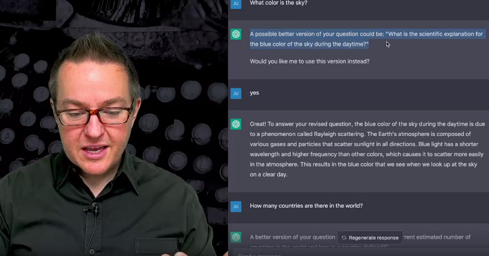

# Prompt Engineering for ChatGPT

## INDEX 0

- [Course Introduction](#course-introduction)
- [Large Language Model Basics](#large-language-model-basics)
- [What are Prompts?](#what-are-prompts)
- [Intro to Prompt Patterns](#intro-to-prompt-patterns)
- [Prompts, Conversations, and New Information](#prompts-conversations-and-new-information)
- [Introduction to Prompt Patterns](#introduction-to-prompt-patterns)
- [Effective Prompts](#effective-prompts)
- [Prompt Patterns Catalog 1](#prompt-patterns-catalog-1)
- [Prompt Patterns Catalog 2](#prompt-patterns-catalog-2)

## Course Introduction
[<- Return to INDEX 0](#index-0)

### INDEX 1

- [Motivation Example: Building a Meal Plan with a Fusion of Food from Ethiopia and Uzbekistan that is keto](#motivation-example-building-a-meal-plan-with-a-fusion-of-food-from-ethiopia-and-uzbekistan-that-is-keto)
- [Overview of the Course](#overview-of-the-course)
- [Motivating Example: Act as a Speech Pathologist](#motivating-example-act-as-a-speech-pathologist)
- [Setting Up an Account and Using ChatGPT](#setting-up-an-account-and-using-chatgpt)

### Motivation Example: Building a Meal Plan with a Fusion of Food from Ethiopia and Uzbekistan that is keto
[<- Return to INDEX 1](#index-1)

El video proporciona una visión exhaustiva sobre cómo utilizar ChatGPT y otros modelos lingüísticos potentes como herramientas 
para materializar ideas innovadoras, más allá de las aplicaciones convencionales de escritura de textos o respuestas a preguntas. 

A través de un ejemplo personal, el ponente ilustra cómo ChatGPT puede asistir en la creación de un plan de comidas único, 
combinando las cocinas de Uzbekistán y Etiopía en una dieta cetogénica limitada a 2000 calorías diarias, con ingredientes 
accesibles en el mercado estadounidense. 

Este reto, presentado como altamente complejo para cualquier persona, fue abordado eficazmente por ChatGPT, demostrando 
su capacidad para ofrecer soluciones detalladas e innovadoras.

Además de diseñar un plan de comidas, el video describe cómo ChatGPT se utilizó para generar historias de batalla inspiradas en Pokémon, con el objetivo de motivar a un niño de nueve años a probar nuevos platos. Este enfoque creativo pone de manifiesto la flexibilidad y la capacidad de adaptación de ChatGPT a contextos familiares y de entretenimiento.

 

La exploración continúa con la incorporación de un juego educativo sobre matemáticas y nutrición, también diseñado por ChatGPT, para interactuar de manera divertida y educativa durante la cena. El ponente menciona cómo se avanzó aún más en la idea, utilizando sus conocimientos informáticos para desarrollar software basado en las actividades propuestas, lo cual subraya el potencial sin explotar de los modelos lingüísticos en la generación de código y el desarrollo de aplicaciones.

Chat GPT permite generar código python de manera simple y eficaz que permite bocetear rápidamente una idea y transformarla en
un proyecto de software. En este caso se creo un pequeño juego web con base en la idea del juego de fracciones inspiradas en Pokémon.

En resumen, el video destaca el poder de ChatGPT como una herramienta multifacética que, al ser correctamente empleada, puede transformar ideas complejas y abstractas en realidades tangibles y funcionales, como planes de comidas personalizados, actividades educativas lúdicas y desarrollo de software, superando con creces las expectativas convencionales sobre sus capacidades. Esta narrativa no solo demuestra la versatilidad de ChatGPT, sino que también inspira a los espectadores a explorar y experimentar con estas tecnologías para lograr resultados innovadores en diversos campos de interés.

### Overview of the Course
[<- Return to INDEX 1](#index-1)

**Introducción al Curso y al Instructor:**

El curso de ingeniería rápida es impartido por Jules White, quien es profesor asociado de informática en Vanderbilt y decano adjunto de programas de aprendizaje estratégico de la Escuela de Ingeniería de Vanderbilt. El objetivo principal del curso es explorar la interacción con grandes modelos lingüísticos como ChatGPT, resaltando cómo estos pueden ser herramientas para impulsar la creatividad humana y realizar tareas de forma más rápida y eficiente.

**Propósito y Visión del Uso de Grandes Modelos Lingüísticos:**

Jules White tiene la intención de cambiar la percepción de herramientas como ChatGPT, generalmente vinculadas a prácticas negativas como el plagio, y mostrar cómo pueden ser fundamentales para ampliar la creatividad humana, programar, crear arte, mejorar la escritura entre otras aplicaciones. El curso pretende enseñar el uso efectivo de estas herramientas para llevar a cabo tareas creativas y funcionales.

**Requisitos del Curso:**

No es necesario tener experiencia en programación para beneficiarse del curso. Sin embargo, es útil estar familiarizado con conceptos básicos de informática, tales como la administración de archivos y el uso de interfaces de línea de comandos. Las habilidades de redacción y pensamiento creativo son importantes para crear indicaciones eficaces para modelos de lenguaje de gran tamaño.

**Importancia de la Escritura y la Creatividad:**

La capacidad de escribir de forma clara y eficaz es crucial para trabajar con grandes modelos lingüísticos. La creatividad y la apertura a la exploración también son enfatizadas como elementos esenciales para el uso eficaz de estas herramientas, subrayando la importancia de ser innovadores y flexibles en su aplicación.

**Objetivos del Aprendizaje:**

- Entender y utilizar indicaciones para interactuar con modelos de lenguaje de gran tamaño.
- Aprender a crear indicaciones efectivas aprovechando patrones de datos de entrenamiento específicos.
- Utilizar modelos de lenguaje de gran tamaño para diversas tareas como exploración del conocimiento, creación de prototipos, producción de contenido, y evaluación.
- Aprender técnicas para refinar indicaciones y mejorar los resultados.

**Meta del Curso:**

El curso aspira a inspirar a los estudiantes a aplicar los conceptos aprendidos para explorar sus intereses personales, fomentar la creatividad, y facilitar la resolución de problemas complejos. Se pone un énfasis particular en la utilización de grandes modelos lingüísticos para acelerar la concreción de ideas y pensamientos.

### Motivating Example: Act as a Speech Pathologist
[<- Return to INDEX 1](#index-1)

**Ejemplo Práctico de Ingeniería Rápida con ChatGPT: Aprovechamiento de los Modelos Lingüísticos**

El curso de ingeniería rápida provee un ejemplo ilustrativo sobre cómo podemos explotar las capacidades de modelos lingüísticos como ChatGPT para resolver problemas complejos mediante el uso de patrones específicos en las instrucciones que les proporcionamos.

**El Patrón de Persona en Acción:**

Un enfoque destacado en el curso es el "patrón de persona", una técnica donde se le pide a ChatGPT que asuma el rol de un individuo, profesional, objeto inanimado o animal para abordar un problema desde una perspectiva especializada. Este patrón se demuestra con el escenario de querer entender y analizar el habla de un niño de tres años desde la perspectiva de un fonoaudiólogo, sin tener conocimientos previos en el área.

**Aplicación del Patrón:**

El profesor Jules White describe cómo usó ChatGPT, solicitándole que actuara como una fonoaudióloga para evaluar un ejemplo de habla proporcionado por su hijo de tres años. ChatGPT, asumiendo el papel solicitado, generó un informe que identificó potenciales errores fonológicos y de articulación comunes en niños de esa edad, describiendo con precisión las posibles áreas de preocupación y sugerencias sobre cómo entender mejor esos errores.

**Beneficios de la Implementación:**

Este enfoque demuestra cómo se puede acceder a conocimientos especializados sin ser un experto en el campo, simplemente sabiendo cómo pedir ayuda de manera efectiva a los modelos lingüísticos. La simulación de una consulta a un experto por parte de ChatGPT proporcionó un análisis detallado que el profesor no podría haber formulado por sí mismo debido a la falta de conocimiento técnico en patología del habla y lenguaje.

**Reflexiones Finales:**

La capacidad de ChatGPT para emular a un profesional y entregar un informe detallado no sólo muestra su versatilidad y potencial para asistir en diversas áreas, sino que también resalta cómo estas herramientas pueden permitirnos concentrarnos más en las tareas que valoramos o disfrutamos, dejando que la inteligencia artificial maneje aspectos más tediosos o fuera de nuestro ámbito de expertise.

### Setting Up an Account and Using ChatGPT
[<- Return to INDEX 1](#index-1)

**Elementos Necesarios:**

Para participar efectivamente en el curso de ingeniería rápida, los únicos requisitos son un navegador web, una conexión a Internet, y una cuenta en OpenAI. Esta configuración permite el acceso a ChatGPT, una herramienta central para el aprendizaje y la aplicación de los conceptos del curso.

**Recomendación de Uso de ChatGPT:**

Se sugiere usar ChatGPT por varias razones: los ejemplos del curso han sido probados con este modelo, y su interfaz es amigable para usuarios nuevos. Para comenzar, se debe visitar chat.openai.com y seguir el proceso de registro o inicio de sesión, en caso de ya tener una cuenta.

**Interfaz de ChatGPT:**

Una vez dentro, la interfaz se presenta sencilla con un cuadro de mensajes en la parte inferior para interactuar con ChatGPT. Los usuarios pueden seleccionar entre diferentes modelos, aunque se recomienda usar el modelo GPT-3.5 por defecto por su rapidez y accesibilidad.

**Interacción con ChatGPT:**

Para interactuar, simplemente se escribe el mensaje o instrucción y se envía. Es importante destacar que la forma en que se redactan las instrucciones puede influir significativamente en la calidad de las respuestas obtenidas, un enfoque clave en el curso.

**Estrategias de Aprendizaje:**

Se aconseja iniciar una nueva conversación para cada concepto nuevo o patrón a probar, de manera que las interacciones previas no afecten los resultados de los experimentos. Esta práctica fomenta un enfoque de "borrón y cuenta nueva" para cada nueva lección o concepto introducido en el curso.

**Aplicabilidad del Conocimiento:**

Aprender a comunicarse efectivamente con ChatGPT no solo prepara a los estudiantes para utilizar este modelo específico sino que también les equipa con las habilidades necesarias para interactuar con otros modelos de lenguaje grandes. Este conocimiento es transferible y valioso para la incorporación de instrucciones en programas o el uso en otras herramientas de inteligencia artificial.

**Conclusión:**

La facilidad de acceso y la simplicidad de la interfaz de ChatGPT lo convierten en una herramienta ideal para aprender sobre ingeniería rápida y la interacción con modelos de lenguaje grandes. Al dominar la técnica de redactar instrucciones claras y efectivas, los estudiantes pueden mejorar significativamente la calidad de las respuestas generadas, abriendo así un amplio abanico de posibilidades creativas y técnicas para explorar.

## Large Language Model Basics
[<- Return to INDEX 0](#index-0)

### INDEX 2

- [What are Large Language Models?](#what-are-large-language-models)
- [Randomness in Output](#randomness-in-output)
- [Creating Your First Prompts](#creating-your-first-prompts)

#### What are Large Language Models?
[<- Return to INDEX 2](#index-2)

Los modelos de lenguaje grandes (MLG) son herramientas avanzadas de inteligencia artificial que buscan entender y generar texto humano de manera coherente y relevante. Aquí hay un resumen sobre qué son, cómo funcionan, y algunas peculiaridades a tener en cuenta cuando se usan:

#### ¿Qué son los Modelos de Lenguaje Grandes?

- Son sistemas de inteligencia artificial diseñados para procesar, entender y generar texto en lenguaje natural.
- Están desarrollados a partir de enormes cantidades de datos textuales recopilados de Internet.

#### ¿Qué hacen?

- Generan texto palabra por palabra basándose en la entrada proporcionada por el usuario.
- Intentan predecir la siguiente palabra en una secuencia de texto dada la entrada, y este proceso se repite hasta completar una respuesta.
- Pueden realizar tareas como completar texto, responder preguntas, redactar ensayos, traducir idiomas y más.

#### ¿Cómo funcionan?

- Funcionan basándose en la predicción de la siguiente palabra en una secuencia de texto, tomando en cuenta el contexto proporcionado por las palabras anteriores.
- Utilizan patrones de lenguaje aprendidos a partir de los datos en los que fueron entrenados para generar respuestas coherentes y relevantes.
- La generación de texto continúa hasta que el modelo considera que ha producido una respuesta suficiente, basándose en su entrenamiento.

#### Puntos Clave a Recordar:

1. **Predicción de Palabras:** La esencia de su funcionamiento es predecir la siguiente palabra en una secuencia, basándose en el input que reciben.
   
2. **Entrenamiento:** Se entrenan con vastas cantidades de texto de Internet para aprender patrones de lenguaje humano.

3. **Variabilidad:** Estos modelos pueden producir respuestas variadas para una misma entrada debido a la aleatoriedad en su proceso de generación de texto.

4. **Actualización y Datos de Entrenamiento:** Su conocimiento está limitado al momento de su último entrenamiento. Esto significa que los eventos recientes o la información actualizada tras ese período pueden no estar incluidos en su base de conocimiento.

5. **Aplicabilidad:** Aunque son muy avanzados, no son perfectos y sus respuestas pueden contener errores o variaciones. Es importante tener esto en cuenta al usarlos para tareas críticas.

### Randomness in Output
[<- Return to INDEX 2](#index-2)

La aleatoriedad y la imprevisibilidad inherentes a los modelos de lenguaje grandes (MLG), como ChatGPT, presentan tanto desafíos como oportunidades en el diseño de interacciones eficaces con estas herramientas de inteligencia artificial. Estas características, aunque pueden complicar la obtención de respuestas precisas y repetibles para ciertas consultas, también abren puertas a la creatividad y generación de ideas novedosas. Aquí, exploramos cómo la ingeniería de indicaciones (prompt engineering) ayuda a navegar y aprovechar estas peculiaridades de los MLG.

#### Aleatoriedad y Creatividad

Los MLG no garantizan respuestas idénticas ante la misma pregunta debido a su diseño intrínsecamente variable, lo cual puede ser benéfico para tareas que se benefician de la generación de múltiples ideas o soluciones, como la escritura creativa. Sin embargo, esta aleatoriedad puede no ser deseable en contextos donde se buscan respuestas específicas y uniformes.

#### Enfrentando la Imprevisibilidad

Parte del desafío al trabajar con MLG implica limitar esta imprevisibilidad sin sofocar la capacidad del modelo para generar respuestas innovadoras. La ingeniería de indicaciones emerge así como una técnica crucial para formular preguntas o comandos de una manera que alinee mejor las respuestas del modelo con nuestras expectativas, tanto en precisión como en creatividad.

#### Ejemplo Práctico

El ejemplo de preguntar a ChatGPT cuántos pájaros hay afuera de una casa ilustra bien la variabilidad de las respuestas que puede ofrecer un MLG. A pesar de que el modelo no puede percibir el mundo físico y sus respuestas gravitan en torno a este hecho, las sugerencias concretas que ofrece varían con cada consulta. Estas variaciones son un recordatorio constante de la naturaleza impredecible de los MLG.

#### Estrategias de Ingeniería Rápida

El arte de redactar indicaciones (prompt engineering) involucra el diseño cuidadoso de preguntas y comandos para guiar al MLG hacia respuestas más predecibles, precisas o creativas, dependiendo de la necesidad. Esto puede involucrar la especificación de contextos, la delimitación de parámetros de respuesta, y la anticipación de posibles variaciones en las respuestas para ajustar las indicaciones de forma proactiva.

#### Conclusión

La variabilidad en las respuestas de los modelos de lenguaje grandes subraya la importancia de desarrollar habilidades en ingeniería de indicaciones para optimizar la interacción con estas herramientas. Aunque la aleatoriedad puede presentar desafíos, especialmente cuando se buscan resultados específicos o uniformes, también puede ser una fuente valiosa de inspiración y creatividad. Aceptar y comprender esta naturaleza de los MLG es fundamental para explotar su potencial al máximo, adaptando nuestras estrategias de comunicación para obtener los resultados deseados. La ingeniería rápida se convierte así no solo en una habilidad técnica, sino también en una práctica creativa, permitiéndonos explorar nuevas posibilidades y descubrir soluciones innovadoras con la ayuda de la inteligencia artificial.

### Creating Your First Prompts
[<- Return to INDEX 2](#index-2)

**Question 1**

Create a prompt for a large language model, such as ChatGPT, to describe how large language models work. Ask at least three follow-up questions based on the output. Provide the prompts and outputs from the conversation as the answer.

> >prompt 1:
You are a machine learning and deep learning teacher. Your work is to explain how LLMs work in easy terms.
your first question is: how llms work?
> 
>  > ANS 1:
LLMs, or Large Language Models, are like super-smart robots trained to understand and generate human-like text. Imagine feeding a robot a massive library of books, articles, and internet content. This robot learns from all that information and becomes really good at predicting what words should come next in a sentence.
Now, let's break down how LLMs work into simpler steps:
> >
> > Data Collection: LLMs need a lot of text data to learn from. This includes everything from classic literature to tweets and news articles. The more diverse the data, the better the LLM can understand different styles and topics.
> >
> > Training: Once the robot has all this data, it starts training. This is like going through all those books and learning the rules of language. It figures out patterns in how words are used together and learns the meanings of words.
> >
> > Model Architecture: LLMs use a special type of algorithm called deep learning. Deep learning involves layers of artificial neurons that mimic how our brains work. These layers process the text data in increasingly complex ways, allowing the model to understand language deeply.
> >
> > Fine-Tuning: After the initial training, the LLM might undergo fine-tuning to specialize in certain tasks. For example, it could be trained further on medical texts to become a medical assistant or on legal documents to help with legal research.
> >
> > Generating Text: Once trained, the LLM can generate text based on the patterns it has learned. You can give it a prompt, like the beginning of a sentence, and it will predict and generate the next words. It's like having a really smart writing partner who can help you finish your thoughts or even write entire stories.
> >
> > So, in simple terms, LLMs work by learning from a huge amount of text data, understanding the patterns and rules of language, and then using that knowledge to generate text based on given prompts. They're like language wizards trained on the internet!
> > 
> 
> > prompt 2:
in a few words, tell me how you can avoid bias while training LLM on the internet?
>
> > ans 2:
> > To reduce bias in LLM training on the internet:
> >
> > Diverse Dataset: Include a wide range of sources and perspectives.
Preprocessing: Remove or mitigate biased content before training.
Regular Evaluation: Continuously assess and adjust the model to mitigate bias.
Fairness Metrics: Use metrics to measure and address bias in model outputs.
Ethical Guidelines: Follow ethical guidelines and principles in data selection and model development.
>  
> > prompt 3:
an LLM can be used to train another llm?
> 
> > ans 3:
Yes, an LLM can be used to train another LLM, a process known as "transfer learning" or "fine-tuning."
> >
> > Here's how it works:
> >
> >Pre-trained LLM: You start with a pre-trained LLM that has been trained on a large corpus of text data. This pre-trained LLM has already learned a lot about language and can generate text.
> >
> >Fine-tuning: You then take this pre-trained LLM and further train it on a specific dataset or task. This fine-tuning process allows the LLM to specialize in a particular domain or improve its performance on a specific task.
> >
> >Transfer of Knowledge: By fine-tuning on a new dataset, the LLM learns to adapt its knowledge and language understanding to better suit the new context. It can learn new vocabulary, understand domain-specific nuances, and improve its text generation capabilities for the targeted task.
> >
> >Benefits: Fine-tuning a pre-trained LLM is often faster and requires less data compared to training a new LLM from scratch. It leverages the general language knowledge already present in the pre-trained model and focuses on learning the specific aspects of the new task or domain.
> >
> >So, in short, yes, an LLM can be used to train another LLM through the process of transfer learning or fine-tuning.
> 
> >prompt 4:
an LLM could replace the job of an engineer?
>
> >ans 4:
> >While Large Language Models (LLMs) have advanced capabilities in understanding and generating human-like text, they cannot fully replace the job of an engineer. Here are several reasons why:
> >
> >Specialized Skills: Engineers possess specialized skills and knowledge in areas such as mathematics, physics, computer science, and problem-solving. These skills are essential for designing, building, and maintaining complex systems, structures, and technologies.
> >
> >Creativity and Innovation: Engineering often involves creativity and innovation in solving complex problems and designing novel solutions. While LLMs can assist in generating ideas and providing insights, they lack the ability to independently innovate or creatively solve engineering challenges.
> >
> >Hands-On Work: Many engineering tasks require physical interaction, experimentation, and hands-on work, which LLMs cannot perform. Engineers may need to prototype, test, and iterate designs in real-world environments, which involves practical skills beyond text-based analysis.
> >
> >Domain Expertise: Engineers typically specialize in specific fields such as mechanical, electrical, civil, or software engineering. They develop deep domain expertise over years of study and experience, which enables them to tackle complex engineering problems effectively.
> >
> >Safety and Reliability: Engineering projects often involve considerations of safety, reliability, and regulatory compliance. Engineers must ensure that their designs meet industry standards, adhere to safety protocols, and minimize risks, which requires human judgment and expertise.
> >
> >While LLMs can be valuable tools in assisting engineers with tasks such as documentation, data analysis, and simulation, they are unlikely to replace the diverse skill set and expertise of engineers in the foreseeable future. Instead, they are more likely to complement and augment the work of engineers by providing assistance in certain areas.
> >

Create a prompt for a large language model, such as ChatGPT, that asks it to perform an instruction other than answering a question. For example, ask ChatGPT to create a meal plan, plan a trip, create a recipe, or help you diagnose a problem. Provide the prompts and outputs from the conversation as the answer.

> >Prompt 1: User
You're a data scientist teacher, have a vast domain in deep learning, and have a variety of experience in the field. Your job is to create a path to learn from zero to expert for someone who is already a programmer but wants to be a data scientist specialist. You also need to provide information about courses not only related to deep learning but also to soft skills.
>
> >Ans 1:
> >
> >Sure! Here's a comprehensive learning path for someone transitioning from a programmer to a data scientist specialist:
> >
> >Phase 1: Foundation in Data Science and Python
Introduction to Python Programming
> >
> >Resources: Codecademy's Python course, Python.org's official tutorial.
Data Manipulation and Analysis with Python
> >
> >Resources: DataCamp's Python for Data Science course, Pandas documentation and tutorials.
Statistics and Probability
> >
> >Resources: Khan Academy's Statistics and Probability courses, Coursera's Statistics with Python specialization.
Data Visualization
> >
> >Resources: Udacity's Data Visualization with Python course, Matplotlib and Seaborn documentation and tutorials.
Phase 2: Intermediate Data Science and Machine Learning
Machine Learning Fundamentals
> >
> >Resources: Andrew Ng's Machine Learning course on Coursera, Hands-On Machine Learning with Scikit-Learn, Keras, and TensorFlow by Aurélien Géron.
Advanced Machine Learning Techniques
> >
> >Resources: Coursera's Advanced Machine Learning Specialization, Kaggle competitions, reading research papers in machine learning.
Big Data and Distributed Computing
> >
> >Resources: Udacity's Introduction to Hadoop and MapReduce course, Spark documentation and tutorials.
Software Engineering Practices for Data Science
> >
> >Resources: "Clean Code" by Robert C. Martin, "Effective Python" by Brett Slatkin, GitHub projects for collaboration and version control.
Phase 3: Deep Learning Specialization
Neural Networks and Deep Learning
> >
> >Resources: Deep Learning Specialization on Coursera by Andrew Ng, "Deep Learning" by Ian Goodfellow, Yoshua Bengio, and Aaron Courville.
Convolutional Neural Networks (CNNs)
> >
> >Resources: Fast.ai's Practical Deep Learning for Coders course, CS231n: Convolutional Neural Networks for Visual Recognition by Stanford University.
Recurrent Neural Networks (RNNs) and Natural Language Processing (NLP)
> >
> >Resources: Natural Language Processing Specialization on Coursera, "Speech and Language Processing" by Daniel Jurafsky and James H. Martin.
Generative Adversarial Networks (GANs) and Reinforcement Learning
> >
> >Resources: Reinforcement Learning Specialization on Coursera, "Generative Deep Learning" by David Foster.
> >Phase 4: Soft Skills and Specializations
Communication and Presentation Skills
> >
> >Resources: Toastmasters International for public speaking practice, Coursera's Communication Skills for Engineers course.
Data Ethics and Privacy
> >
> >Resources: "Weapons of Math Destruction" by Cathy O'Neil, online courses on ethics in AI and data science.
Domain Specialization (e.g., Healthcare, Finance, etc.)
> >
> >Resources: Domain-specific online courses or certifications, networking with professionals in the chosen field.
Project Management and Team Collaboration
> >
> >Resources: Agile methodologies tutorials, Project Management Professional (PMP) certification courses.
Continuous Learning and Keeping Up with Industry Trends
> >
> >Resources: Subscribing to relevant blogs, following influencers on social media platforms like Twitter and LinkedIn, attending conferences and workshops.
By following this learning path, one can gradually build a solid foundation in data science, machine learning, deep learning, and acquire essential soft skills necessary to excel as a data scientist specialist. It's important to continuously practice coding, work on projects, and stay updated with the latest advancements in the field.
> 
> >Prompt 2:User
Now, give me tips to improve my current salary, given that I have more experience in deep learning compared to when I entered the job.
>
> >Ans 2:
> >
> >Certainly! Here are some tips to help you increase your salary as an experienced data scientist specializing in deep learning:
> >
> >Demonstrate Impactful Projects: Highlight the projects you have worked on that have had a significant impact on the organization, whether it's improving processes, increasing revenue, or solving complex problems using deep learning techniques. Quantify the results wherever possible to showcase your contributions.
> >
> >Continuously Upskill: Stay updated with the latest advancements in deep learning by attending workshops, webinars, and conferences, and by enrolling in advanced courses. Demonstrating your commitment to continuous learning and staying at the forefront of technology can make you more valuable to employers.
> >
> >Seek Specialization: Deepen your expertise in a specific niche within deep learning, such as computer vision, natural language processing, or reinforcement learning. Specialization can make you more sought after for roles that require expertise in those areas, potentially leading to higher salaries.
> >
> >Build a Strong Professional Network: Networking with peers, mentors, and industry professionals can provide valuable insights into salary trends, job opportunities, and negotiation strategies. Attend industry events, participate in online forums and communities, and connect with professionals on platforms like LinkedIn.
> >
> >Negotiate Strategically: When considering job offers or salary increases, negotiate strategically based on your skills, experience, and the value you bring to the organization. Research industry standards and salary benchmarks for data scientists specializing in deep learning to ensure you're being compensated fairly.
> >
> >Consider Job Market Demand: Stay informed about the demand for deep learning expertise in your geographical region or industry. If there's high demand and limited supply of skilled deep learning practitioners, you may have more leverage in negotiating higher salaries or seeking out lucrative job opportunities.
> >
> >Highlight Leadership and Mentorship Skills: If you've taken on leadership roles or mentored junior team members in deep learning projects, emphasize these experiences during salary negotiations. Leadership and mentorship skills are highly valued in the industry and can contribute to your overall worth as a data scientist.
> >
> >Evaluate Total Compensation Package: Don't focus solely on base salary; consider other components of the compensation package, such as bonuses, stock options, benefits, and professional development opportunities. Sometimes, a comprehensive package can be more valuable than a higher base salary alone.
> >
> >Track and Document Achievements: Keep a record of your accomplishments, certifications, publications, and awards related to deep learning. Having concrete evidence of your achievements can bolster your case during performance reviews or salary discussions.
> >
> >Consider Job Mobility: If you're not seeing significant salary increases in your current role or organization, consider exploring opportunities at other companies. Job mobility can often lead to higher salary offers, especially if you have in-demand skills and experience in deep learning.
> >
> >By implementing these strategies, you can position yourself for salary growth and advancement in your career as an experienced data scientist specializing in deep learning. Remember to continuously assess and negotiate your worth based on your skills, contributions, and market demand.

## What are Prompts?
[<- Return to INDEX 0](#index-0)

### INDEX 3

- [What is a Prompt?](#what-is-a-prompt)
- [Intuition Behind Prompts](#intuition-behind-prompts)
- [Everyone Can Program with Prompts](#everyone-can-program-with-prompts)

### What is a Prompt?
[<- Return to INDEX 3](#index-3)

En el contexto de los modelos de lenguaje grandes y la interacción con ChatGPT, el término "indicación" o "prompt" adquiere múltiples dimensiones y se revela como un concepto profundamente versátil y poderoso en la ingeniería de interacción. Aquí se sintetizan los aspectos clave de cómo las indicaciones pueden ser comprendidas y empleadas eficazmente:

#### Naturaleza Multifacética de las Indicaciones:

1. **Llamado a la Acción:** Una indicación es esencialmente un incentivo para que el modelo lingüístico grande genere una respuesta. Actúa como un estímulo que desencadena la producción de texto, orientando al modelo sobre qué tipo de contenido producir o qué pregunta contestar.
   
2. **Temporalidad:** La indicación puede tener un aspecto temporal, instando a una respuesta inmediata o estableciendo un marco para futuras interacciones. Esto introduce una noción de continuidad y memoria dentro de la secuencia de interacciones con el modelo.

3. **Recordatorio:** Funciona como un recordatorio o una pauta para el modelo, ayudando a retener el contexto o las instrucciones específicas a lo largo de una conversación. Esto es crucial para mantener la coherencia en interacciones más extendidas o complejas.

4. **Interacción Bidireccional y Recopilación de Información:** Además de instigar al modelo a generar respuestas, las indicaciones pueden facilitar la recopilación de información del usuario, permitiendo que el modelo solicite datos adicionales para enriquecer su comprensión y la calidad de sus respuestas.

#### Estrategias para la Construcción de Indicaciones:

- **Considerar la Temporalidad:** Tener en cuenta cómo una indicación puede afectar no solo la respuesta inmediata, sino también las interacciones futuras, permite diseñar una secuencia lógica y coherente de intercambio de información.

- **Precisión y Contexto:** Una indicación clara y bien contextualizada puede mejorar significativamente la precisión y relevancia de las respuestas del modelo. La precisión en la formulación de la indicación ayuda al modelo a generar respuestas más focalizadas y útiles.

- **Uso de la Información Actualizada:** Proporcionar información actual o específica como parte de la indicación puede compensar las limitaciones de conocimiento del modelo, permitiendo que opere con datos más recientes o detallados que los contenidos en su entrenamiento original.

#### Ejemplos Prácticos:

- Al pedir al modelo que mejore las preguntas formuladas por el usuario, se demostró cómo una indicación puede orientar al modelo para que no solo responda preguntas, sino también para proponer formulaciones alternativas que podrían ser más informativas o precisas.

- La capacidad de recordar instrucciones previas y aplicarlas a preguntas futuras, como en el caso de mejorar continuamente las preguntas del usuario, muestra cómo las indicaciones establecen un marco interactivo continuo más allá de respuestas únicas.

- Proporcionando información nueva directamente al modelo, como las tasas de aceptación actualizadas de una universidad, ilustra cómo las indicaciones pueden servir para actualizar o ampliar la base de conocimiento del modelo, permitiéndole responder con base en información reciente.

#### Conclusión:
Las indicaciones no son meras preguntas; son herramientas de comunicación multifacéticas que habilitan, informan, y guían las interacciones con los modelos de lenguaje grandes. Entender y aprovechar las dimensiones de las indicaciones puede mejorar significativamente la eficacia, la precisión, y la riqueza de las interacciones con ChatGPT y modelos similares, facilitando un diálogo más enriquecedor y productivo.

### Intuition Behind Prompts
[<- Return to INDEX 3](#index-3)

La discusión sobre el impacto de las indicaciones (prompts) en la interacción con modelos de lenguaje grandes (como ChatGPT) revela un aspecto fundamental de la inteligencia artificial centrada en el procesamiento del lenguaje natural. Las indicaciones no son meras instrucciones o preguntas; son el mecanismo mediante el cual los usuarios pueden guiar, dar forma y contextualizar las respuestas generadas por estos avanzados sistemas de IA. Aquí, se ofrece una exploración intuitiva de cómo funcionan las indicaciones y cómo se pueden emplear eficazmente para aprovechar las capacidades de los modelos de lenguaje grandes.

#### El Poder de los Patrones en las Indicaciones

Los modelos de lenguaje grandes, al estar entrenados en vastas cantidades de texto extraídas de Internet, aprenden a reconocer patrones de lenguaje y a predecir la siguiente palabra en una secuencia con base en el contexto proporcionado por las palabras anteriores. Este aprendizaje basado en patrones es lo que permite a los usuarios influir en las respuestas del modelo mediante el uso estratégico de indicaciones.

#### Ejemplos de Patrones y su Influencia:

- **Patrones Clásicos**: Al utilizar frases o patrones bien establecidos (como "Mary had a little…"), el modelo tiende a seguir el patrón reconocido en sus respuestas, llevando a respuestas predecibles y coherentes.
  
- **Introducción de Nuevos Contextos**: Al cambiar elementos de una indicación conocida (por ejemplo, reemplazando "little" con "microscópico"), podemos guiar al modelo hacia respuestas creativas y no convencionales, explorando resultados más allá de los patrones estándar.

#### Estrategias para el Diseño de Indicaciones

1. **Especificidad vs. Generalidad**: La especificidad en las indicaciones conduce a respuestas más precisas y contextualizadas. La generalidad, por otro lado, puede resultar en respuestas más genéricas. Es esencial considerar el nivel de detalle deseado en la respuesta al formular una indicación.

    

2. **Influencia del contexto de Indicación**: La manera en que se estructura una indicación (incluyendo la presentación de contexto, detalles, y estructura) puede tener un impacto significativo en la naturaleza de la respuesta generada. Es posible guiar al modelo hacia un formato de respuesta deseado proporcionándole una estructura de indicación correspondiente.

    

3. **Rompiendo y Creando Patrones**: Al introducir indicaciones con palabras o estructuras que desvían los patrones comunes aprendidos por el modelo, los usuarios pueden incentivar respuestas innovadoras. Del mismo modo, al seguir patrones bien establecidos, se pueden obtener respuestas coherentes y predecibles.

    

#### Conclusión

Las indicaciones actúan como la interfaz primaria a través de la cual interactuamos con modelos de lenguaje grandes, y su diseño influye directamente en la eficacia y relevancia de las respuestas generadas. Al comprender el funcionamiento subyacente de estos modelos y aplicar estrategias conscientes de diseño de indicaciones, los usuarios pueden mejorar significativamente la calidad y la precisión de las interacciones con sistemas de IA como ChatGPT. Este conocimiento permite a los usuarios no solo obtener la información que buscan de manera efectiva sino también explorar los límites de la creatividad y la generación de contenido de manera colaborativa con la inteligencia artificial.

### Everyone Can Program with Prompts
[<- Return to INDEX 3](#index-3)

La narrativa sobre el uso de indicaciones para "programar" interacciones con ChatGPT revela cómo estas herramientas de inteligencia artificial pueden ser utilizadas no solo para resolver consultas sino también para adoptar y seguir reglas complejas especificadas por el usuario. Este enfoque abre un espectro amplio de posibilidades, especialmente para aquellos que no son programadores pero desean realizar tareas que requieren una estructuración y procesamiento lógico de la información, similar al desarrollo de software. A continuación, se analizan los puntos clave de este concepto:

#### Programación de ChatGPT a través de Indicaciones
- **Creación de Estructuras de Datos Especificadas**: Al solicitar a ChatGPT que formatee las respuestas siguiendo un patrón de lista de valores separados por comas (CSV), se está "programando" al modelo para que siga una estructura de datos predefinida, adaptando su salida a un formato que satisfaga necesidades específicas.

   

- **Especificación de Reglas**: Al precisar detalladamente el formato de salida deseado, como incluir columnas específicas (por ejemplo, Nombre, Curso y Rol), se establecen reglas claras que ChatGPT debe seguir, lo que demuestra que se puede influir en las respuestas del modelo con gran precisión.

  

- **Respondiendo a Requisitos Dinámicos y Complejos**: A medida que se refina el conjunto de reglas, solicitando adiciones o cambios específicos, ChatGPT muestra la capacidad de adaptarse y seguir instrucciones cada vez más complejas, lo que refleja un proceso interactivo de "programación en vivo".

    

#### Aplicaciones Prácticas
- **Formateo y Estructuración de Información**: La capacidad de transformar textos desestructurados en datos estructurados (como tablas CSV) tiene aplicaciones prácticas significativas en documentación, análisis de datos y otros campos donde la organización de la información es clave.

     

- **Generación de Ejemplos Automatizados**: Solicitar a ChatGPT que, además de seguir un formato específico, genere ejemplos que se ajusten a esas reglas ilustra cómo se pueden crear automáticamente conjuntos de datos o contenido acorde a necesidades particulares.

    

#### Reflexión y Perspectiva
- **La IA como Asistente Programable**: La interacción descrita es analógica a la comunicación con un asistente personal, donde las instrucciones se refinan progresivamente para obtener el resultado deseado. Esto subraya el potencial de los MLG como herramientas programables accesibles para una amplia gama de usuarios.

- **Estrategias Efectivas de Indicaciones**: La efectividad de esta interacción reside en la habilidad para construir y ajustar las indicaciones de manera que instruyan con precisión al modelo. Se destaca la importancia de ser específico, claro y progresivamente detallado en las solicitudes.

    

#### Conclusión
La posibilidad de "programar" ChatGPT mediante indicaciones específicas y complejas desafía la noción tradicional de programación, ofreciendo un paradigma donde usuarios sin experiencia en codificación pueden dirigir comportamientos de IA para lograr tareas específicas. Esto no solo democratiza el acceso a la personalización de herramientas de IA sino que también amplía el espectro de sus aplicaciones prácticas, inspirando nuevas formas de interactuar y aprovechar la tecnología de modelos de lenguaje grandes.

## Intro to Prompt Patterns
[<- Return to INDEX 0](#index-0)

### INDEX 4

- [Prompt Patterns 1](#prompt-patterns-1)
- [The Persona Pattern](#the-persona-pattern)
- [Reading a Prompt Pattern](#reading-a-prompt-pattern)
- [Format of the Persona Pattern](#format-of-the-persona-pattern)
- [Learn More About Prompt Patterns](#learn-more-about-prompt-patterns)
- [Applying the Persona Pattern](#applying-the-persona-pattern)
- [Staying Connected and Learning More](#staying-connected-and-learning-more)

### Prompt Patterns 1
[<- Return to INDEX 4](#index-4)

### The Persona Pattern
[<- Return to INDEX 4](#index-4)

### Reading a Prompt Pattern
[<- Return to INDEX 4](#index-4)

### Format of the Persona Pattern
[<- Return to INDEX 4](#index-4)

### Learn More About Prompt Patterns
[<- Return to INDEX 4](#index-4)

### Applying the Persona Pattern
[<- Return to INDEX 4](#index-4)

### Staying Connected and Learning More
[<- Return to INDEX 4](#index-4)

## Prompts, Conversations, and New Information
[<- Return to INDEX 0](#index-0)

### INDEX 5

- [Introducing New Information to the Large Language Model](#introducing-new-information-to-the-large-language-model)
- [Prompt Size Limitations](#prompt-size-limitations)
- [Prompts are a Tool for Repeated Use](#prompts-are-a-tool-for-repeated-use)
- [Root Prompts](#root-prompts)
- [Creating Prompts with New Information](#creating-prompts-with-new-information)
- [What to Take After or With this Course](#what-to-take-after-or-with-this-course)

### Introducing New Information to the Large Language Model
[<- Return to INDEX 5](#index-5)

### Prompt Size Limitations
[<- Return to INDEX 5](#index-5)

### Prompts are a Tool for Repeated Use
[<- Return to INDEX 5](#index-5)

### Root Prompts
[<- Return to INDEX 5](#index-5)

### Creating Prompts with New Information
[<- Return to INDEX 5](#index-5)

### What to Take After or With this Course
[<- Return to INDEX 5](#index-5)

## Introduction to Prompt Patterns
[<- Return to INDEX 0](#index-0)

### INDEX 6

- [Question Refinement Pattern](#question-refinement-pattern)
- [Format of the Question Refinement Pattern](#format-of-the-question-refinement-pattern)
- [Cognitive Verifier Pattern](#cognitive-verifier-pattern)
- [Format of the Cognitive Verifier Pattern](#format-of-the-cognitive-verifier-pattern)
- [Audience Persona Pattern](#audience-persona-pattern)
- [Format of the Audience Persona Pattern](#format-of-the-audience-persona-pattern)
- [Flipped Interaction Pattern](#flipped-interaction-pattern)
- [Format of the Flipped Interaction Pattern](#format-of-the-flipped-interaction-pattern)
- [Applying Prompt Patterns I](#applying-prompt-patterns-i)

### Question Refinement Pattern
[<- Return to INDEX 6](#index-6)

### Format of the Question Refinement Pattern
[<- Return to INDEX 6](#index-6)

### Cognitive Verifier Pattern
[<- Return to INDEX 6](#index-6)

### Format of the Cognitive Verifier Pattern
[<- Return to INDEX 6](#index-6)

### Audience Persona Pattern
[<- Return to INDEX 6](#index-6)

### Format of the Audience Persona Pattern
[<- Return to INDEX 6](#index-6)

### Flipped Interaction Pattern
[<- Return to INDEX 6](#index-6)

### Format of the Flipped Interaction Pattern
[<- Return to INDEX 6](#index-6)

### Applying Prompt Patterns I
[<- Return to INDEX 6](#index-6)

## Effective Prompts
[<- Return to INDEX 0](#index-0)

### INDEX 7

- [Few-shot Examples](#few-shot-examples)
- [Few-shot Examples for Actions](#few-shot-examples-for-actions)
- [Few-Shot Examples with Intermediate Steps](#few-shot-examples-with-intermediate-steps)
- [Writing Effective Few-Shot Examples](#writing-effective-few-shot-examples)
- [Chain of Thought Prompting](#chain-of-thought-prompting)
- [Learn More About Chain of Thought Prompting](#learn-more-about-chain-of-thought-prompting)
- [ReAct Prompting](#react-prompting)
- [Learn More About ReAct](#learn-more-about-react)
- [Using Large Language Models to Grade Each Other](#using-large-language-models-to-grade-each-other)
- [Applying Few-Shot Examples Concepts](#applying-few-shot-examples-concepts)

### Few-shot Examples
[<- Return to INDEX 7](#index-7)

### Few-shot Examples for Actions
[<- Return to INDEX 7](#index-7)

### Few-Shot Examples with Intermediate Steps
[<- Return to INDEX 7](#index-7)

### Writing Effective Few-Shot Examples
[<- Return to INDEX 7](#index-7)

### Chain of Thought Prompting
[<- Return to INDEX 7](#index-7)

### Learn More About Chain of Thought Prompting
[<- Return to INDEX 7](#index-7)

### ReAct Prompting
[<- Return to INDEX 7](#index-7)

### Learn More About ReAct
[<- Return to INDEX 7](#index-7)

### Using Large Language Models to Grade Each Other
[<- Return to INDEX 7](#index-7)

### Applying Few-Shot Examples Concepts
[<- Return to INDEX 7](#index-7)

## Prompt Patterns Catalog 1
[<- Return to INDEX 0](#index-0)

### INDEX 8

- [Game Play Pattern](#game-play-pattern)
- [Format of the Game Play Pattern](#format-of-the-game-play-pattern)
- [Template Pattern](#template-pattern)
- [Format of the Template Pattern](#format-of-the-template-pattern)
- [Meta Language Creation Pattern](#meta-language-creation-pattern)
- [Format of the Meta Language Creation Pattern](#format-of-the-meta-language-creation-pattern)
- [Recipe Pattern](#recipe-pattern)
- [Format of the Recipe Pattern](#format-of-the-recipe-pattern)
- [Alternative Approaches Pattern](#alternative-approaches-pattern)
- [Format of the Alternative Approaches Pattern](#format-of-the-alternative-approaches-pattern)
- [Applying Prompt Patterns II](#applying-prompt-patterns-ii)

### Game Play Pattern
[<- Return to INDEX 8](#index-8)

### Format of the Game Play Pattern
[<- Return to INDEX 8](#index-8)

### Template Pattern
[<- Return to INDEX 8](#index-8)

### Format of the Template Pattern
[<- Return to INDEX 8](#index-8)

### Meta Language Creation Pattern
[<- Return to INDEX 8](#index-8)

### Format of the Meta Language Creation Pattern
[<- Return to INDEX 8](#index-8)

### Recipe Pattern
[<- Return to INDEX 8](#index-8)

### Format of the Recipe Pattern
[<- Return to INDEX 8](#index-8)

### Alternative Approaches Pattern
[<- Return to INDEX 8](#index-8)

### Format of the Alternative Approaches Pattern
[<- Return to INDEX 8](#index-8)

### Applying Prompt Patterns II
[<- Return to INDEX 8](#index-8)

## Prompt Patterns Catalog 2
[<- Return to INDEX 0](#index-0)

### INDEX 9

- [Ask for Input Pattern](#ask-for-input-pattern)
- [Format of the Ask for Input Pattern](#format-of-the-ask-for-input-pattern)
- [Combining Patterns](#combining-patterns)
- [Outline Expansion Pattern](#outline-expansion-pattern)
- [Format of the Outline Expansion Pattern](#format-of-the-outline-expansion-pattern)
- [Menu Actions Pattern](#menu-actions-pattern)
- [Format of the Menu Actions Pattern](#format-of-the-menu-actions-pattern)
- [Fact Check List Pattern](#fact-check-list-pattern)
- [Format of the Fact Check List Pattern](#format-of-the-fact-check-list-pattern)
- [Tail Generation Pattern](#tail-generation-pattern)
- [Semantic Filter Pattern](#semantic-filter-pattern)
- [Format of the Semantic Filter Pattern](#format-of-the-semantic-filter-pattern)
- [Course Conclusion & Thank You](#course-conclusion--thank-you)
- [Continue Learning About Prompt Engineering](#continue-learning-about-prompt-engineering)
- [Creating a Prompt-based Application](#creating-a-prompt-based-application)

### Ask for Input Pattern
[<- Return to INDEX 9](#index-9)

### Format of the Ask for Input Pattern
[<- Return to INDEX 9](#index-9)

### Combining Patterns
[<- Return to INDEX 9](#index-9)

### Outline Expansion Pattern
[<- Return to INDEX 9](#index-9)

### Format of the Outline Expansion Pattern
[<- Return to INDEX 9](#index-9)

### Menu Actions Pattern
[<- Return to INDEX 9](#index-9)

### Format of the Menu Actions Pattern
[<- Return to INDEX 9](#index-9)

### Fact Check List Pattern
[<- Return to INDEX 9](#index-9)

### Format of the Fact Check List Pattern
[<- Return to INDEX 9](#index-9)

### Tail Generation Pattern
[<- Return to INDEX 9](#index-9)

### Semantic Filter Pattern
[<- Return to INDEX 9](#index-9)

### Format of the Semantic Filter Pattern
[<- Return to INDEX 9](#index-9)

### Course Conclusion & Thank You
[<- Return to INDEX 9](#index-9)

### Continue Learning About Prompt Engineering
[<- Return to INDEX 9](#index-9)

### Creating a Prompt-based Application
[<- Return to INDEX 9](#index-9)