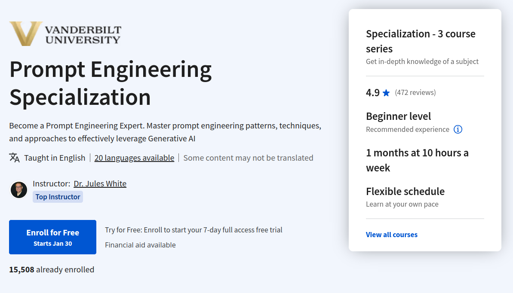

# Prompt Engineering Specialization

## PROGRESO GENERAL: 

## INDICE:

-  [1 Prompt Engineering for ChatGPT](1%20Prompt%20Engineering%20for%20ChatGPT)
-  [2 ChatGPT Advanced Data Analysis](2%20ChatGPT%20Advanced%20Data%20Analysis)
-  [3 Trustworthy Generative AI](3%20Trustworthy%20Generative%20AI)

**Aprenda a aumentar y amplificar su creatividad humana y su pensamiento crítico con la IA Generativa**. Al final del curso, será capaz de utilizar la IA 
Generativa como un exoesqueleto para su mente. 

En esta especialización práctica, aprenderá a aprovechar las capacidades emergentes de los grandes modelos lingüísticos 
para automatizar tareas, aumentar la productividad y aumentar la inteligencia humana. A través de una serie de cursos prácticos, adquirirá habilidades para aplicar estas herramientas en su trabajo, su educación y su vida diaria. 

La especialización ofrece desde el principio conocimientos fundamentales hasta habilidades avanzadas para la ingeniería de instrucciones, el arte de elaborar instrucciones para grandes modelos lingüísticos. Empezará por lo básico y, al final, será capaz de aprovechar las capacidades de razonamiento de estos modelos para una amplia gama de aplicaciones de automatización y aumento de la inteligencia. 

Al final de la especialización, será capaz de utilizar instrucciones y conversaciones con ChatGPT para lograr hazañas asombrosas como:

- escribir y esbozar 10 veces más rápido

- idear nuevas formas de resolver problemas 

- planificar eventos complejos, viajes, procesos, etc.

- generar automáticamente presentaciones de PowerPoint y visualizaciones a partir de datos de Excel

- extraer información clave de PDF y documentos

- producir contenidos de marketing a partir de transcripciones y vídeos o personalizados para clientes concretos

### Proyecto de aprendizaje aplicado

Los alumnos harán de todo, desde aprovechar las capacidades de razonamiento emergente utilizando personas hasta producir posts para redes sociales con IA Generativa. Cada curso incluye múltiples ejercicios prácticos de ingeniería de prontos que desarrollarán de forma incremental sus habilidades de ingeniería de prontos. 